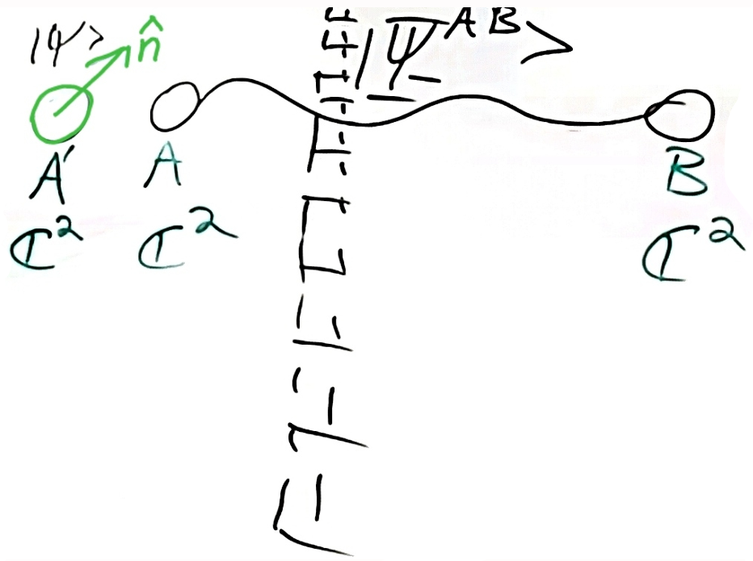
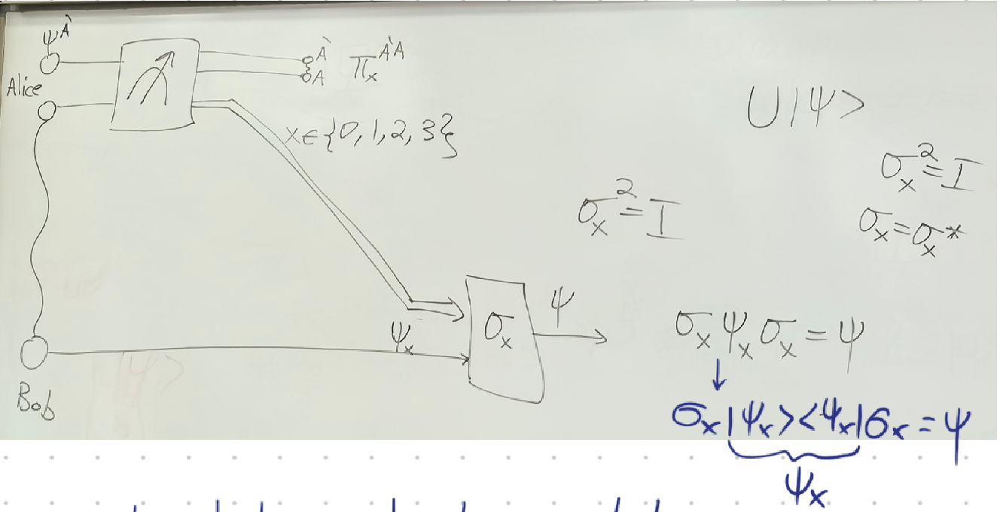
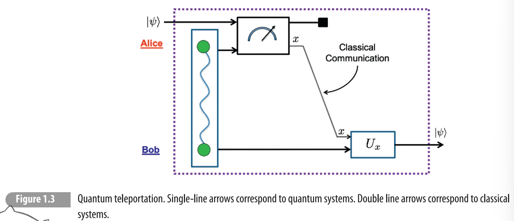
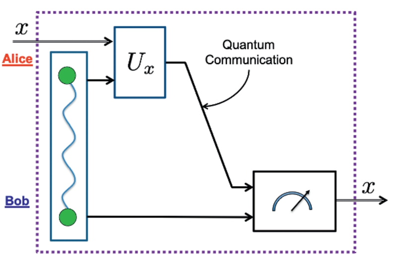
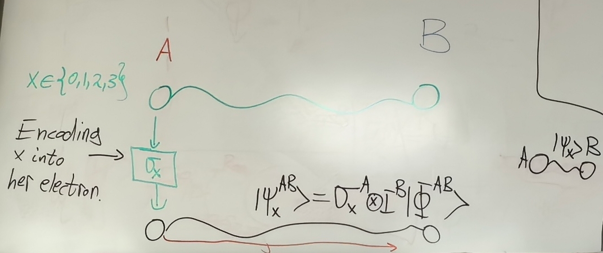
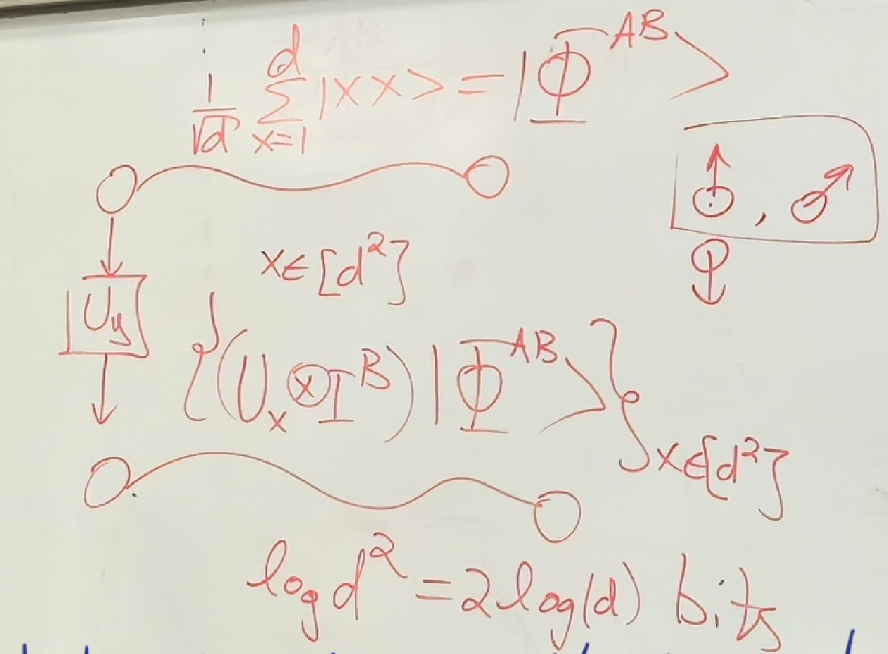
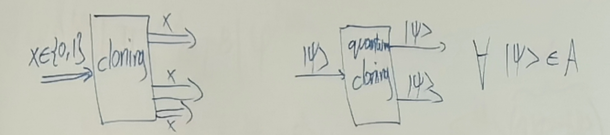
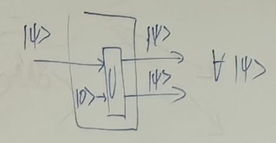

# 8.12 Quantum Teleportation, Superdense Coding and No-Cloning Theorem

### Quantum Teleportation

If Alice performs a measurement in the n direction, it will dictate Bob's post-measurement state to align with the opposite $n$ direction.

Quantum teleportation enables Alice to transmit an unknown quantum state $|\psi\rangle$ to Bob.

Initial state: $|\psi^{A'}\rangle|\Psi_-^{AB}\rangle$, $|\psi^{A'}\rangle = a|0\rangle+b|1\rangle$ Alice and Bob don't know a and b

Then $|\psi^{A'}\rangle|\Psi_{-}^{AB}\rangle = (a|0\rangle^{A'}+b|1\rangle^{A'})(\frac{1}{\sqrt{2}} (|01\rangle^{AB}-|10\rangle^{AB}))$ $= \frac{1}{\sqrt{2}}(a|001\rangle - a|010\rangle + b|101\rangle - b|110\rangle)$  
We use Bell Basis of $\mathbb{C}^2 \otimes \mathbb{C}^2$: $|\Psi_\pm^{A'A}\rangle = \frac{1}{\sqrt{2}}(|01\rangle \pm |10\rangle) \quad |\Phi_\pm^{A'A}\rangle = \frac{1}{\sqrt{2}}(|00\rangle \pm |11\rangle)$  
Then $|00\rangle^{A'A} = \frac{1}{\sqrt{2}}(|\Phi_+^{A'A}\rangle + |\Phi_-^{A'A}\rangle)$ and $|11\rangle^{A'A} = \frac{1}{\sqrt{2}}(|\Phi_+^{A'A}\rangle - |\Phi_-^{A'A}\rangle)$  
​$|01\rangle^{A'A} = \frac{1}{\sqrt{2}}(|\Psi_+^{A'A}\rangle + |\Psi_-^{A'A}\rangle)$ and $|10\rangle^{A'A}= \frac{1}{\sqrt{2}}(|\Psi_{+}^{A'A}\rangle - |\Psi_{-}^{A'A}\rangle )$  

Then $|\psi^{A'}\rangle|\Psi_-^{AB}\rangle = \frac{1}{2}(a|\Phi_+^{A'A}\rangle|1\rangle^B + a|\Phi_-^{A'A}\rangle|1\rangle^B - a|\Psi_+^{A'A}\rangle|0\rangle^B - a|\Psi_-^{A'A}\rangle|0\rangle^B + b|\Psi_+^{A'A}\rangle|1\rangle^B - b|\Psi_-^{A'A}\rangle|1\rangle^B - b|\Phi_+^{A'A}\rangle|0\rangle^B + b|\Phi_-^{A'A}\rangle|0\rangle^B)$  
$= \frac{1}{2}( |\Phi_+^{A'A}\rangle(a|1\rangle^B-b|0\rangle^B) + |\Phi_-^{A'A}\rangle(a|1\rangle^B+b|0\rangle^B) + |\Psi_+^{A'A}\rangle(-a|0\rangle^B+b|1\rangle^B) + |\Psi_-^{A'A}\rangle(-a|0\rangle^B-b|1\rangle^B) )$  
Here we change the state in Alice to Bob

Then we can do a measurement: $\Pi_0^{A'A} = |\Psi_-\rangle\langle\Psi_-|$, $\Pi_1^{A'A} = |\Phi_-\rangle\langle\Phi_-|$  
$\Pi_2^{A'A} = |\Phi_+\rangle\langle\Phi_+|$, $\Pi_3^{A'A} = |\Psi_+\rangle\langle\Psi_+|$  
Then clearly: $\sum_{i=0}^{3} \Pi_{i}^{A'A}= I^{A'A}$, $\Pi_x\Pi_y = \delta_{xy}\Pi_x, \forall x,y \in \{0,1,2,3\}$  
Thus $\{\Pi_x\}_{x\in\{0,1,2,3\}}$ is a projective von-Neumann Measurement.

For $|\psi^{A'}\rangle|\Psi_-^{AB}\rangle = |\varphi^{A'AB}\rangle$, we do measurement.

- $x=0$, $P_{0} = \Pr(x=0) = \langle\varphi|[\Pi_{0}^{A'A}\otimes I^{B}]|\varphi\rangle^{A'AB}$  
  Post-Measurement state: $|\varphi_{0}^{A^{\prime}AB}\rangle:=\frac{1}{\sqrt{P_{0}}}\Pi_{0}^{A^{\prime}A}\otimes I^{B}|\varphi\rangle^{A^{\prime}AB}$
- $x=1$, ......
- $x=2$, ......
- $x=3$, ......

**Generally**, $P_{x}=\Pr(x)=\langle\varphi|\Pi_{x}^{A^{\prime}A}\otimes I^{B}|\varphi \rangle^{A^{\prime}AB}$  
Post-Measurement state: $|\varphi_{x}^{A^{\prime}AB}\rangle:=\frac{1}{\sqrt{P_{x}}}\Pi_{x}^{A^{\prime}A}\otimes I^{B}|\varphi\rangle^{A^{\prime}AB}$  

**Example**:  
​$(\Pi_{0}^{A'A}\otimes I^{B})|\varphi^{A'AB}\rangle = -\frac{1}{2}|\Psi_{-}^{A'A} \rangle(a|0\rangle+b|1\rangle)$  
​$\langle\varphi^{A'AB}|(\Pi_0^{A'A} \otimes I^B)|\varphi^{A'AB}\rangle = \frac{1}{4} = P_0$  
​$|\varphi_{0}^{A^{\prime}AB}\rangle=\frac{1}{\sqrt{1/4}}(\Pi_{0}^{A^{\prime}A}\otimes I^{B})|\varphi^{A^{\prime}AB}\rangle=-|\Psi_{-}^{A^{\prime}A}\rangle\underbrace{(a|0\rangle+b|1\rangle)} _{|\psi^{B}\rangle}$

---

Check: $P_0=P_1=P_2=P_3=1/4$      $\psi^{B}:= |\psi^{B}\rangle\lang\psi^{B}|$

|Outcome|Simplification|Post-Measurement State|
| :----------------------: | :-----------------------------: | :-------------------------------------: |
|$x=0$|$\Psi_{-}^{A'A}\otimes \psi_{0}^{B}$|$\|\psi_{0}^{B}\rangle=\sigma_{0}\|\psi^{B}\rangle=\|\psi^B\rang$|
|$x=1$|$\Phi_-^{A'A} \otimes \psi_1^B$|$\|\psi_1^B\rangle := a\|1\rangle+b\|0\rangle = \sigma_1\|\psi\rangle$ |
|$x=2$|$\Phi_+^{A'A} \otimes \psi_2^B$|$\|\psi_{2}^{B}\rangle := a\|1\rangle-b\|0\rangle = -i\sigma_{2}\|\psi\rangle$|
|$x=3$|$\Psi_+^{A'A} \otimes \psi_3^B$|$\|\psi_3^B\rangle = a\|0\rangle-b\|1\rangle = \sigma_3\|\psi\rangle$|

where we denote by $\{\sigma_x\}_{x=0,1,2,3}$ the identity matrix $\sigma_0 = I_2$, and the three Pauli matrices $\sigma_1, \sigma_2$, and $\sigma_3$.  
Hence, up to a global phase, Bob's state after outcome $x$ occurred is $\sigma_x|\psi\rangle$.  
After Alice sends (via a classical communication channel) the measurement state $\sigma_{x}(\sigma_{x}|\psi\rangle)=\sigma_{x}^{2}|\psi\rangle=|\psi\rangle$  

Therefore, by using shared entanglement, and <u>after transmitting two classical bits</u> (cbits), Alice was able to transfer her unknown **qubit** state $|\psi\rangle$ to Bob's side.

### Super dense coding

$|\Phi_{+}^{AB}\rang = \frac{1}{\sqrt{2}}(|00\rangle + |11\rangle)$  

After encoding, Alice send this state to Bob, then Bob has two states

1. $|\psi_0^{AB}\rangle = \sigma_0 \otimes I |\Phi_+^{AB}\rangle = |\Phi_+^{AB}\rangle$
2. $|\psi_1^{AB}\rangle = \sigma_1 \otimes I |\Phi_+^{AB}\rangle$ $= \begin{pmatrix} 0 & 1 \\ 1 & 0 \end{pmatrix} \otimes I (\frac{1}{\sqrt{2}}(|00\rangle+|11\rangle))$ $= \frac{1}{\sqrt{2}}(|10\rangle + |01\rangle)$ $= |\Psi_{+}^{AB}\rangle$
3. $|\psi_2^{AB}\rangle = (\sigma_2 \otimes I) |\Phi_+^{AB}\rangle$ $= -i|\Psi_-^{AB}\rangle$
4. $|\psi_3^{AB}\rangle = (\sigma_3 \otimes I) |\Phi_+^{AB}\rangle = |\Phi_-^{AB}\rangle$

Bob perform the measurement  
$\{|\underbrace{\psi_{x'}\rangle\langle\psi_{x'}}_{\pi_{x'}}|\}_{x\in\{0,1,2,3\}}$ where $\Pi_x \Pi_{x'} = \delta_{xx'} \Pi_x$ and $\sum =I$, then it's projective von-Neumann Measurement  
$\Pr(x') := \langle\psi_2^{AB}|\Pi_{x'}^{AB}|\psi_2^{AB}\rangle = \delta_{x'2}$, thus 100% we get result $x'=2$

The same for other $x'$  
We perform one measurement, many possible outcomes e.g. energy

#### Generally

use one qubit to transmit two cbits (d=2)

### No cloning theorem

$A \rightarrow A \otimes A$

#### Theorem

Quantum Clonning is not possible.

Because $|\psi_1\rangle|\psi_1\rangle = U|0\rangle|\psi_1\rangle$ and $|\psi_2\rangle|\psi_2\rangle = U|0\rangle|\psi_2\rangle$

If $\langle\psi_1|\psi_2\rangle = \frac{1}{2}$, then $\langle\psi_1|\psi_2\rangle = \langle\psi_1|\psi_2\rangle^2$, then $\frac{1}{2}= (\frac{1}{2})^{2}$ is impossible

Only orthogonal state can be cloned

‍
