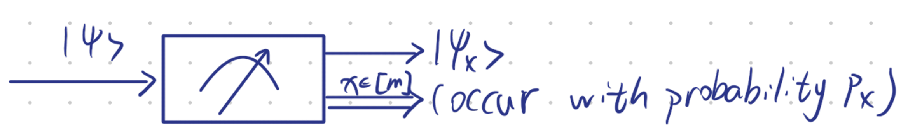
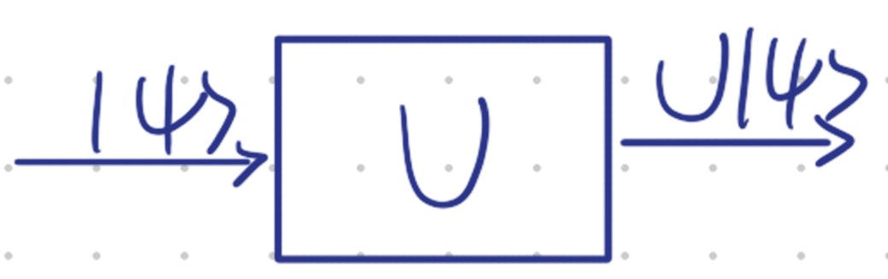
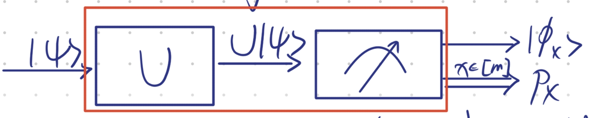
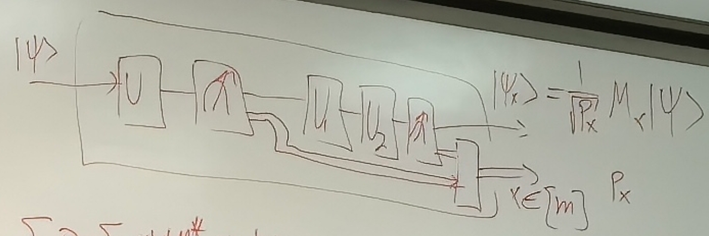
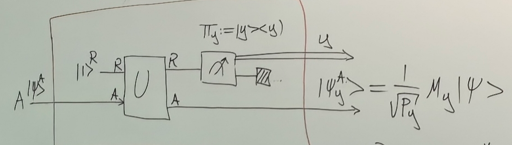
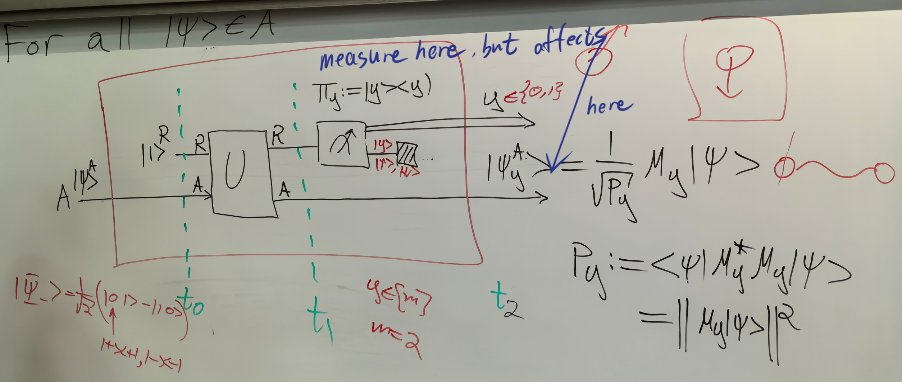

# 8.14 Generalized Measurements and Open Quantum Systems

### Elements of Quantum Mechanics: Open systems

#### Generalized Measurement

Two types of Evolution

1. Projective von-Neumann Measurement $\{\Pi_x\}_{x\in[m]}$  
   Initial state: $|\psi\rangle$  
   Outcome $x$ occur with probability $P_x = \langle\psi|\Pi_x|\psi\rangle$  
   Post-Measurement state: $\frac{\Pi_x|\psi\rangle}{\sqrt{P_x}} := |\psi_x\rangle$  

   
2. Unitary Evolution  
   ​

Then combining (1) + (2)

 where $P_x = \langle\psi|U^*\Pi_x U|\psi\rangle$, $|\phi_x\rangle := \frac{1}{\sqrt{P_x}}\Pi_x U|\psi\rangle$

Here we transform $|\psi\rangle \longrightarrow |\phi_x\rangle, P_x$  
Let's $M_x := \Pi_x U$(no longer projection and unitary), then $|\phi_x\rangle = \frac{1}{\sqrt{P_x}}M_x|\psi\rangle$, $\sum_{x\in[m]} M_x^*M_x = I$, $P_x = \langle\psi|M_x^*M_x|\psi\rangle$ since $\Pi_x$ is hermitian ($\Pi_x = \sum|\phi_x\rangle\langle\phi_x|$)  

##### Generally

Here we also get $|\psi_x\rangle = \frac{1}{\sqrt{P_x}} M_x |\psi\rangle$ and $P_x$

Then $\sum_x P_x = \sum_x \langle\psi|M_x^* M_x|\psi\rangle$

Of course $\sum_{x}P_{x}=1,\forall|\psi\rangle\implies\langle\psi|\sum_{x}M_{x}^{*}M_{x}|\psi \rangle=1,\forall|\psi\rangle\implies\sum_{x}M_{x}^{*}M_{x}=I$  

#### Definition

A collection of m complex matrices $\{M_x\}_{x\in[m]} \in \mathbb{C}^{d \times d}$ is called a generalized measurement if $\sum_{x\in[m]} M_x^* M_x = I^A$ with $A \cong \mathbb{C}^d$

#### Theorem

Let $\{M_x\}_{x\in[m]}$ be a generalized measurement.  
Then, there exists system $R$ of dimension $m$, and a unitary matrix $U^{RA}: RA \rightarrow RA$ ($U$ is $md \times md$).  
For all $|\psi\rangle \in A$,   
We have $|\psi_y^A\rangle = \frac{1}{\sqrt{P_y}} M_y |\psi\rangle$ with $P_y := \langle\psi|M_y^* M_y|\psi\rangle$ $= ||M_y|\psi\rangle||^2$

Proof

Every unitary matrix $U^{RA}$ can be written as $U^{RA} = \sum_{y,y' \in [m]} |y\rangle\langle y'|^R \otimes \Lambda_{yy'}^A$ where $\Lambda_{yy'}$ - complex matrices. Because $U^{RA}=\sum_{x,x^{\prime},y,y^{\prime}}C_{xx^{\prime}yy^{\prime}}|y\rangle\langle y^{\prime} |^{R}\otimes|x\rangle\langle x^{\prime}|^{A}=\sum_{y,y^{\prime}}|y\rangle\langle y^{\prime}|\otimes\left(\sum_{x,x^{\prime}}C_{xx^{\prime}yy^{\prime}}|x\rangle\langle x^{\prime}|\right)\rightarrow\Lambda_{yy^{\prime}}$, then $U^{RA} = \begin{pmatrix}\Lambda_{11} & \Lambda_{12} & \cdots & \Lambda_{1m} \\\Lambda_{21} & \Lambda_{22} & \cdots & \Lambda_{2m} \\\vdots & \vdots & \ddots & \vdots \\\Lambda_{m1} & \Lambda_{m2} & \cdots & \Lambda_{mm}\end{pmatrix}$

Then we define $\Lambda_{11} := M_1, \Lambda_{21} := M_2 \quad \forall y \in [m] \quad \Lambda_{y1} := M_y \quad \sum_{y=1}^m M_y^* M_y = I$  
$U^{*}U = \begin{bmatrix} 	\Lambda_{11}^{*} & \Lambda_{21}^{*} & \cdots & \Lambda_{m1}^{*} \\ 	                 & \vdots           &        &                  \\ \end{bmatrix} \begin{bmatrix} 	\Lambda_{11} &        \\ 	\Lambda_{21} & \cdots \\ 	\vdots       &        \\ 	\Lambda_{m1} & \end{bmatrix}= \begin{pmatrix} 	\sum_{y=1}^{m}\Lambda_{y1}^{*}\Lambda_{y1}= I & * & * \\* 	                                              & * & * \\* 	                                              & * & * \end{pmatrix}=I$  
For the first block$\begin{bmatrix} 	a_{1}^{*} & a_{2}^{*} & a_{3}^{*} \\ 	b_{1}^{*} & b_{2}^{*} & b_{3}^{*} \\ 	\vdots    & \vdots    & \vdots    \\ 	-         & -         & - \end{bmatrix} \begin{bmatrix} 	a_{1} & b_{1} & \cdots \\ 	a_{2} & b_{2} & \cdots \\ 	a_{3} & b_{3} & \cdots \end{bmatrix} = \begin{bmatrix} 	1 & 0 & *      \\ 	0 & 1 & *      \\ 	* & * & \ddots \end{bmatrix}$

Then the first column is orthonormal. Then we can complete the columns to all orthonormal columns by G.S. process.

Thus such dimension and matrix exists

  

$t_0 : |1\rangle^R |\psi^A\rangle$

$t_{1}:U^{RA}(|1\rangle^{R}|\psi^{A}\rangle)=\sum_{y}|y\rangle^{R}\otimes\Lambda_{y1} ^{A}|\psi\rangle$ $=\sum_{y^{\prime}}|y^{\prime}\rangle^{R}\otimes M_{y^{\prime}}|\psi\rangle:=|\phi ^{RA}\rangle$

$t_2:$Probability for outcome $y \in [m]$ is: $\Pi_{y}=|y\rangle\langle y|$, $P_{y}=\langle\phi^{RA}|\Pi_{y}^{R}\otimes I^{A}|\phi^{RA}\rangle=\langle\psi|M_{y} ^{*}M_{y}|\psi\rangle$  

$|\psi_{y}^{RA}\rangle=\frac{1}{\sqrt{P_{y}}}\underbrace{\Pi_{y}^{R}}_{|y\rangle\langle y|}\otimes I^{A}|\phi^{RA}\rangle=\frac{1}{\sqrt{P_{y}}}|y\rangle^{R}\otimes M_{y} |\psi\rangle=|y\rangle_{R}\otimes\left(\frac{1}{\sqrt{p_{y}}}M_{y}|\psi\rangle\right )$  

**Homework**:

1. Given $\{M_x\}_{x\in[m]}, \{N_y\}_{y\in[n]}$ - Generalized measurements. Prove that $\{M_x N_y\}_{x,y}$ is also a generalized measurement.

   Proof:  
   We know $\sum_{i=1}^m M_i^* M_i = I, \sum_{i=1}^n N_i^* N_i = I$  
   NTP: $\sum_{i=1}^m \sum_{j=1}^n (M_i N_j)^* (M_i N_j) = I \iff \sum_{i=1}^m \sum_{j=1}^n N_j^* M_i^* M_i N_j = I$  
   ​$\iff \sum_{j=1}^n N_j^* (\sum_{i=1}^m M_i^* M_i) N_j = I \iff \sum_{j=1}^n N_j^* \cdot I \cdot N_j = I \quad \checkmark$
2. Given $M_{0}=a|+\rangle\langle0|,M_{1}=b|0\rangle\langle+|$. Find conditions on $a,b \in \mathbb{C}$ s.t. $\exists M_2$ with $\{M_0, M_1, M_2\}$ are Generalized Measurements.

   Proof:  
   We know $M_0^*M_0 + M_1^*M_1 + M_2^*M_2 = I$  
   Then $\bar{a}|0\rangle\langle+|\cdot a|+\rangle\langle0|+\bar{b}|+\rangle\langle0|\cdot b|0\rangle\langle+|+M_{2}^{*}M_{2}=I$  
   Then $||a||^{2} \begin{pmatrix} 	1 & 0 \\ 	0 & 0 \end{pmatrix} + \frac{||b||^{2}}{2} \begin{pmatrix} 	1 & 1 \\ 	1 & 1 \end{pmatrix} + M_{2}^{*}M_{2} = \begin{pmatrix} 	1 & 0 \\ 	0 & 1 \end{pmatrix}$  
   Then $M_2^*M_2 = \begin{pmatrix} 1-||a||^2 & 0 \\ 0 & 1 \end{pmatrix} - \frac{||b||^2}{2} \begin{pmatrix} 1 & 1 \\ 1 & 1 \end{pmatrix}$  
   Then $M=M_{2}^{*}M_{2} = \begin{pmatrix} 	1-||a||^{2} - \frac{||b||^2}{2} & -\frac{||b||^2}{2}  \\ 	-\frac{||b||^2}{2}              & 1-\frac{||b||^2}{2} \end{pmatrix}$ since $M$ is hermitian and positive, then the **eigenvalue should be non-negative**

   $\det(xId-M) = \det \begin{pmatrix} x-1+\|a\|^2+\frac{\|b\|^2}{2} & -\frac{\|b\|^2}{2} \\ -\frac{\|b\|^2}{2} & x-1+\frac{\|b\|^2}{2} \end{pmatrix}$  
   ​$= (x-1+\frac{\|b\|^2}{2})^2 + \|a\|^2(x-1+\frac{\|b\|^2}{2}) - \frac{\|b\|^4}{4}$  
   ​$= x^2+1+\frac{\|b\|^4}{4} -2x + x\|b\|^2 - \|b\|^2 + \|a\|^2x - \|a\|^2 + \frac{\|a\|^2\|b\|^2}{2} - \frac{\|b\|^4}{4}$  
   ​$= x^2 + x(-2+\|b\|^2+\|a\|^2) + 1 - \|b\|^2 - \|a\|^2 + \frac{\|a\|^2\|b\|^2}{2}$  
   ​$= 0 \Rightarrow x = \frac{2-\|b\|^2-\|a\|^2 \pm \sqrt{\|a\|^4+\|b\|^4}}{2}$  

   Then $x \geq 0 \Rightarrow \frac{2 - ||b||^2 - ||a||^2 - \sqrt{||a||^4 + ||b||^4}}{2} \geq 0$  

   Then $2 - ||b||^2 - ||a||^2 \geq \sqrt{||a||^4 + ||b||^4} \geq 0$  

   Then $4 + ||b||^4 + ||a||^4 - 4||b||^2 - 4||a||^2 + 2||b||^2 ||a||^2 \geq ||a||^4 + ||b||^4$  

   Then $||a||^2 (||b||^2 - 2) \geq 2||b||^2 - 2$  

   **Since** **$P_0 = \langle 0 | M_0 | 0 \rangle = |a|^2 \leq 1$**​ **,**  the same, $|b|^2 \leq 1$, then $||a||^2 \leq \frac{2||b||^2 - 2}{||b||^2 - 2}$  

   Thus $0 \leq ||b||^2 \leq 1$, $0 \leq ||a||^{2} \leq \min \left\{ 1, \frac{2||b||^{2} - 2}{||b||^{2} - 2}\right \}$

‍

‍
