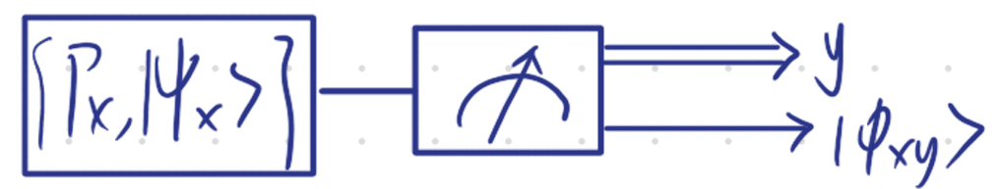
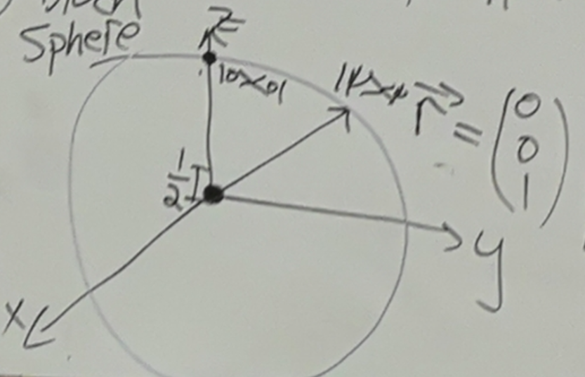
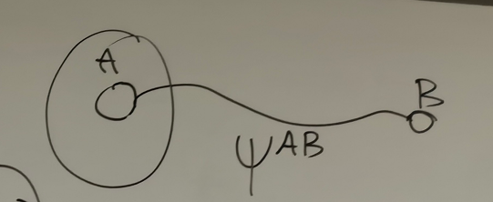

# 8.15 Mixed States

### Mixed Quantum State

The first postulate of quantum mechanics states that the information about closed physical systems is encoded in pure quantum states.  
Here we show how this postulate implies that for open quantum systems, mixed quantum states encode all the information that can be extracted from the system.

So far we considered isolated systems that we described with a pure state $|\psi\rangle \in A$  
Suppose Alice also has access to classical systems, like coins or dice, that can generate random numbers.  
In this case, Alice can roll a dice with $m$ possible outcomes and based on the outcome, prepare one of the $m$ states $\{|\psi_{x}\rangle\langle\psi_{x}|\}_{x \in [m]} \subset \mathcal{D}(A)$.  
This way, Alice can prepare the state $|\psi_{x}\rangle$with some probability $p_{x}$.  
Now, suppose that Alice forgot the value of $x$. Then, Alice knows that her state is one out of the $m$ states in the ensemble of states $\{|\psi_{x}\rangle\langle\psi_{x}|, p_{x}\}_{x \in [m]}$.

To gather information about her system, Alice can execute a generalized measurement, denoted as $\{M_y\}_{y \in [n]}$, on her system, characterized by the ensemble $\{\left|\psi_{x}\right\rangle\left\langle\psi_{x}\right|, p_{x}\}_{x \in[m]}$.  
This measurement results in an outcome y with a corresponding probability denoted as $q_y$. 

Let $\{M_y\}_{y\in[n]}$ be a generalized measurement and $\left\{P_x, |\psi_x\rangle\right\}_{x \in [m]}$ be ensemble of states. $|\psi_x\rangle$ are not orthogonal, otherwise we can do a measurement.

Let $q_{y|x} := \langle\psi_x|M_y^* M_y|\psi_x\rangle$ be probability of $y$ when input is fixed $x$  
And post-measurement state: $|\phi_{xy}\rangle = \frac{1}{\sqrt{q_{y|x}}} M_y |\psi_x\rangle$

Then $\Pr(y)=q_{y}=\sum_{x}p_{x}q_{y|x}$ (we don't know if input is $x$, 条件概率)  
$=\sum_{x=1}^{m}p_{x}\langle\psi_{x}|M_{y}^{*}M_{y}|\psi_{x}\rangle=\sum_{x=1}^{m} p_{x}\mathrm{Tr}[\psi_{x}M_{y}^{*}M_{y}]$ where $\psi_{x} := |\psi_{x}\rangle\langle\psi_{x}|$ because $\text{Tr}(AB)=\text{Tr}(BA)$  
$= \mathrm{Tr}[(\sum_{x} P_{x} \psi_{x}) \cdot M_{y}^{*} M_{y}]$, let $\rho^{A}:=\sum_{x=1}^{m}p_{x}\psi_{x}$

$\Pr(\text{outcome }y)=\mathrm{Tr}[\rho^{A}M_{y}^{*}M_{y}]$

There can be two different ensembles $\{p_{x},\psi_{x}^{A}\}_{x\in[m]},\{r_{z},\phi_{z}^{A}\}_{z\in[k]}$ s.t. $\rho^{A}:=\sum_{x=1}^{m}p_{x}\psi_{x}=\sum_{z=1}^{k}r_{z}\phi_{z}^{A}$ since [this exercise](../Tutorial/8.21%20Exercise.md#20250822164545-bo5j53o)  
But state will be different, we need to measure it to see probability that decided by density matrix but density matrix is same by above result. Thus we cannot distinguish them

If initial state is $|\psi_x\rangle$, then after outcome $y$ the state is $|\phi_{xy}\rangle:=\frac{1}{\sqrt{q_{y|x}}}M_{y}|\psi_{x}\rangle,q_{y|x}:=\langle \psi_{x}|M_{y}^{*}M_{y}|\psi_{x}\rangle$

This results in a new ensemble $\{p_{x}q_{y|x},|\phi_{xy}\rangle\}$ (didn't fix x, y)  
$p_{x}q_{y|x}=q_{y}r_{x|y}$ since we get $y$ in measurement

Then $r_{x|y}=\frac{p_{x}q_{y|x}}{q_{y}}$, then after outcome $y$, the post-measurement state is an ensemble of state $\{r_{x|y}, |\phi_{xy}\rangle\}$ (fix $y$, since we know it)

$\Pr(X=x|Y=y) = \frac{\Pr(X=x)\cdot\Pr(Y=y|X=x)}{\Pr(Y=y)}, \quad r_{x|y}=\frac{P_{x} q_{y|x}}{q_{y}}, q_{y}=\sum_{x} p_{x} q_{y|x}$  
​$\sigma_{y} = \sum_{x} r_{x|y}\phi_{xy}= \sum_{x} \frac{r_{x|y}}{q_{y|x}}M_{y} |\psi _{x}\rangle\langle\psi_{x}| M_{y}^{*} = \sum_{x} \frac{p_{x}}{q_{y}}M_{y} |\psi_{x} \rangle\langle\psi_{x}| M_{y}^{*}$ $= \frac{1}{q_y} M_y \rho^A M_y^*$  

#### Conclusion

Measurements in open systems: Given $\{M_x\}_{x\in[m]}$ - Generalized measurement and $\rho$ - initial state  
Probability for outcome $x$: $p_{x}=\mathrm{Tr}[M_{x}\rho M_{x}^{*}]$  
Post-measurement state after outcome $x$ occurred is $\sigma_{x} = \frac{M_{x} \rho M_{x}^{*}}{p_{x}}$  

### The qubit density matrix

$\rho: \mathbb{C}^2 \rightarrow \mathbb{C}^2$ is hermitian, then $\rho = \lambda_0\sigma_0 + \lambda_1\sigma_1 + \lambda_2\sigma_2 + \lambda_3\sigma_3$ where $\sigma_0=I$, $\sigma_1=\begin{pmatrix} 0 & 1 \\ 1 & 0 \end{pmatrix}$, $\sigma_2=\begin{pmatrix} 0 & -i \\ i & 0 \end{pmatrix}$, $\sigma_3=\begin{pmatrix} 1 & 0 \\ 0 & -1 \end{pmatrix}$.  
Since $\rho$ is density matrix, then it's positive and $\mathrm{Tr}\rho=1$. Then $\lambda_0 = \frac{1}{2}$ since trace=1

Then $\rho\geq 0$ iff $0\leq \lambda\leq 1$ iff $\text{Tr}\rho^2\leq 1$  

Since $\rho = \frac{1}{2}I + \lambda_{1}\sigma_{1} + \lambda_{2}\sigma_{2} + \lambda_{3} \sigma_{3}$, then $\mathrm{Tr}\rho^{2}= \frac{1}{4}\mathrm{Tr}[I] + \sum_{i,j}\lambda_{i}\lambda_{j} \underbrace{\mathrm{Tr}[\sigma_{i}\sigma_{j}]}_{2\delta_{ij}}$  
Thus $\rho\geq 0$ iff $\mathrm{Tr}\rho^{2}= \frac{1}{4}\mathrm{Tr}[I] + \sum_{i,j}\lambda_{i}\lambda_{j} \underbrace{\mathrm{Tr}[\sigma_{i}\sigma_{j}]}_{2\delta_{ij}}$ iff $\mathrm{Tr}\rho^{2}=\frac{1}{2}+2\sum_{i=1}^{3}\lambda_{i}^{2}$  
Let $r_{i}:=2\lambda_{i}$, then $\rho \geq 0$ iff $\mathrm{Tr}\rho^{2}=\frac{1}{2}(1+\sum_{i=1}^{3}r_{i}^{2})\le1$ iff $\sum_{i=1}^{3}r_{i}^{2}\le1$ iff $||\vec{r}||\le1$

Also $||\vec{r}||=1$ iff $\text{Tr}\rho^{2}= 1$, thus $\rho$ is pure iff $||\vec r||=1$ since [this](7.31%20Hermitian%20and%20Quantum%20States.md#20250731115245-17c1hdu)

And we denote $\rho = \frac{1}{2}(I + \vec{r}\cdot\vec{\sigma})$

---

Let $\rho \in \mathrm{Herm}(A)$, $|A|=2, \mathrm{Tr}\rho=1$, show that $\rho \ge 0$ iff $\mathrm{Tr}\rho^2 \le 1$

Proof

$\Rightarrow$) Since $\rho$ is positive, then the eigenvalues of $\rho$ are non-negative and $\rho$ is diagonalizable  
Since $\text{Tr}\rho=\lambda_{0}+\lambda_{1}=1$, then $0\leq \lambda_0,\lambda_1\leq 1$ and $\text{Tr}\rho^{2}=\lambda_{0}^{2}+\lambda_{1}^{2}\leq1$

$\Leftarrow$) Since $\rho$ is Hermitian, then $\rho$ is diagonalizable, then $\text{Tr}\rho=\lambda_{0}+\lambda_{1}=1$

NTP: $\rho \ge 0$, since $\rho$ is Hermitian, then NTP: The eigenvalues of $\rho$ are non-negative

Then $\mathrm{Tr}\rho^{2}=\lambda_0^2+\lambda_1^2 =\lambda_0^2+(1-\lambda_0)^2 \le 1$, then $0\leq \lambda_{0}$, otherwise $\text{Tr}\rho^2>1$

Thus $\rho\geq 0$  

---

##### **Bloch Sphere**

Hence, a qubit can be represented by the Bloch Sphere

- The pure states represented on the boundary of the sphere

  $\rho = \frac{1}{2}(I + \vec{r}\cdot\vec{\sigma})$,$\quad \vec{r}\in \mathbb{R}^{3}\quad ||\vec{r}|| =  1$ which means $\mathrm{Tr}\rho^{2} = 1$. Thus all the surface are pure
- The mixed states in the interior of the sphere.
- The center of the sphere, that is, $\mathbf{r} = 0$, corresponds to the state $\rho = \frac{1}{2}I$, which is called the maximally mixed state.

###### Example

- When $\vec r=\begin{pmatrix} 0\\0\\1 \end{pmatrix}$, then $\rho=\frac{1}{2}(I+\vec{r}\cdot\vec{\sigma})=\frac{1}{2}(I+\sigma_{z})=\frac{1}{2} \begin{pmatrix} 	1 & 0 \\ 	0 & 1 \end{pmatrix}+\frac{1}{2} \begin{pmatrix} 	1 & 0  \\ 	0 & -1 \end{pmatrix}=\begin{pmatrix} 	1 & 0  \\ 	0 & 0 \end{pmatrix}=|0\rang\lang 0|$
- When $\vec r=\begin{pmatrix} 0\\0\\0 \end{pmatrix}$, then $\rho=\frac{1}{2}I=\frac{1}{2}|0\rangle\langle0|+\frac{1}{2}|1\rangle\langle1|$

**Exercise 3.6**. Consider a density operator for a qutrit; that is, $\rho \in \mathcal{D}(\mathbb{C}^{3})$, $\rho \geq 0$, and $\mathrm{Tr}[\rho] = 1$. Let $\boldsymbol{\lambda} = (\lambda_{1}, \lambda_{2}, \ldots, \lambda_{8})$ be a vector of matrices with $\{\lambda_{j}\}_{j \in [8]}$ being some Hermitian traceless $3 \times 3$ matrices satisfying the condition $\mathrm{Tr}(\lambda_{i}\lambda_{j}) = 2\delta_{ij}$ (note that also the Pauli matrices satisfy this orthogonality condition).

1. Show that $\rho$ can be written as $\rho=\frac{1}{3}I_{3}+\mathbf{t}\cdot\bm{\lambda}$ where $\mathbf{t} \in \mathbb{R}^{8}$ and $I_{3}$ is the $3 \times 3$ identity matrix.

   Proof

   $\rho = t_{1}\lambda_{1} + \dots + t_{8}\lambda_{8} + t_{0}\lambda_{0}= t_{0}\mathbb{I}+ t_{1}\lambda_{1} + \dots + t_{8}\lambda_{8}$ since $\lambda_0 = \mathbb{I}$  
   Since $\rho \geq 0$, $\text{Tr}[\rho] = 1$, and $\{\lambda_j\}_{j \in \{1,\dots,8\}}$ are traceless  
   Then $\text{Tr}[\rho]=t_{0}\text{Tr}[\mathbb{I}]=t_{0}\cdot3\implies3t_{0}=1\implies t _{0}=\frac{1}{3}$  
   Then $\rho = \frac{1}{3}\mathbb{I} + t\lambda$ where $t=(t_1, \dots, t_8)^T$, $\lambda = (\lambda_1, \dots, \lambda_8)$
2. Show that $\|\mathbf{t}\|_{2} \leq \frac{1}{\sqrt{3}}$.

   Proof

   Since $\rho \geq 0$, then $\text{Tr}[\rho^2] \leq 1$. Then $\text{Tr}[\rho^{2}]=\text{Tr}[\frac{1}{9}\mathbb{I}+\sum_{i,j}^{8}t_{i}t_{j}\lambda _{i}\lambda_{j}]=\frac{3}{9}+\sum_{i,j}^{8}t_{i}t_{j}\text{Tr}[\lambda_{i}\lambda _{j}]$  
   ​$=\frac{1}{3}+\sum_{i,j}^{8}t_{i}t_{j}2\delta_{ij}=\frac{1}{3}+2\sum_{i=1}^{8}t_{i} ^{2}\leq1\implies2\sum_{i=1}^{8}t_{i}^{2}\leq\frac{2}{3}\implies\sum_{i=1}^{8}t_{i} ^{2}\leq\frac{1}{3}\implies||t||_{2}^{2}\leq\frac{1}{3}$$\implies ||t||_2 \leq \frac{1}{\sqrt{3}}$
3. Show that if $\rho$ is a pure state, then $\|\mathbf{t}\|_{2} = \frac{1}{\sqrt{3}}$.

   $\rho$ is pure iff $\text{Tr}[\rho^2] = 1$, iff $||t||_2 = \frac{1}{\sqrt{3}}$
4. Is it true that for every $\mathbf{t}$ with $\|\mathbf{t}\|_{2} \leq \frac{1}{\sqrt{3}}$, $\rho$ above corresponds to a density matrix? If yes prove it, otherwise give a counter example.

   Use gell matrix: $\lambda_{1}$ and $\mathbf{t}=(0.4,0,0,0,0,0,0,0)$  

   Because in dimension 3, $\rho \geq 0\nLeftarrow \text{Tr}[\rho^{2}] \leq 1$.

### Purification of density matrices

$\rho^{A} = \mathrm{Tr}_{B}[\psi^{AB}] = \mathrm{Tr}_{B}[(I^{A} \otimes U)\psi^{AB} (I^{A} \otimes U)^{B}]$

Recall $\mathrm{Tr}_{B} \Lambda^{AB}= \mathrm{Tr}_{B}[\sum \lambda_{x} \omega_{x} \otimes \mu_{x}]$

$(I^A \otimes V)|\psi^{AB}\rangle = |\phi^{AC}\rangle \quad V: B \rightarrow C \quad M = \sum C_{xx'yy'} |x\rangle\langle x'| \otimes |y\rangle\langle y'|$

If $\psi^{AB}$ and $\phi^{AC}$ are purifications of $\rho^A$ then there exist isometry such that: $|\phi^{AC}\rangle = I^A \otimes V^{B \to C} |\psi^{AB}\rangle$

Also $\sqrt{\rho^A} \otimes I^{\tilde{A}} |\Omega^{A\tilde{A}}\rangle$ - purification of $\rho^A$.

‍
