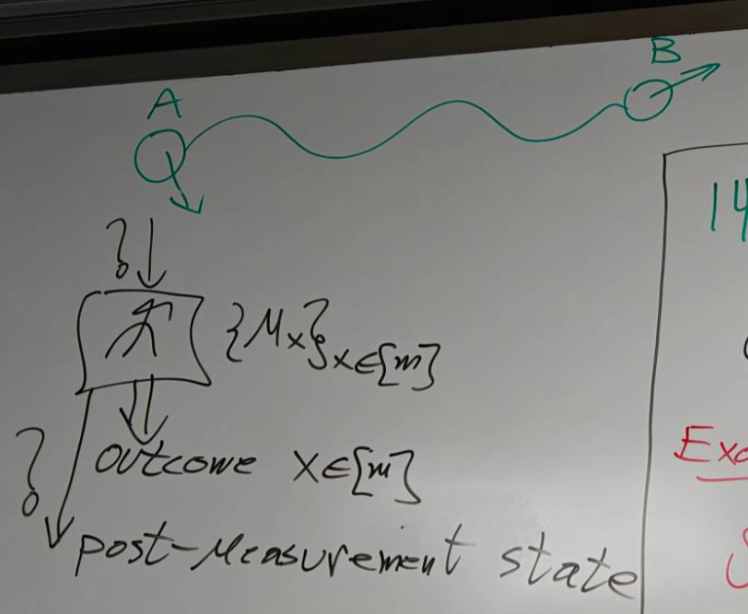
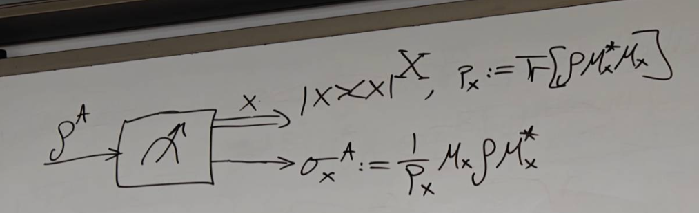
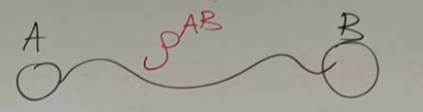
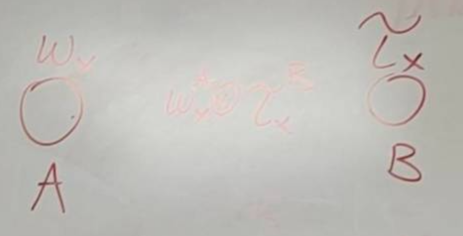
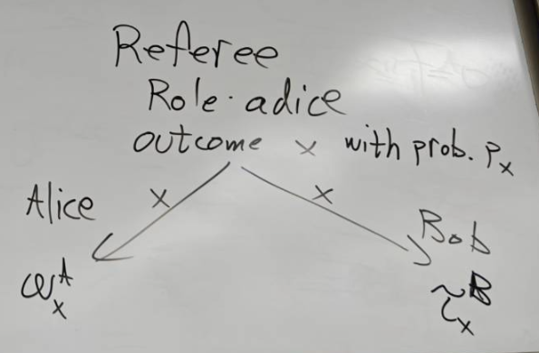
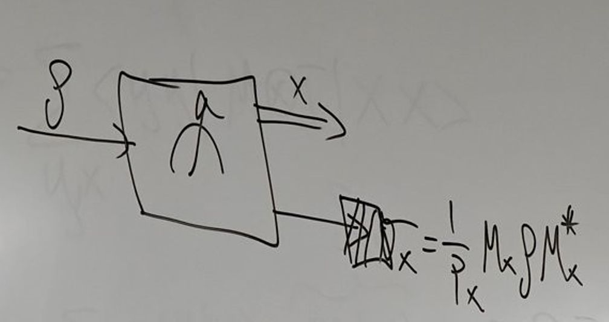
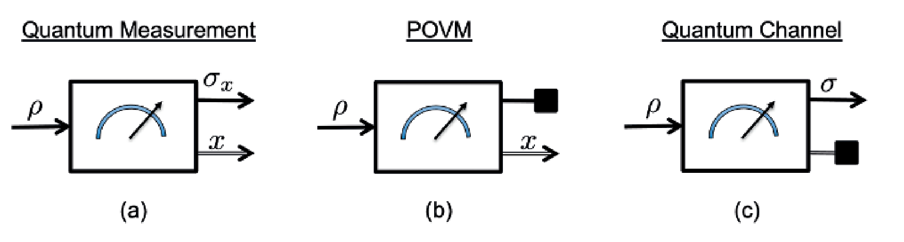
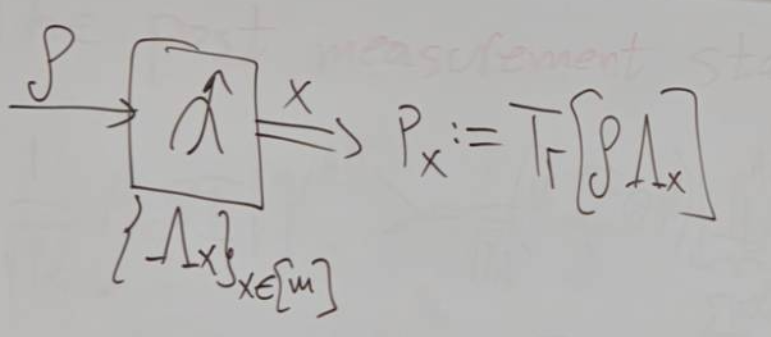

# 8.19 Mixed Quantum States and POVM

## Revision

### Density Matrices - Mixed Quantum States

Assume the physical system is open, it is described by a density matrix $\rho^A:A\to A,\,\rho\geq 0,\text{Tr}\rho^A=1$

That is the information about the physical system is encoded in a density matrix

Any measurement is described by Generalized Measurement

We apply a Generalized Measurement: $\{M_x\}_{x\in[m]}$ and $\sum_{x\in[m]}M^*_xM_x=I^A$

Physical process, transform $\rho$ to $\sigma_x:=\frac{1}{p_x}M_x\rho M_x^*$(post-measurement state) where $p_x=\text{Tr}[M_x^*M_x\rho]$

This tells us how to extract the information from system (many times we get partial information)

And $x$ is the outcome of the measurement

---

Suppose we have a pure state $|\psi^{AB}\rang$, example: $|\psi^{AB}\rang =\sqrt{\frac{1}{3}}|00\rang+\sqrt{\frac{2}{3}}|11\rang$

We know any purification can be written as $|\psi^{AB}\rangle=\sqrt{\rho}\otimes V^{A\to B}|\Omega^{A\tilde{A}}\rangle$([Proof](8.1%20Schmidt%20Decomposition%20and%20Partial%20Trace.md#20250824093309-va3bpxb). In this case, the bases of Bob and Alice are same, thus $V=I$), $\rho^{A}:=\text{Tr}_{B}[|\psi^{AB}\rang\lang\psi^{AB}|]$

Example: $\rho^{A}=\text{Tr}_{B}[|\psi^{AB}\rangle\langle\psi^{AB}|]=\frac{1}{3}|0\rangle\langle 0|+\frac{2}{3}|1\rangle\langle1|$, $|\psi^{AB}\rangle=\sqrt{\rho}\otimes I|\Omega^{A\tilde{A}}\rangle$($\checkmark$)

---

Suppose Alice performs a generalized measurement described by $\{M_x\}_{x\in[m]}$ in 

And suppose $x$ occurs with probability $p_{x}=\langle\psi^{AB}|M_{x}^{*}M_{x}\otimes I^{B}|\psi^{AB}\rangle$ (after outcome $x$ occurred)

$=\langle\Omega^{A\tilde{A}}|(\sqrt{\rho}\otimes V^{*})(M_{x}^{*}M_{x}\otimes I^{B})(\sqrt{\rho}\otimes V)|\Omega^{A\tilde{A}}\rangle$

$=\langle\Omega^{A\tilde{A}}|(\sqrt{\rho}M_{x}^{*}M_{x}\sqrt{\rho}\otimes V^{*}V) |\Omega^{A\tilde{A}}\rangle=\langle\Omega^{A\tilde{A}}|(\sqrt{\rho}M_{x}^{*}M_{x} \sqrt{\rho}\otimes I)|\Omega^{A\tilde{A}}\rangle$

Since [this](8.1%20Schmidt%20Decomposition%20and%20Partial%20Trace.md#20250801105632-9s2wdpv), $=\text{Tr}\left\lbrack\sqrt{\rho}M_{x}^{*}M_{x}\sqrt{\rho})\right\rbrack=\text{Tr} \left\lbrack\rho M_x^*M_x\right\rbrack$

The post measurement state: After outcome $x$ occurred  
​$|\phi_{x}\rangle=\frac{1}{\sqrt{p_{x}}}M_{x}\otimes I|\psi^{AB}\rangle=\frac{1}{\sqrt{p_{x}}} (M_{x}\sqrt{\rho}\otimes V)|\Omega^{A\tilde{A}}\rangle$, then $\sigma_{x}=\text{Tr}_{B}[|\phi_{x}\rang\lang \phi_{x}|]=\frac{1}{p_{x}}M_{x}\rho M_{x}^{*}$ since we only want the sub system of Alice  
​$\sigma_{x}=\text{Tr}_{B}[|\phi_{x}\rangle\langle\phi_{x}|]=\text{Tr}_{B}[\frac{1}{\sqrt{p_{x}}} (M_{x}\sqrt{\rho}\otimes V)|\Omega^{A\tilde{A}}\rangle\frac{1}{\sqrt{p_{x}}}\langle \Omega^{A\tilde{A}}|(\sqrt{\rho}M_{x}^{*}\otimes V^{*})]$  
​$=\frac{1}{\sqrt{p_{x}}}\text{Tr}_{B}[(M_{x}\sqrt{\rho}\otimes V)|\Omega^{A\tilde{A}} \rangle\langle\Omega^{A\tilde{A}}|(\sqrt{\rho}M_{x}^{*}\otimes V^{*})]\frac{1}{\sqrt{p_{x}}} =\frac{1}{\sqrt{p_{x}}}M_{x}\sqrt{\rho}\text{Tr}_{B}[V\Omega^{A\tilde{A}}V^{*}]\sqrt{\rho} M_{x}^{*}\frac{1}{\sqrt{p_{x}}}$  

$=\frac{1}{p_{x}}M_{x}\rho\text{Tr}_{\tilde{A}}[\Omega^{A\tilde{A}}]M_{x}^{*}=\frac{1}{p_{x}} M_{x}\rho M_{x}^{*}$ since $\text{Tr}_{\tilde{A}}[\Omega^{A\tilde{A}}]=I$

### A classical - quantum state(cq-state)

When $x$ remains both unknown and unrecorded, as discussed previously, the complete characterization of the system is encapsulated by the density operator $\rho^A = \sum_{x \in [m]} p_x |\psi_x \rangle \langle \psi_x |$. 

When $x$ is recorded within the classical system $X$ using the mapping $x\to|x\rangle\langle x|$, the description of the system adopts a classical-quantum state, represented by $\rho^{XA}=\sum_{x\in[m]}p_{x}|x\rang\lang x|^{X}\otimes \rho^{A}_{x}$ where $X$ is classical system and $A$ is quantum system

$\{p_{x},\rho_{x}^{A}\}_{x\in[m]}$ is ensemble of states where we define $\rho^A:=\sum_xp_x\rho_x^A$, $x\to|x\rangle\langle x|$  

$\{p_{x}, \sigma_{x}^{A}\}$ describe it with $\sigma^{XA}:=\sum_{x}p_{x}|x\rangle\langle x|\otimes\sigma_{x}^{A}$ $=\sum_{x}|x\rangle\langle x|^{X}\otimes M_{x}\rho M_{x}^{*}$ where $\rho^A \xrightarrow{Measurement} \sigma^{XA}$ and since we substitute $p_x \sigma_x^A = M_x \rho^A M_x^*$

### Separable State

$\rho^{AB}:A\otimes B\to A\otimes B$

$\rho^{AB}:=\sum_{x\in[m]}p_{x}\omega_{x}^{A}\otimes\tau_{x}^{B}$ is separable state where $p_x$ is probability

A convex combination of vectors in $\R^n$ is $\sum^m_{x=1}p_x\vec v_x$ for vectors $\vec v_1,\vec v_2,\vec v_3,...,\vec v_m$ and $p_x\geq 0,\sum^m_{x=1}p_x=1$ (It's linear combination and coefficients is probability)

Remark: Given a separable state, you can write it with rank 1 $\omega$ and $\tau$  

That is $\rho=\sum_{y}p_{y}\psi_{y}\otimes\phi_{y}$, $\omega_{x}^{A} = \sum_{y} \gamma_{y|x}\psi_{yx}^{A}$ and $\tau_{x}^{B} = \sum_{z} s_{z|x}\phi_{zx}^{B}$ since $\omega,\tau$ are density matrix, they can be decomposed as pure states

$\rho = \sum_{x,y,z}\underbrace{\gamma_{yx} s_{z|x} p_x}_{\lambda_\alpha}\psi_{yx} \otimes \phi_{zx}$ $= \sum_{\alpha}\lambda_{\alpha}\psi_{\alpha}\otimes \phi_{\alpha}$ where $\sum_{\alpha} \lambda_{\alpha} = 1$  

Show that: $\Phi_+^{AB} = |\Phi_+\rangle \langle \Phi_+|$, and $|\Phi_{+}^{AB}\rangle=\frac{1}{\sqrt{2}}(|00\rangle+|11\rangle)$ $\neq |\Psi^A\rangle|\Phi^B\rangle$

Proof

Assume $|\Phi_+^{AB}\rangle = |\Psi^A\rangle |\Phi^B\rangle$, where $|\Psi^A\rangle = \alpha |0\rangle + \beta |1\rangle, \quad |\Phi^B\rangle = \gamma |0\rangle + \delta |1\rangle,$ with $|\alpha|^2 + |\beta|^2 = 1$ and $|\gamma|^2 + |\delta|^2 = 1$

Then $|\Psi^A\rangle |\Phi^B\rangle = \alpha \gamma |00\rangle + \alpha \delta |01\rangle + \beta \gamma |10\rangle + \beta \delta |11\rangle.$

Then $\alpha \gamma = \frac{1}{\sqrt{2}}$, $\alpha \delta = 0$, $\beta \gamma = 0$, $\beta \delta = \frac{1}{\sqrt{2}}$. No solution

---

A quantum state is said to be entangled if it is not separable

  
A referee samples a number $x$ with a probability distribution $p_{x}$ (e.g. roll a possibly biased dice, or flip a coin) and sends the number $x$ to Alice and Bob who are spatially separated.  
Based on this value, Alice prepares the state $\rho_{x}^{A}$, and Bob prepares the state $\tau_{x}^{B}$. Then, if Alice and Bob forget the value of $x$, but still know the distribution $p_{x}$ from which $x$ was sampled, the state of their  
composite system becomes $\rho^{AB}:=\sum_{x\in[m]}p_{x}\omega_{x}^{A}\otimes\tau_{x}^{B}$

### Positive operator valued measured(POVM)

If we don't care about the post measurement state, we only focus on probabilities

Since $p_{x}= \text{Tr}[\rho M_{x}^{*}M_{x}]$, then we define $\Lambda_{x}:= M_{x}^{*}M_{x}\qquad \{\Lambda_{x}\}_{x \in [m]}- POVM$

If $\sum_{x\in[m]}\Lambda_{x}=I,\Lambda_{x}\ge0$, then it's a POVM

And $0 \le \Lambda_x \le I$ which means $I - A_x \ge 0$(Positive semi-definite)

No Post-Measurement State

To every generalized measurement there exists a unique POVM that corresponds to it via the relation $\Lambda_x = M_x^* M_x$.

However, for every POVM there are many quantum measurements corresponding to it.
