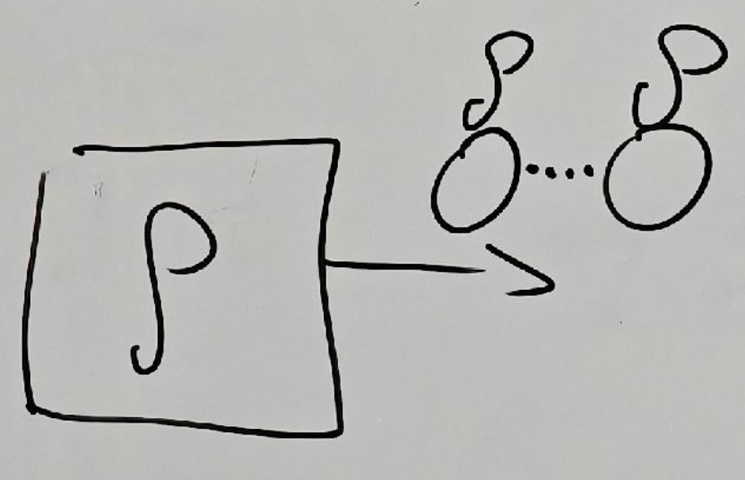
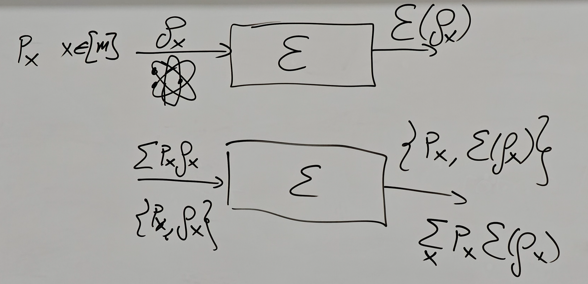
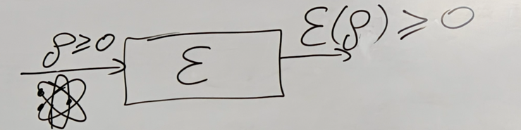
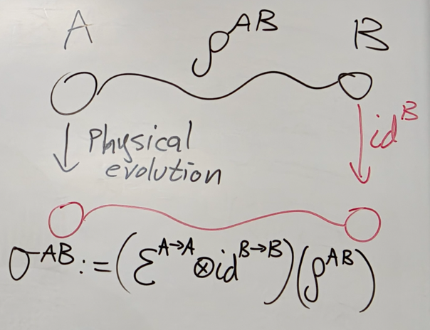

# 8.21 Quantum Tomography and Evolution of Open Systems

### Quantum Tomography

Output electrons, we want to learn $\rho$, then we do measurement to get $\rho$ where $\rho$ is a density matrix

Let's choose standard basis $\{|x\rang\}_{x\in [d]},d:=|A|$ and $\Lambda_x=|x\rang\lang x|$

Then the probability for outcome $x$ is $p_{x}=\text{Tr}[\Lambda_{x}\rho]=\text{Tr}[|x\rang\lang x|\rho]=\lang x|\rho|x\rang$ is on the diagonal of $\rho$

We do many times measurements and count them, then dived the total number of measurements, we get the probability of $x$(e.g. $x=2$), that is we can estimate $p_x$ in experiments

Then we can know the diagonal exactly.

For the rest of matrix:

### Informationally Complete POVM

A POVM $\{\Lambda_x\}_{x\in [m]}$ is called informationally complete if $\text{Herm}(A)=\text{span}_\R\{\Lambda_x\}_{x\in[m]}$

In the previous example: $\Lambda_x=|x\rang\lang x|$ is not informationally complete because $\text{span}_\R\{\Lambda_x\}_{x\in [d]}=\left\{\sum^d_{x=1}r_x|x\rang\lang x|:r_x\in \R\right\}$ is diagonal

Recall: $\dim(\text{Herm}(A))=|A|^2$ where $|A|=d$  

If $\{\Lambda_x\}_{x\in [m]}$ is IC-POVM, then $m\geq d^2$

If $m=d^2$, then $\{\Lambda_x\}_{x\in[m]}$ is a basis of $\text{Herm}(A)$

#### Example

$\{\Gamma_{0}=|0\rang\lang 0|,\Gamma_{1}=|1\rang\lang 1|,\Gamma_{2}=|+\rang\lang +|,\Gamma_{3}=|+i\rang\lang +i|\}$ where $|+\rang=\frac{1}{\sqrt{2}}(|0\rang+|1\rang)$ and $|+i\rang=\frac{1}{\sqrt{2}}(|0\rang+i|1\rang)$  

This list satisfies $\Gamma_{x}\geq 0$ and a basis since eigenvalues, but the sum is not identity, thus it's not POVM

Does such $\Lambda_x$ always exists? Yes

Definition: $\Gamma:=\sum^{3}_{y=0}\Gamma_y>0$ (Hermitian, positive, then invertible since Hermitian ensures all eigenvalues are real and positive ensure all eigenvalues are positive, then $\Gamma$ is injective and since it's endomorphism, then it's invertible)

Then $\Lambda_{x}:=\Gamma^{-\frac{1}{2}}\Gamma_{x}\Gamma^{-\frac{1}{2}}$ where $\Gamma$ is diagonal, then $\Gamma^{-\frac{1}{2}}=\sum_j\lambda_j^{-\frac{1}{2}}|x\rang\lang x|$  

Why not $\Lambda_x=\Gamma^{-1}\Gamma_{x}$? Because this is not positive, then not POVM

Then $\sum^{3}_{x=0}\Lambda_{x}=\sum_{x=0}^{3}\Gamma^{-\frac{1}{2}}\Gamma_{x}\Gamma^{-\frac{1}{2}} =\Gamma^{-\frac{1}{2}}(\sum^{3}_{x=0}\Gamma_{x})\Gamma^{-\frac{1}{2}}=\Gamma^{-\frac{1}{2}} \Gamma\Gamma^{-\frac{1}{2}}=I$

This $\Lambda_x$ is also positive: $\lang \psi|\Lambda_x|\psi\rang=\lang \psi|\Gamma^{-\frac{1}{2}}\Gamma_x\Gamma^{-\frac{1}{2}}|\psi\rang=\lang \phi|\Gamma_x|\phi\rang>0$ since $\Gamma_x$ is positive

Thus $\Lambda_x$ is IC-POVM

---

Let $H \in \text{Herm}(A)$. Let $H' = \Gamma^{1/2} H \Gamma^{1/2}$.  
We need to show that there exist $\{r_{x}\}_{x=0}^{3}\subset\mathbb{R}$ s.t. $H=\sum_{x=0}^{3}r_{x}\Lambda_{x}$.  
Since $\{\Gamma_x\}_{x=0}^3$ is a basis, there exists $\{r_{x}\}_{x=0}^{3}$ s.t. $H=\sum_{x=0}^{3}r_{x}\Gamma_{x}\Rightarrow\underbrace{\Gamma^{-1/2}H^{\prime}\Gamma^{-1/2}} _{H}=\sum_{x=0}^{3}r_{x}\underbrace{\Gamma^{-1/2}\Gamma_{x}\Gamma^{-1/2}}_{\Lambda_{x}}$  

---

Take $m=d^2$, therefore $\{\Lambda_x\}^\R_{x=1}$ is a basis of $\text{Herm}(A)$  

Let $\{\Gamma_y\}_{y=1}^{d^2}$ be the dual basis of $\{\Lambda_x\}_{x=1}^{d^2}$

Theorem: $\text{Tr}[\Lambda_{x}\Gamma_{y}]=\delta_{xy}$ where $\Gamma_y$ doesn't have to be positive, it is only Hermitian

Show that at least one eigenvalue of $\Gamma_y$ is negative

Proof

Suppose $\Gamma_{y}\ge 0$, then $\Lambda_x = \sum_{k=1}^d a_k |u_k\rangle \langle u_k|$, $a_k \ge 0$, $\Gamma_{y}=\sum_{m=1}^{r}b_{m}|v_{m}\rangle\langle v_{m}|$, $b_m > 0$, $r \ge 1$ by spectral decomposition.

Since $\text{Tr}[\Lambda_{x}\Gamma_{y}]=\delta_{xy}$, when $x \ne y$, $\text{Tr}[\Lambda_{x}\Gamma_{y}]=0$.

$\Rightarrow \text{Tr}\left[ \sum_{k,m=1}^{d}a_{k}b_{m}|u_{k}\rangle \langle u_{k} | v_{m}\rangle \langle v_{m}| \right] = 0 \Rightarrow \sum_{k,m=1}^{d}a_{k}b_{m}\text{Tr} [|u_{k}\rangle \langle u_{k}|v_{m}\rangle \langle v_{m}|] = 0$.

Then $\text{Tr}[|u_{k}\rangle\langle u_{k}|v_{m}\rangle\langle v_{m}|]=0\Rightarrow\text{Tr} [\langle u_{k}|v_{m}\rangle\langle v_{m}|u_{k}\rangle]=0\Rightarrow\langle u_{k}| v_{m}\rangle=0$ when $x \ne y$.

For $S = \text{span} \{ |v_m\rangle \}_{m=1}^r$, $|u_k\rangle \in S^\perp \Rightarrow \{ \Lambda_x \}_{x \ne y} \subset \text{Herm}(S^\perp)$.

$\Rightarrow \text{dim} \{ \Lambda_x \}_{x \ne y} \le \text{dim Herm}(S^\perp) \Rightarrow d^2-1 \le (d-r)^2 \le (d-1)^2$. Contradiction

---

$\rho=\sum_{y=1}^{d^2}q_{y}\Gamma_{y}$ since mixed state is hermitian and we know $p_{x}=\text{Tr}[\Lambda_{x}\rho]$ $=\sum_{y=1}^{d^2}q_{y}\text{Tr}[\Lambda_{x}\Gamma_{y}]=\sum_{y=1}^{d^2}q_{y}\delta _{xy}=q_{x}$

Thus $\rho=\sum_{x=1}^{d^{2}}p_{x}\Gamma_{x}$, thus we can know the matrix

### Evolution of Open Systems

Any evolution has to take density matrix to density matrix in physics, because the information is described in density matrix

The Axiomatic Approach:

#### Axiom 1

Evolution is described with a linear Transformation: $\mathcal{E}: \mathcal{L}(A) \rightarrow \mathcal{L}(B)$ where $\mathcal{L}(A): = \mathcal{L}(A,A) \cong \mathbb{C}^{d\times d}$ and $d := |A|$  

Take density matrices to density matrices

Alice prepares the state $\rho_x$ and $\rho_x$ interacts with enviroment then it becomes $\mathcal{E}(\rho_{x})$ and send to Bob

If we don't know $x$, density matrix is an ensemble, thus we must have $\mathcal{E}(\sum_{x}p_{x}\rho_{x})=\sum_{x}p_{x}\mathcal{E}(\rho_{x} )$

#### Axiom 2

$\mathcal{E}$ is Trace Preserving

Motivation: $\text{Tr}[\mathcal{E}(\rho)]=1$ if $\rho$ is a density matrix ($\rho\geq 0,\text{Tr}[\rho]=1$)

##### Lemma

Let $\mathcal{E}:\mathbb{C}^{d\times d}\to \mathbb{C}^{d'\times d'}$ be a linear transformation.  
If $\text{Tr}[\mathcal{E}(\rho)]=1,\forall\rho\geq0,\text{Tr}[\rho]=1$, then $\text{Tr}[\mathcal{E}(M)]=\text{Tr}[M]$  

Proof

1. We show $\mathrm{Tr}[\mathcal{E}(\Lambda)] = \mathrm{Tr}[\Lambda] \quad \forall \Lambda \ge 0$  
   Let $\lambda = \mathrm{Tr}[\Lambda]$, then $\mathrm{Tr}\left[\mathcal{E}\underbrace{\left(\frac{1}{\lambda}\Lambda\right)}_{\text{density matrix}}\right] = 1 \Rightarrow \frac{1}{\lambda}\mathrm{Tr}(\mathcal{E}(\Lambda)) = 1 \Rightarrow \mathrm{Tr}(\mathcal{E} (\Lambda)) = \lambda = \mathrm{Tr}[\Lambda]$
2. Hermitian Matrices: We show $\mathrm{Tr}(\mathcal{E}(H)) = \mathrm{Tr}(H) \quad \forall H \in \mathrm{Herm}(A)$  
   We know $H=\Lambda_{+}-\Lambda_{-}$, then $\mathrm{Tr}[\mathcal{E}(H)]=\mathrm{Tr}[\mathcal{E}(\Lambda_{+}-\Lambda_{-})]=\mathrm{Tr} [\mathcal{E}(\Lambda_{+})]-\mathrm{Tr}[\mathcal{E}(\Lambda_{-})]$  
   ​$= \mathrm{Tr}[\Lambda_{+}] - \mathrm{Tr}[\Lambda_{-}] = \mathrm{Tr}[H]$
3. Show it for all complex matrix: $\text{Tr}[\mathcal{E}(M)]=\text{Tr}[M]$  
   We know $M=H_{1}+iH_{2}$, then $\text{Tr}[\mathcal{E}(H_{1}+iH_{2})]=\text{Tr}[\mathcal{E}(H_{1})]+i\text{Tr}[\mathcal{E}(H_{2})]=\text{Tr}[H_1]+i\text{Tr}[H_2]=\text{Tr}[H_1+iH_2]=\text{Tr}[M]$

#### Axiom 3

$\mathcal{E}$ is complete positive.

##### Definition

A linear map $\mathcal{E} \in \mathcal{L}(A \rightarrow B)$ is called $k$-positive if $\left(id_{K}^{R \rightarrow R} \otimes \mathcal{E}^{A \rightarrow B}\right)\left(\rho^{R A}\right) \geq 0 \quad \forall \rho^{R A} \geq 0$ where $K:=|R|$, $\forall R$  
Furthermore, $\mathcal{E}$ is called completely positive (CP) if it is $k$-positive for all $k \in \mathbb{N}$.  
Every Physical operation is a CPTP, linear map(complete positive, trace preserving, linear map)

Consider a composite system consisting of two subsystems $A$ and $B$. Such a system is described by a bipartite density operator $\rho^{AB} \in \mathcal{D}(A \otimes B)$.  
If the subsystem $A$ undergoes a physical evolution described by a linear map $\mathcal{E}\in \mathcal{L}(A \to A)$, while system $A$ does not evolve and remain intact, then the state $\rho^{AB}$will evolve to the state $\sigma^{AB}:=(\mathcal{E}^{A\rightarrow A}\otimes id^{B\rightarrow B})(\rho^{AB} )$

---

If $\mathcal{E}$ represents a physical evolution, then both $\mathcal{E}$ and $\mathrm{id}^{A} \otimes \mathcal{E}$ must take one density matrix to another density matrix. In particular, the linear map $\mathrm{id} \otimes \mathcal{E} \in$ $\mathcal{L}(AB \rightarrow A B')$ must also be a positive map for any system $A$.  
Thus it is possible that $\mathcal{E}$ are positive while $\mathrm{id}^{A} \otimes \mathcal{E}$ is not positive. The following example shows this.

##### Example

$\Phi_{+}^{AB}=|\Phi_{+}\rangle\langle\Phi_{+}|,|\Phi_{+}\rangle=\frac{1}{\sqrt{2}} (|00\rangle+|11\rangle)$  

$\Phi_{+}^{AB}=\frac{1}{2}(|0\rangle\langle0|\otimes|0\rangle\langle0|+|0\rangle\langle 1|\otimes|0\rangle\langle1|+|1\rangle\langle0|\otimes|1\rangle\langle0|+|1\rangle \langle1|\otimes|1\rangle\langle1|)$  

Let $\mathcal{E}(\rho) = \rho^T$, then $(\mathcal{E} \otimes id^B)(\Phi_+) = \frac{1}{2}(|0\rangle\langle0|\otimes|0\rangle\langle0| + |1\rangle\langle0|\otimes|0\rangle\langle1| + |0\rangle\langle1|\otimes|1\rangle\langle0| + |1\rangle\langle1|\otimes|1\rangle\langle1|)$

$\Phi_{+}=\frac{1}{2} \begin{pmatrix} 	1 & 0 & 0 & 1 \\ 	0 & 0 & 0 & 0 \\ 	0 & 0 & 0 & 0 \\ 	1 & 0 & 0 & 1 \end{pmatrix}$ is positive but $\mathcal{E}\otimes \text{id}(\Phi_{+}) = \frac{1}{2} \begin{pmatrix} 	1 & 0 & 0 & 0 \\ 	0 & 0 & 1 & 0 \\ 	0 & 1 & 0 & 0 \\ 	0 & 0 & 0 & 1 \end{pmatrix}$ is not

Then $\mathcal{E}$ take a density matrix to a negative matrix is not valid.

#### Conclusion

Such a linear CPTP map is called a quantum channel. The set of all quantum channels in $\mathcal{L}(A \rightarrow B)$ will be denoted by $CPTP(A \rightarrow B)$.
