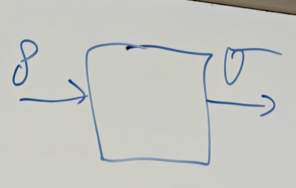

# 8.26 Choi Matrix

##### Corollary

A linear map $\mathcal{E} \in \mathcal{L}(A \rightarrow B)$ is $|A|$-positive if and only if it is completely positive.

Proof

By definition if $\mathcal{E}$ is a CP map then it is $|A|$-positive. Conversely, if $\mathcal{E}$ is $|A|$-positive, then its Choi matrix $\mathcal{E}^{\tilde{A} \rightarrow B}\left(\Omega^{A \tilde{A}}\right)$ is positive semi-definite. Hence, from the theorem above $\mathcal{E}$ is a CP map.

#### Lemma

$\mathcal{E}^{A\to B}$ is Trace-Preserving iff $J_{\mathcal{E}}^{A}=I^{A}$ where $J_{\mathcal{E}}^{A}:=\text{Tr}_{B}[J_{\mathcal{E}}^{AB}]$

Proof

$\Rightarrow$) Suppose $\mathcal{E}$ is trace preserving and set $m:=|A|$. Then, $J_{\mathcal{E}}^{A}=\operatorname{\mathrm{Tr}}_{B}\left[J_{\mathcal{E}}^{AB}\right ]=\text{Tr}_{B}[\mathcal{E}^{\tilde{A}\to B}(\Omega^{A\tilde{A}})]$

$=\text{Tr}_{B}\left[\sum_{x,y\in\left\lbrack m\right\rbrack}|x\rangle\langle y|^{A} \otimes\mathcal{E}^{\tilde{A}\to B}(|x\rangle\langle y|^{\tilde{A}})\right]=\sum_{x,y\in\left\lbrack m\right\rbrack}|x\rangle\langle y|^{A}\text{Tr}_{B}\left[\mathcal{E}^{\tilde{A}\to B}(|x\rangle\langle y|^{\tilde{A}})\right]$

Since $\mathcal{E}$ is trace preserving, then $J_{\mathcal{E}}^{A}=\sum_{x,y\in[m]}|x\rangle\langle y|\operatorname{\mathrm{Tr}} [|x\rangle\langle y|)]=\sum_{x,y\in[m]}|x\rangle\langle y|\delta_{xy}=I^{A}.$

$\Leftarrow$) Suppose $J_{\mathcal{E}}^{A}=I^{A}$, then $\forall\rho \in \mathcal{L}(A)$, NTP: $\text{Tr}[\rho]=\operatorname{\mathrm{Tr}}[\mathcal{E}(\rho)]$, we start from $\text{Tr}[\mathcal{E}(\rho)]$

Since [this](8.22%20Quantum%20Channels%20and%20Choi%20Representation.md#20250822114136-jrnyp0h) and we already have a full trace, then $\text{Tr}[\mathcal{E}(\rho)]=\text{Tr}[J^{AB}\left((\rho^{A})^{T}\otimes I^{B}\right )]$

Claim: $\text{Tr}[J^{AB}\left((\rho^{A})^{T}\otimes I^{B}\right)]=\text{Tr}[J_{\mathcal{E}}^{A}(\rho^{A})^{T}]$

Since $J_{\mathcal{E}}^{A}=I^{A}$, then $\operatorname{\mathrm{Tr}}\left[J_{\mathcal{E}}^{A}\rho^{T}\right]=\operatorname{\mathrm{Tr}} \left[\rho^{T}\right]=\operatorname{\mathrm{Tr}}[\rho].$

Proof of claim  
Let $J^{AB}=\sum_{j}\mu_{j}^{A}\otimes\zeta_{j}^{B}$, we get $\text{Tr}[\mathcal{E}(\rho)]=\text{Tr}\left[\left(\sum_{j}\mu_{j}^{A}\otimes\zeta _{j}^{B}\right)\left((\rho^{A})^{T}\otimes I^{B}\right)\right]=\text{Tr}\left[\left (\sum_{j}\mu_{j}^{A}(\rho^{A})^{T}\otimes\zeta_{j}^{B}\right)\right]=\sum_{j}\text{Tr} [\zeta_{j}^{B}]\text{Tr}[\mu_{j}^{A}(\rho^{A})^{T}]$  
Since $J_\mathcal{E}^A=\text{Tr}_B[J_\mathcal{E}^{AB}]=\sum_j\text{Tr}[\zeta_j^B]\mu_j^A$, then $\sum_{j}\text{Tr}[\zeta_{j}^{B}]\text{Tr}[\mu_{j}^{A}(\rho^{A})^{T}]=\text{Tr}[\sum _{j}\text{Tr}[\zeta_{j}^{B}]\mu_{j}^{A}(\rho^{A})^{T}]=\text{Tr}[J_{\mathcal{E}}^{A} (\rho^{A})^{T}]$

---

#### Conclusion

$\mathcal{E}\in CPTP(A\to B)\iff J_{\mathcal{E}}^{AB}\geq 0 \text{ and }J_{\mathcal{E}} ^{A}=I^{A}$ where $J_{\mathcal{E}}^{A}:=\text{Tr}_{B}[J_{\mathcal{E}}^{AB}]$

##### Examples

1. Choi matrix of the transpose map $\Tau:A\to A,\Tau(\rho)=\rho^{T},J_{\Tau}^{AB}=\Tau^{\tilde{A}\to A}(\Omega^{A\tilde{A}} )=\sum_{x,y}|x\rang\lang y|\otimes (|x\rang\lang y|)^{T}$  
   Then $J_{\mathrm{T}}^{AB}=\sum_{x,y}|x\rangle\langle y|\otimes|y\rangle\langle x|=F^{AB}$  
   Then $F^{AB}|x'\rang|y'\rang=\sum(|x\rang\lang y|\otimes |y\rang\lang x|)(|x'\rang| y'\rang)=|y'\rang|x'\rang$ this is flip operator  
   **Exercise:**  $F^{AB}|\psi\rang|\phi\rang=|\phi\rang|\psi\rang$ and $F^{2}=I^{AB}$(Write it in basis)
2. $\sigma\in \mathfrak{D}(B)$ (Density)  
   $\mathcal{E}(\rho^{A})=\sigma^{B}\,\,\forall \rho\in \mathcal{L}(A)$ is not a quantum channel since this is not trace preserving since $\sigma$ is density matrix but $\rho$ not

   Let $\mathcal{E}(\rho^A):=\text{Tr}[\rho^A]\sigma^B,\forall \rho\in\mathcal{L}(A)$  
   Clearly this is trace preserving because  
   $J_{\mathcal{E}}^{AB}=\mathcal{E}^{\tilde{A}\to B}(\Omega^{A\tilde{A}})=\sum_{x,y} |x\rang\lang y|\otimes \mathcal{E}(|x\rang\lang y|)=\sum_{x,y}|x\rang\lang y|\otimes \text{Tr}[|x\rang\lang y|]\sigma^{B}=\sum_{x,y}|x\rang\lang y|\otimes \delta_{xy} \sigma^{B}$  
   $=\sum_{x}|x\rang\lang x|\otimes \sigma^{B}=I^{A}\otimes \sigma^{B}$, then $J_{\mathcal{E}}^{A}=\text{Tr}_{B}[J_{\mathcal{E}}^{AB}]=\text{Tr}_{B}[I^{A}\otimes \sigma^{B}]=I^{A}\text{Tr}[\sigma^{B}]=I^{A}$ since $\sigma$ is density matrix

**Exercise**

Let $\rho\in\mathfrak{D}(AB)$, show that there exists a channel $\mathcal{E}\in CPTP(A\to B)$ and a pure state $\psi^{A\tilde{A}}$ s.t.

$$
\rho^{AB}=\mathcal{E}^{\tilde{A}\to B}(\psi^{A\tilde{A}})
$$

Proof

We need to check two conditions

- $\rho^{AB}\geq 0$ by definition of a density matrix
- If $\rho^A=I^A$, then $\text{Tr}\rho^A=\text{Tr}I^A\Rightarrow 1=|A|$ which is not true, thus we need to fix this

Let $J^{AB}:= (\underbrace{(\rho^{A})^{-1/2}\otimes I^{B}}_{M^*}) \rho^{AB}(\underbrace{(\rho^{A})^{-1/2}\otimes I^{B}}_{M})$  

- $J^{AB} \ge 0$ by theorem
- $J^{A}= \text{Tr}_B[J^{AB}] = (\rho^{A})^{-1/2}\text{Tr}_B[\rho^{AB}] (\rho^{A} )^{-1/2}= (\rho^{A})^{-1/2}\rho^{A} (\rho^{A})^{-1/2}= I^{A}$

Then by theorem there exists quantum channel s.t. $J^{AB}=J_{\mathcal{E}}^{AB}$

$J_{\mathcal{E}}^{AB}= \mathcal{E}^{\tilde{A} \to B}(\Omega^{A\tilde{A}}) =\left( \left (\rho^{A}\right )^{-1/2}\otimes I^{B}\right)\rho^{AB}\left(\left(\rho^{A}\right)^{-1/2}\otimes I^{B}\right)$  
Then $\left(\sqrt{\rho^{A}}\otimes I^{B}\right) \mathcal{E}^{\tilde{A} \to B}(\Omega^{A\tilde{A}} ) \left(\sqrt{\rho^{A}}\otimes I^{B}\right) = \rho^{AB}$  

Then $\mathcal{E}^{\tilde{A}\to B}\left(\left(\sqrt{\rho^{A}}\otimes I^{B}\right)\Omega^{A\tilde{A}} \left(\sqrt{\rho^{A}}\otimes I^{B}\right)\right)=\rho^{AB}$  
Let $|\psi^{A\tilde{A}}\rangle := \sqrt{\rho^A} \otimes I^{\tilde{A}} |\Omega^{A\tilde{A}}\rangle$, then $\mathcal{E}^{\tilde{A} \to B} (\psi^{A\tilde{A}}) = \rho^{AB}$

---

Note that $\rho^A=\psi^A$ where $\rho^{A}:=\text{Tr}_{B}[\rho^{AB}],\psi^{A}:=\text{Tr}_{\tilde{A}}[\psi^{A\tilde{A}} ]$  

This is because a theorem: $\text{Tr}_B\circ \mathcal{E}^{A\to B}=\text{Tr}_A$  

$\rho^{A}:=\text{Tr}_{B}[\rho^{AB}]=\text{Tr}_B\circ \mathcal{E}^{\tilde{A}\to B}(\psi^{A\tilde{A}})=\text{Tr}_{\tilde{A}}[\psi^{A\tilde{A}}]=\psi^A$  

Proof of Theorem

$\text{Tr}_{B}\circ\mathcal{E}^{\tilde{A}\to B}(\phi^{A\tilde{A}})=\text{Tr}_{B}\left [\sum_{x,y,x^{\prime},y^{\prime}\in[d]}|x\rangle\langle y|^{A}\otimes\mathcal{E}^{\tilde{A}\to B}(|x^{\prime}\rangle\langle y^{\prime}|^{\tilde{A}})\right]$ $=\sum_{x,y,x^{\prime},y^{\prime}\in\left\lbrack d\right\rbrack}|x\rangle\langle y|^{A}\text{Tr}[\mathcal{E}^{\tilde{A}\to B}|x^{\prime}\rangle\langle y^{\prime}| ^{\tilde{A}}]$  

$\text{Tr}_{\tilde{A}}[\phi^{A\tilde{A}}]=\sum_{{x,y,x^{\prime},y^{\prime}\in\left\lbrack d\right\rbrack}} |x\rangle\langle y|^{A}\text{Tr}[|x^{\prime}\rangle\langle y^{\prime}|^{\tilde{A}} ]$

They are equal since $\mathcal{E}$ is trace preserving

---

**Exercise:**  Show that the multiply of two positive(density) matrix is no longer positive even hermitian

Counter example

$\begin{pmatrix} 	1 & i \\ 	0 & 3 \end{pmatrix}\times \begin{pmatrix} 	1 & i \\ 	0 & 3 \end{pmatrix}^{*}= \begin{pmatrix} 	2   & 3i \\ 	-3i & 9 \end{pmatrix}$ which is positive by theorem  
Then $\begin{pmatrix} 	1 & 0 \\ 	0 & 3 \end{pmatrix}$ is also positive, but $\begin{pmatrix} 	2   & 3i \\ 	-3i & 9 \end{pmatrix}\cdot \begin{pmatrix} 	1 & 0 \\ 	0 & 3 \end{pmatrix}=\begin{pmatrix} 2&9i\\ -3i&27 \end{pmatrix}$ which is not hermitian
