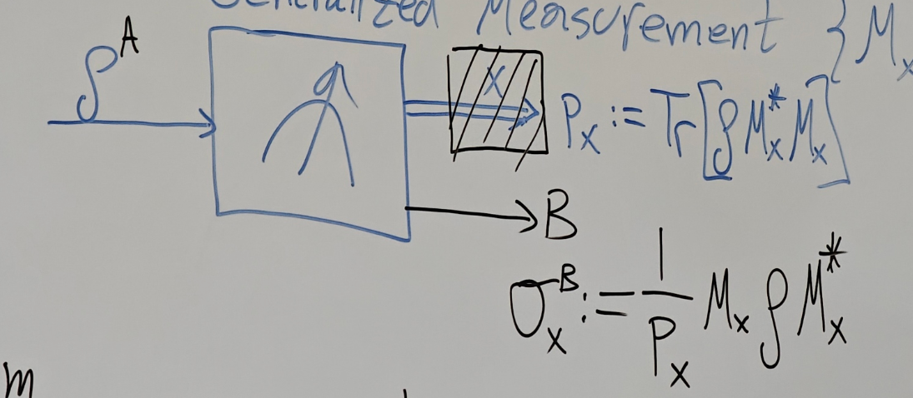
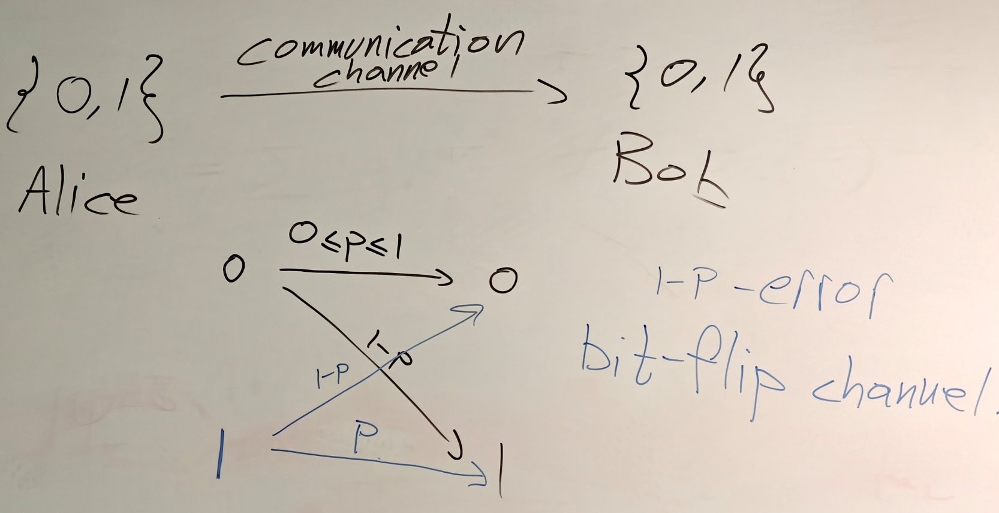

# 8.28 Operator Sum Representation

## Operator Sum Representation(Class operator)

Consider a Generalized Measurement $\{M_x\}_{x\in[m]}$ where $\sum^m_{x=1}M_x^*M_x=I$  

Block the outcome, just record probabilities

Then we forget $x$, the outcome is an ensemble:

$\sum_{x=1}^{m}p_{x}\sigma_{x}^{B}=\sum_{x}p_{x}\frac{1}{p_{x}}M_{x}\rho^{A}M_{x} ^{*}=\sum_{x}M_{x}\rho^{A}M_{x}^{*}$, then $\rho^{A}\to \sum^{m}_{x=1}M_x\rho^AM_x^*$

Above representation of a quantum channel is called the operator sum representation

Every quantum channel CPTP map can be considered as a measurement without looking at the outcome

### Theorem

A linear map $\mathcal{E}:\mathcal{L}(A)\to \mathcal{L}(B)$ is CPTP (i.e. a quantum channel) iff there exists a generalized measurement $\{M_x\}_{x\in [m]}$(satisfying $\sum^m_{x=1}M_xM^*_x=I$ automatically) such that $\forall \rho\in \mathcal{L}(A),\mathcal{E}(\rho)=\sum^{m}_{x=1}M_{x} \rho M_{x}^{*}$ (operator sum representation) where $M_x:A\to B$

Proof

$\Leftarrow$) Suppose $\mathcal{E}(\rho)=\sum^m_{x=1}M_x\rho M_x^*$ where $\{M_x\}_{x\in [m]}$ is generalized measurement

Trace preserving: $\text{Tr}[\mathcal{E(\rho)}]=\text{Tr}\left[\sum_{x}M_{x}M_{x}^{*}\rho\right]=\text{Tr} [I\rho]=\text{Tr}[\rho]$  

$\mathcal{E}$ is positive $\iff$Choi matrix $J^{AB}_\mathcal{E}=\sum_{x=1}^mJ_{\mathcal{E}_x}^{AB}$ since $\mathcal{E}=\sum^m_{x=1}\mathcal{E}_x$ and $\mathcal{E}_x(\rho):=M_x\rho M_x^*$  

It's enough to show that $J_{\mathcal{E}_x^{AB}}\geq 0$: $J_{\mathcal{E}_{x}}^{AB}=\mathcal{E_{x}}^{\tilde{A}\to B}(\Omega^{A\tilde{A}})=M _{x}|\Omega^{A\tilde{A}}\rangle\langle\Omega^{A\tilde{A}}|M_{x}^{*}\geq0$

$\Rightarrow$) Suppose $\mathcal{E}$ is a quantum channel, then $J_\mathcal{E}^{AB}\geq 0,J_\mathcal{E}^A=I^A$  

We know $J_{\mathcal{E}}^{AB}= \sum_{x=1}^{m}|\psi_{x}^{AB}\rangle\langle\psi_{x}^{AB}|$ by spectral decomposition(hermitian, diagonalizable) and absorb real eigenvalues where $|\psi_x^{AB}\rang$ are unnormalized eigenvectors

We know $|\psi_{x}^{AB}\rang=I^{A}\otimes M_{x}|\Omega^{A\tilde{A}}\rang$, we need to argue this $M_x$ is generalized measurements

Then $J_{\mathcal{E}}^{AB}=\sum_{x=1}^{m}\left(I^{A}\otimes M_{x}\right)\Omega^{A\tilde{A}} \left(I^{A}\otimes M_{x}\right)^{*}$, then $I^{A}=J_{\mathcal{E}}^{A}=\text{Tr}_{B}\left[\sum_{x=1}^{m}\left(I^{A}\otimes M_{x} \right)\Omega^{A\tilde{A}}\left(I^{A}\otimes M_{x}\right)^{*}\right]$  

$=\text{Tr}_{B}\left[\sum_{x=1}^{m}(M_{x}^{T}\otimes I)\Omega^{\tilde{B}B}(M_{x}^{T} \otimes I)^{*}\right]=\sum_{x=1}^{m}M_{x}^{T}\,\text{Tr}_{B}[\Omega^{\tilde{B}B}] (M_{x}^{T})^{*}$  
​$=\sum_{x=1}^{m}M_{x}^{T}I^{\tilde{B}}(M_{x}^{T})^{*}=\sum_{x=1}^{m}M_{x}^{T}(M_{x} ^{T})^{*}$  

Thus we have $I=\sum M^T_x\overline{M_x}\Rightarrow\bar I=\sum \overline{M}^T_x M_x\Rightarrow I=\sum M_x^*M_x$, then it's generalized measurement.

Since [this](8.22%20Quantum%20Channels%20and%20Choi%20Representation.md#20250822114136-jrnyp0h), then $\mathcal{E}\left(\rho\right)=\text{Tr}_{A}[J_{\mathcal{E}}^{AB}\left(\rho^{T}\otimes I^{B}\right)]=\sum_{x=1}^{m}\text{Tr}_{A}[\psi_{x}^{AB}\left(\rho^{T}\otimes I ^{B}\right)]$  

$=\sum_{x=1}^{m}\text{Tr}_{A}\left[(I^{A}\otimes M_{x})\Omega^{A\tilde{A}}(I\otimes M_{x})^{*}(\rho^{T}\otimes I^{B})\right]=\sum_{x=1}^{m}\text{Tr}_{A}\left[(I^{A}\otimes M_{x})\Omega^{A\tilde{A}}(\rho^{T}\otimes M_{x}^{*})\right]$  

$=\sum_{x=1}^{m}\text{Tr}_{A}\left[(I^{A}\otimes M_{x})\Omega^{A\tilde{A}}(I^{A}\otimes \rho M_{x}^{*})\right]$$=\sum_{x=1}^{m}M_{x}\text{Tr}_{A}\left[\Omega^{A\tilde{A}}\right]\rho M_{x}^{*}= \sum_{x=1}^{m}M_{x}\rho M_{x}^{*}$

### Theorem

Let $m,n\in\N,\{M_{x}\}_{x\in[m]},\{N_{y}\}_{y\in [n]}$ generalized measurements and $m\leq n$. The following statement are equivalent:

1. $\sum^{m}_{x=1}M_{x}\rho M_{x}^{*}=\sum^{n}_{y=1}N_{y}\rho N_{y}^{*}\quad \forall \rho\in \mathcal{L}(A)$
2. $\exists V:\mathbb{C}^m\to \mathbb{C}^n$ isometry $V^*V=I_m$ s.t. $N_{y}=\sum_{x=1}^{m}v_{yx}M_{x}$

Proof

$(2\Rightarrow 1)$  

$\sum_{y=1}^{n}N_{y}\rho N_{y}^{*}=\sum_{y=1}^{n}\left(\sum_{x=1}^{m}v_{yx}M_{x}\right )\rho\left(\sum_{x=1}^{m}v_{yx^{\prime}}M_{x^{\prime}}\right)^{*}=\sum_{x,x^{\prime}\in[m]} \left(\sum_{y=1}^{n}v_{yx}v_{yx^{\prime}}^{*}\right)M_{x}\rho M_{x^{\prime}}^{*}$  

$=\sum_{x,x^{\prime}\in[m]}\left(\sum_{y=1}^{n}v_{x^{\prime}y}^{*}v_{yx}\right)M_{x} \rho M_{x^{\prime}}^{*}=\sum_{x,x^{\prime}\in[m]}\left(V^*V\right)_{xx'}M_{x}\rho M_{x^{\prime}}^{*}$  

$=\sum_{x,x^{\prime}\in[m]}\left(I\right)_{xx^{\prime}}M_{x}\rho M_{x^{\prime}}^{*} =\sum_{x,x^{\prime}\in[m]}\delta_{xx^{\prime}}M_{x}\rho M_{x^{\prime}}^{*}=\sum_{x\in[m]} M_{x}\rho M_{x}^{*}$  

$(1\Rightarrow 2)$  

Since [this](#20250828120220-brqe1rh), there exists a quantum channel s.t. $\mathcal{E}(\rho)=\sum_{x=1}^{m}M_{x}\rho M_{x}^{*}$  

$J_{\mathcal{E}}^{AB}=\mathcal{E}^{\tilde{A}\to B}(\Omega^{A\tilde{A}})=\sum^{m}_{x=1} (I\otimes M_{x})\Omega^{A\tilde{A}}(I\otimes M_{x}^{*})$  

We define $|\psi_x\rang^{AB}:=(I\otimes M_x)|\Omega^{A\tilde{A}}\rang$, then $J_{\mathcal{E}}^{AB}=\sum^{m}_{x=1}|\psi_{x}\rang\lang \psi_{x}|$  

Also define $|\phi_{x}\rang^{AB}:=(I\otimes N_{y})|\Omega^{A\tilde{A}}\rang$, then $J_{\mathcal{E}}^{AB}=\sum_{x=1}^{m}|\phi_{x}\rangle\langle\phi_{x}|$  

Then $J_{\mathcal{E}}^{AB}=\sum_{x=1}^{m}|\phi_{x}\rangle\langle\phi_{x}|=\sum_{x=1}^{m} |\phi_{x}\rangle\langle\phi_{x}|$. Then since [this](../Tutorial/8.21%20Exercise.md#20250822164545-bo5j53o)

$\exists V:\mathbb{C}^m\to\mathbb{C}^n$ s.t. $|\phi_{y}^{AB}\rang =\sum^{m}_{x=1}v_{yx}|\psi_{x}^{AB}\rang$, then $|\phi_{y}^{AB}\rangle=I\otimes\left(\sum_{x=1}^{m}v_{yx}M_{x}\right)|\Omega^{A\tilde{A}} \rang$  

Also we know $|\phi_{x}\rangle^{AB}:=(I\otimes N_{y})|\Omega^{A\tilde{A}}\rangle$, then $(I\otimes N_{y})|\Omega^{A\tilde{A}}\rangle=I\otimes\left(\sum_{x=1}^{m}v_{yx}M_{x} \right)|\Omega^{A\tilde{A}}\rangle$

By theorem: $I\otimes E|\Omega\rang =I\otimes F|\Omega\rang\iff E=F$, we get $N_{y}=\sum_{x=1}^{m}v_{yx}M_{x}$

---

Proof of that theorem $I\otimes E|\Omega\rang =I\otimes F|\Omega\rang\iff E=F$

$I\otimes E|\Omega\rangle=I\otimes F|\Omega\rangle\iff I\otimes E\sum_{x=1} ^{m}|x\rangle|x\rangle=I\otimes F\sum_{x=1}^{m}|x\rangle|x\rangle$

$\iff \sum^m_{x=1}|x\rang E|x\rang=\sum^m_{x=1}|x\rang F|x\rang\iff E|x\rang =F|x\rang,\forall x\iff E=F$  

### The Quantum Bit Flip (Example 1)

$\Phi^{+} = \frac{|00\rangle + |11\rangle}{\sqrt{2}}$, $\Phi^- = \frac{|00\rangle - |11\rangle}{\sqrt{2}}$, $\Psi^{+}=\frac{|01\rangle+|10\rangle}{\sqrt{2}}$, $\Psi^{-}=\frac{|01\rangle-|10\rangle}{\sqrt{2}}$  

Because there exists noise in communication channel, then $0$ may become $1$  

$\mathcal{E}(\rho):=p\rho+(1-p)XPX=M_0\rho M_0^*+M_1\rho M_1^*$ where $X=\begin{pmatrix} 0&1\\1&0 \end{pmatrix}$, $M_0=\sqrt{p}I$ and $M_1=\sqrt{1-p}X$  

We can check that $\sum_{x=1}^2M_x^*M_x=I$, thus $M$ is a generalized measurement

Then $J_{\mathcal{E}}^{AB}=(I\otimes M_{0})\Omega^{A\tilde{A}}(I\otimes M_{0})^{*}+(I\otimes M_{1})\Omega^{A\tilde{A}}(I\otimes M_{1})^{*}$  

$I\otimes M_{0}|\Omega^{A\tilde{A}}\rangle=\sqrt{P}|\Omega^{AB}\rangle=\sqrt{2}\sqrt{P} |\Phi_{+}^{AB}\rangle$  

$I \otimes M_{1}|\Omega^{A\tilde{A}}\rangle = \sqrt{1-P}(I \otimes X)|\Omega^{A\tilde{A}} \rangle = \sqrt{2}\sqrt{1-P}|\Psi_+^{AB}\rang$ since $(I\otimes X)|\Omega^{A\tilde{A}}\rangle=(I\otimes X)(|00\rangle+|11\rangle)$ $= |0\rang X|0\rang + |1\rang X|1\rang$ $=|0\rangle|1\rangle+|1\rangle|0\rangle$ $=\sqrt{2}|\Psi_{+}\rangle$  

Thus $J_{\mathcal{E}}^{AB}= 2p\Phi_{+}^{AB}+ 2(1-p) \Psi_{+}^{AB}$  

### The Depolarizing Channel

$\mathcal{E}(\rho)=\frac{1}{2}p\text{Tr}[\rho]I^{A}+(1-p)\rho$  where $p\in[0,1]$, $A = \mathbb{C}^2$, $\rho\in \mathfrak{D}(A)$ and $I^A = \begin{bmatrix} 1 & 0 \\ 0 & 1 \end{bmatrix}$

$M_{0}= \sqrt{1 - \frac{3p}{4}}I$ and $M_{x}= \frac{\sqrt{p}}{2}\sigma_{x}$ for $x = 1, 2, 3$ where $\sigma_1, \sigma_2, \sigma_3$- Pauli matrices$\sum_{x=0}^{3}M_{x}^{*}M_{x}=\sum_{x=0}^{3}M_{x}^{2}=(1-\frac{3p}{4})I+\frac{p}{4} (\sigma_{1}^{2}+\sigma_{2}^{2}+\sigma_{3}^{2})=(1-\frac{3p}{4})I+\frac{3p}{4}I=I$  

$\sum_{x=0}^{3}M_{x}\rho M_{x}^{*}=(1-\frac{3p}{4})\rho+\frac{p}{4}(\sigma_{1}\rho \sigma_{1}+\sigma_{2}\rho\sigma_{2}+\sigma_{3}\rho\sigma_{3})$ 也可以设出$\rho$然后死算  
Then we claim: $\Lambda=\sum_{x=0}^{3}\sigma_{x}\rho\sigma_{x}=2I_{2}\operatorname{\mathrm{tr}}( \rho)$  
Then $\sum_{x=0}^{3}M_{x}\rho M_{x}^{*}=(1-\frac{3p}{4})\rho+\frac{p}{4}\left(2I-\rho\right )=\frac{p}{2}I+\left(1-p\right)\rho=\mathcal{E}(\rho)$ since $\text{Tr}[\rho]=1$  

$J_{\mathcal{E}}^{AB}=(I\otimes M_{0})\Omega^{A\tilde{A}}(I\otimes M_{0})^{*}+\sum _{x=1}^{3}(I\otimes M_{x})\Omega^{A\tilde{A}}(I\otimes M_{x})^{*}$  

$I\otimes M_{0}|\Omega^{A\tilde{A}}\rangle=I\otimes M_{0}\cdot\sum_{x=0}^{1}|xx\rangle =\sum_{x=0}^{1}|x\rangle M_{0}|x\rangle=\sum_{x=0}^{1}|x\rangle\sqrt{1-\frac{3p}{4}} I|x\rangle=\sqrt{1-\frac{3p}{4}}|\Omega^{A\tilde{A}}\rangle=\sqrt{2-\frac{3p}{2}} |\Phi_{+}\rangle$  

$I\otimes M_{x}|\Omega^{A\tilde{A}}\rangle=I\otimes M_{x}\cdot\sum_{x^{\prime}=0} ^{1}|x^{\prime}x^{\prime}\rangle=\sum_{x^{\prime}=0}^{1}|x^{\prime}\rangle M_{x}| x^{\prime}\rangle=\sum_{x^{\prime}=0}^{1}|x^{\prime}\rangle\frac{\sqrt{p}}{2}\sigma _{x}|x^{\prime}\rangle=\frac{\sqrt{p}}{2}\sum_{x^{\prime}=0}^{1}|x^{\prime}\rangle \sigma_{x}|x^{\prime}\rangle$

$I\otimes M_{1}|\Omega^{A\tilde{A}}\rangle=\frac{\sqrt{p}}{2}\left(|01\rangle+|10 \rangle\right)=\sqrt{\frac{p}{2}}|\Psi_{+}\rangle$, $I\otimes M_{2}|\Omega^{A\tilde{A}}\rangle=i\sqrt{\frac{p}{2}}|\Psi_{-}\rang$, $I\otimes M_{3}|\Omega^{A\tilde{A}}\rangle=\sqrt{\frac{p}{2}}|\Phi_-\rang$  

Then $J_{\mathcal{E}}^{AB}=\left(2-\frac{3p}{2}\right)\Phi_{+}+\frac{p}{2}\left(\Psi_{+} +\Psi_{-}+\Phi_{-}\right)$  

---

Proof of $\Lambda=\sum_{x=0}^{3}\sigma_{x}\rho\sigma_{x}=2I_{2}\operatorname{\mathrm{tr}}( \rho)$  

Let $\sigma_{x'}\Lambda\sigma_{x'}=\Lambda$, because $\sigma_{x^{\prime}}\Lambda\sigma_{x^{\prime}}=\sum_{x=0}^{3}\sigma_{x^{\prime}}\sigma _{x}\rho\sigma_{x}\sigma_{x^{\prime}}=\sum_{x''=0}^{3}\sigma_{x''}\rho\sigma_{x''}=\Lambda$

Then $\sigma_{x^{\prime}}\Lambda\sigma_{x^{\prime}}\cdot\sigma_{x^{\prime}}=\Lambda\cdot \sigma_{x^{\prime}}\Rightarrow\sigma_{x^{\prime}}\Lambda=\Lambda\sigma_{x^{\prime}}$

Then $\left(\sum t_{x^{\prime}}\sigma_{x^{\prime}}\right)\Lambda=\sum t_{x^{\prime}}\Lambda \sigma_{x^{\prime}}\Rightarrow\left(\sum t_{x^{\prime}}\sigma_{x^{\prime}}\right) \Lambda=\Lambda\sum t_{x^{\prime}}\sigma_{x^{\prime}}\Rightarrow H\Lambda=\Lambda H,\forall H$

Assume $\Lambda = a_{0} I + a_{1} X + a_{2} Y + a_{3} Z$  
$[\Lambda,X]=0 \;\Rightarrow\; a_2 [Y,X] + a_3 [Z,X] = 0 \;\Rightarrow\; 2i(a_2 Z - a_3 Y)=0 \;\Rightarrow\; a_2=a_3=0,$  
$[\Lambda,Y]=0 \;\Rightarrow\; a_1 [X,Y] = 2i a_1 Z = 0 \;\Rightarrow\; a_1=0.$  
Hence $\Lambda = a_0 I$. Writing $c:=a_0$, we get $\Lambda = c\,I_{2}$  
$\operatorname{\mathrm{tr}}(\Lambda)=\sum_{a=0}^{3}\operatorname{\mathrm{tr}}(\sigma _{a}\rho\sigma_{a})=\sum_{a=0}^{3}\operatorname{\mathrm{tr}}(\rho)=4\operatorname{\mathrm{tr}} (\rho)\quad\Rightarrow\quad\operatorname{\mathrm{tr}}(cI_{2})=2c=4\operatorname{\mathrm{tr}} (\rho)\Rightarrow c=2\operatorname{\mathrm{tr}}(\rho)$  
So $\Lambda=2\operatorname{\mathrm{tr}}(\rho)I_{2}$

**H.W.**  Show that for every Unitary matrix $\mathcal{E}(U\rho U^{*}) = U\mathcal{E}(\rho)U^{*}$ where $\mathcal{E}$ is depolarizing channel

Proof

$\mathcal{E}(U\rho U^{*})=\frac{1}{2}U\rho U^{*}\text{Tr}[U\rho U^{*}]I^{A}+(1-p) \left(U\rho U^{*}\right)=\frac{1}{2}U\rho U^{*}\text{Tr}[\rho]I^{A}+(1-p)\left(U\rho U^{*}\right)=U\left(\frac{1}{2}\rho\text{Tr}[\rho]I^{A}+(1-p)\rho\right)U^{*}=U\mathcal{E} (\rho)U^{*}$

**H.W.**  $(U \otimes \bar{U}) J_{\varepsilon}^{AB}(U \otimes \bar{U})^{*} = J_{\varepsilon} ^{AB}$ $\forall$Unitary matrices $U$  

Proof

Since $J_{\mathcal{E}}^{AB}=\left(2-\frac{3p}{2}\right)\Phi_{+}+\frac{p}{2}\left(\Psi_{+} +\Psi_{-}+\Phi_{-}\right)$, then $(U\otimes\bar{U})J_{\varepsilon}^{AB}(U\otimes\bar{U})^{*}=(U\otimes\bar{U})J_{\varepsilon} ^{AB}(U^{*}\otimes U^{t})$  

$=(U\otimes\bar{U})\left(\left(2-\frac{3p}{2}\right)\Phi_{+}+\frac{p}{2}\left(\Psi _{+}+\Psi_{-}+\Phi_{-}\right)\right)(U^{*}\otimes U^{t})$

To see it equals $J_\mathcal{E}^{AB}$, we just to see $(U\otimes\bar{U})\Phi_{+}(U^{*}\otimes U^{t})=\Phi_{+}$

$(U\otimes\bar{U})\Phi_{+}(U^{*}\otimes U^{t})=(I\otimes U^{t}\bar{U})\frac{|00\rangle+|11\rangle}{\sqrt{2}} (I\otimes\bar{U}U^{t})=(I\otimes I)\frac{|00\rangle+|11\rangle}{\sqrt{2}}(I\otimes I)=\Phi_{+}$

The same as $\Psi_{+},\Psi_{-},\Phi_{-}$, thus $(U \otimes \bar{U}) J_{\varepsilon}^{AB}(U \otimes \bar{U})^{*} = J_{\varepsilon} ^{AB}$ 

‍

‍

‍

‍
