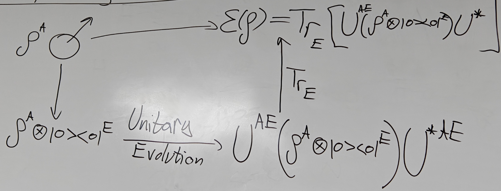
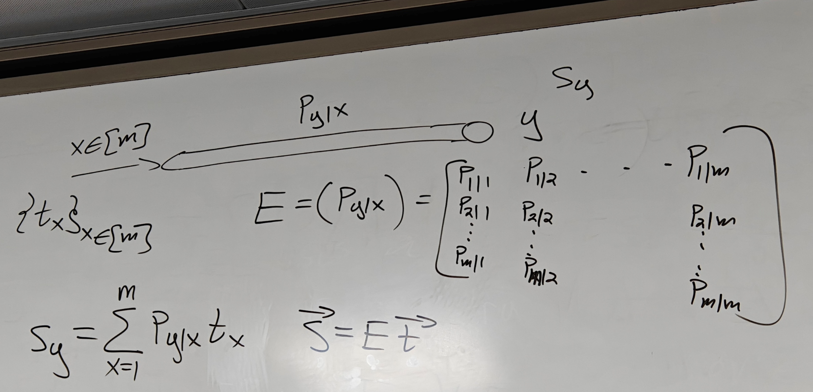
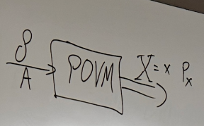

# 8.29 Dilation Theorem and Examples of Channels

## Stinespring's Dilation Theorem

Every quantum channel is a unitary evolution when restrict to the subsystem(Trace the environment)

The environment can be mixed state, but it can be purified in large system

Given $V:A\to AE\quad V^*V=I^A\quad V:=U(I^A\otimes |0\rang^E)\quad V|\psi\rang:=U(|\psi\rang^A|0\rang^E)$

Note that we denote $\mathcal{E}(\rho)=\text{Tr}_{E}[V\rho V^{*}]$ where $V\rho V^{*}=U^{AE}(\rho^{A}\otimes|0\rangle\langle0|^{E})U^{*AE}$  

### Theorem

Given $\mathcal{E}\in \mathcal{L}(A\to B)$. $\mathcal{E}$ is a CPTP (i.e. Quantum Channel) iff $\exists E$ (Hilbert space) with $|E|\leq |AB|$ and an Stinespring's isometry $V:A\to BE$ s.t. $\mathcal{E}(\rho)=\text{Tr}_{E}[V\rho V^{*}],\forall \rho\in\mathcal{L}(A)$

Proof

$\Leftarrow$) Suppose $\mathcal{E}(\rho)=\text{Tr}_{E}[V\rho V^{*}]$  
Trace Preserving: $\text{Tr}[\mathcal{E}(\rho)]=\text{Tr}[V\rho V^*]=\text{Tr}[V^*V\rho]=\text{Tr}[\rho]$  
Complete Positive: $\mathcal{E}(\rho)=\sum_{z=1}^{|E|}\underbrace{\lang^E z|V}_{M_z}\rho \underbrace{V^*|z\rang^E} _{M_z^*}$ where $V^{*}: BE \rightarrow A$, $M_{z}^{*}:=V^{*}\left(I^{B}\otimes|z\rangle^{E}\right)$, $M_{z}^{*}: B \rightarrow A$ and $M_{z}^{*}|\psi_{B}\rangle:=V^{*}|\psi_{B}\rangle|z\rangle$  

Then $\mathcal{E}(\rho)=\sum_{z=1}^{|E|}M_{z}\rho M_{z}^{*}$, this is complete positive since [this](8.28%20Operator%20Sum%20Representation.md#20250828120220-rkj5wc7)

---

$\mathcal{E}(\rho) = \sum_{z=1}^{|E|} M_z \rho M_z^*$is TP iff $\sum M_{z}^{*} M_{z} = I^{A}$ and $\sum_{z=1}^{|E|} M_z^* M_z = \sum_{z=1}^{|E|} V^* |z\rangle^E \langle z|^E V = V^* \left( \sum_z |z\rangle \langle z|^E \right) V = V^* V = I$  
​$J_{\mathcal{E}}^{AB}=\sum(I\otimes M_{z})\Omega^{A\tilde{A}}(I\otimes M_{z}^{*}) \ge0$ CP

$\Rightarrow$) Suppose $\mathcal{E}$ is CPTP, then since [this ](8.28%20Operator%20Sum%20Representation.md#20250828120220-brqe1rh)we have $\mathcal{E}(\rho)=\sum_{z=1}^{m}M_{z}\rho M_{z}^{*}$ and $\sum_{z=1}^{m}M_{z}^{*}M_{z}=I^{A}$ where $E:=\mathbb{C}^m$

We define $V:A\to BE$, $V:=\sum^{m}_{z=1}M_{z}\otimes |z\rang^{E}$ and $V|\psi^A\rang =\sum_z\underbrace{M_z|\psi^A\rang}_{\in B} |z\rang^E$  

Then we need to check $V$ is isometry: $V^*V=$  

$=\sum_{z,z'\in[m]}M_z^* M_{z'}\underbrace{\lang z|z'\rang}_{\delta_{zz'}}=\sum_{z\in [m]}M_z^*M_z=I^A$  

Then $\text{Tr}_{E}[V\rho V^{*}]=\sum_{z=1}^{m}\underbrace{\langle^{E}z|V}_{M_{z}}\rho \underbrace{V^{*}|z\rangle^{E}}_{M_{z}^{*}}=\sum_{z=1}^{m}M_{z}\rho M_{z}^{*}$ since $V^{*}|z\rangle^{E}=\sum_{z^{\prime}=1}^{m}M_{z^{\prime}}^{*}\otimes\left\langle z^{\prime}|z\right\rangle^{E}=M_{z}^{*}$

### Example

$\mathcal{E}(\rho)=\frac{p}{2}\text{Tr}[\rho]I+(1-p)\rho=\sum_{z=0}^3M_z\rho M_z$ where $M_{0}= \sqrt{1 - \frac{3p}{4}}I$ and $M_{x}= \frac{\sqrt{p}}{2}\sigma_{x}$ for $x = 1, 2, 3$

Since [this](#20250829105441-tlk75m5), we can define $V=\sqrt{1-\frac{3p}{4}}I\otimes |0\rang^{E}+\frac{\sqrt{p}}{2}(\sigma_{1}\otimes \ket{1}+\sigma_{2}\otimes \ket{2}+\sigma_{3}\otimes \ket{3})$  

One way: calculate for example $\bra{00}V\ket{0}=\sqrt{1-\frac{3p}{4}}$ to get the entry

Another: Direct expand

$$
V=\left(
\begin{array}{cc}
	\sqrt{1-\frac{3p}{4}} &     0                  \\
	0                     & \frac{\sqrt{p}}{2}    \\
	0                     & -i\frac{\sqrt{p}}{2}  \\
	\frac{\sqrt{p}}{2}    & 0                     \\
	0                     & \sqrt{1-\frac{3p}{4}} \\
	\frac{\sqrt{p}}{2}    & 0                     \\
	i\frac{\sqrt{p}}{2}   & 0                     \\
	0                     & -\frac{\sqrt{p}}{2}
\end{array}\right)
$$

Column sums to one, thus this is column stochastic matrix

### The Completely Dehasing Channel

$\Delta\in CPTP(A\to A)$ and $\Delta(\rho):=\sum_{x=1}^{|A|}\mathinner{\langle{x}|}\rho\mathinner{|{x}\rangle} \mathinner{|{x}\rangle}\mathinner{\langle{x}|}=\sum_{x=1}^{|A|}\underbrace{\ket{x}\bra{x}} _{M_x}\rho \underbrace{\ket{x}\bra{x}}_{M_x^*}$ where $\rho= \begin{pmatrix} 	\rho_{11} & \rho_{12} & -      & - \\ 	\rho_{21} & \rho_{22} & -      & - \\ 	\vdots    & \vdots    & \ddots &   \\ 	          &           &        & \end{pmatrix}$ and $\Delta(\rho)= \begin{pmatrix} 	\rho_{11} &           &        & \placeholder{} \\ 	          & \rho_{22} &        & \placeholder{} \\ 	          &           & \ddots & \placeholder{} \\ 	          &           &        & \rho_{dd} \end{pmatrix}$  
And it's idempotent: $\Delta\circ \Delta=\Delta$  

### Classical Channel

$\mathcal{E}\in CPTP(A\to A)$ is called a classical channel if $\Delta\circ \mathcal{E}\circ \Delta=\mathcal{E}$

We only consider the diagonal input since $\Delta$ is completely Dehasing Channel.

$\sigma:=\mathcal{E}(\rho)=\mathcal{E}\left(\sum^{d}_{x=1}t_{x}|x\rang\lang x|\right )=\sum^{d}_{x=1}t_{x}\mathcal{E}(\ket{x}\bra{x})$ where $\rho = \begin{pmatrix} 	t_{1} &       & 0     \\ 	      & \ddots &       \\ 	0     &       & t_{d} \end{pmatrix}$

Then $\sigma$ is also diagonal since $\mathcal{E}(\rho)=\Delta(\mathcal{E}(\rho))$ by definition

Then $\sum_{y=1}^{d} S_{y}|y\rangle\langle y| = \sum_{x=1}^{d} t_x \mathcal{E}(|x\rangle\langle x|)$, then after multiply $\bra{y'},\ket{y'}$ on both sides, we get $S_{y}=\sum_{x=1}^{d}t_{x}\underbrace{\langle y|\mathcal{E}(|x\rangle\langle x|)|y\rangle} _{p_{y|x}}$ where $p_{y|x}:= \langle y|\mathcal{E}(|x\rangle\langle x|)|y\rangle$

This satisfy $\vec{S} = E\vec{t}$. Also $\Delta(\sigma)=\sigma$

### POVM Channel

$\mathcal{E} \in CPT P(A \to A)$ is a POVM channel if $\mathcal{E} = \Delta \circ \mathcal{E}$ where POVM: $\{\Lambda_{x}\}_{x \in [m]}, \sum_{x} \Lambda_{x} = I$  

$\mathcal{E}(\rho)=\Delta\circ\mathcal{E}(\rho)=\sum_{x=1}^{m}\langle x|\mathcal{E} (\rho)|x\rangle|x\rangle\langle x|=\sum_{x=1}^{m}\text{Tr}\left[|x\rangle\langle x|\mathcal{E}(\rho)\right]|x\rangle\langle x|$  

$=\sum_{x=1}^{m}\text{Tr}\left[ \mathcal{E}^{*}(|x\rangle \langle x|) \rho \right ] |x\rangle \langle x|$ since $\text{Tr}\left[|x\rangle\langle x|\mathcal{E}(\rho)\right]=\langle|x\rangle\langle x|,\mathcal{E}(\rho)\rangle_{HS}=\langle\mathcal{E^{*}}(|x\rangle\langle x|),\rho \rangle_{HS}=\text{Tr}[\mathcal{E}^*(|x\rangle\langle x|)\rho]$ the last step since $\mathcal{E}^{*}(|x\rang\lang x|)\geq 0$(exercise in moodle), then it's output is positive, then hermitian, then the adjoint vanished.

Let $\Lambda_{x}:=\mathcal{E}^{*}(\ket{x}\bra{x})$, then $\mathcal{E}(\rho)=\sum_{x=1}^{m}\text{Tr}[\Lambda_{x}\rho]\ket{x}\bra{x}$  

And $\sum_{x=1}^{m}\Lambda_{x}= \sum_{x=1}^{m}\mathcal{E}^{*}(\ket{x}\bra{x}) = \mathcal{E} ^{*}(\sum_{x}\ket{x}\bra{x}) = \mathcal{E}^{*}(I) = I$ since $\mathcal{E}$ is trace preserving, then $\mathcal{E}^*$ is unital, take identity to identity(exercise in moodle)
