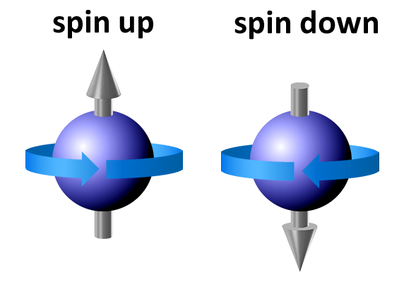
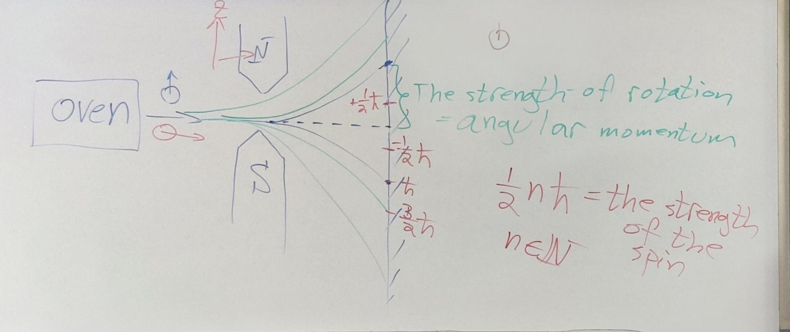
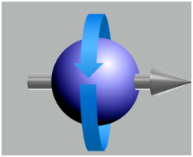
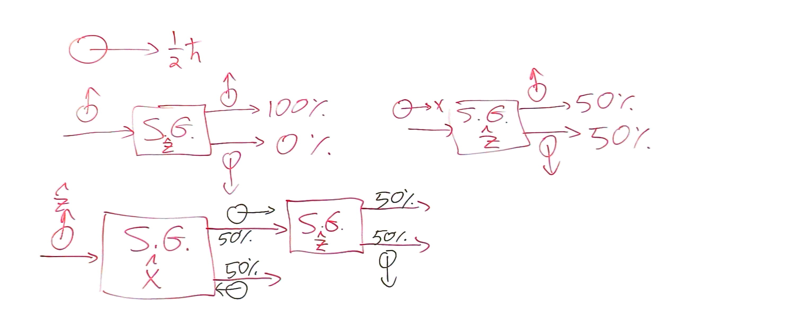
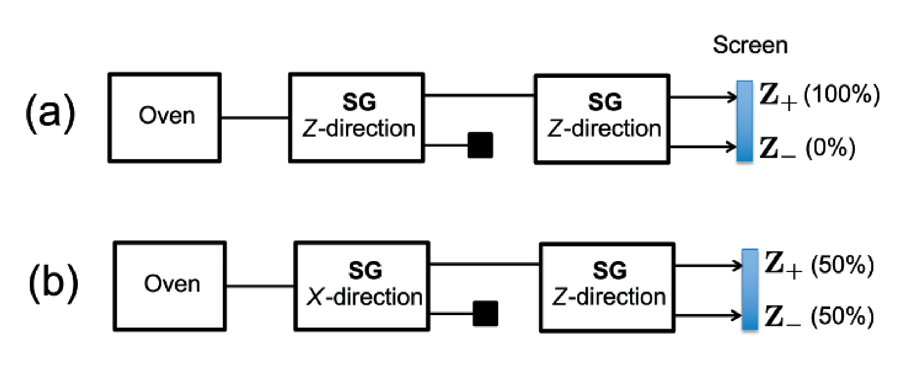

# 8.5 Postulates and Qubit

## Quantum Theory

It doesn't matter how do we represent and implement the $0$ and $1$, in principle, such as the head and the tail of a coin.

Here, we implement them by the spin of electron to code $0$ and $1$

### Two statuses of electron

There are two status: Spin up $\rightarrow$ $0$ and Spin down $\rightarrow$ $1$

### The behavior of quantum particles

Extremely tiny, we need to measure them by experiment.

#### The Stern-Gerlach(SG) experiment

The electrons are always spinning in quantum particles.

The magnets are in the direction $z$

There is no particles between mid and $\pm\frac{1}{2}\hbar$.

This behavior indicates that the angular momentum of the particles takes only discrete values.

There are two implications:

1. Electrons always hit $\pm\frac{1}{2}\hbar$
2. Secondly, all electrons hit the screen in the same two areas, irrespective of their initial spin direction.

   Even if an electron’s initial spin is pointing in the x-direction, it still hits the screen in the same two areas shows that measuring the spin in one direction affects its value in another direction(Like measure the spin in $x$ affects the value in $z$).

---

We can rotate a spin up electron to $x$-axis: 

In that experiment, it still hits $\frac{1}{2}\hbar$

The probability will increase of spin up when it gets close to spin up, vice versa.

- For (a)

  An electron’s spin remains unchanged by a measurement in the same direction.

  After an electron’s spin has been measured, it remains intact by further measurements in the same direction.
- For (b)

  The first SG box measures spin in the x-direction, resulting in the complete loss of information about the electron’s spin in the z-direction.

  This shows that the spin in different directions of a quantum particle is not fully determined by its spin in one particular direction, and that measurements of spin along different axes can yield nontrivial and unexpected results.

Any measurement of one quantity necessarily disturbs the other

##### Conclusion

If a particle’s spin is known to be pointing in the positive z-direction, then a measurement in the x- or y-directions will erase all knowledge about its spin in the z-direction, irrespective of which measurement apparatus is employed.

Therefore, it is the knowledge of the spin in one direction that prevents its knowledge in another orthogonal direction. This phenomenon is a special instance of the uncertainty principle.

## Postulate 1

To any physical system, there is a (separable) Hilbert space that is associated with the system.

And the information about the system is completely described by quantum state.

Isolated system is described by pure state.

## The Quantum Bit(Qubit)

Since the spin of electrons has two statuses, thus we consider $A=\mathbb{C}^2$ which is $2$-dimension

If the spin of electron points in $z$ direction, we denote it by pure state: $|0\rang\lang0|$

Notation: $|\uparrow_z\rang:=|0\rang\in\mathbb{C}^{2}$

### Question: How do we express the spin in all other directions

More generally, we use unit vector $\hat{n}\in\R^{3}$ and $|\uparrow_{\hat n}\rang =\begin{pmatrix} a\\b \end{pmatrix}$  

Let $R_{\theta}^{(\hat n)}$ be rotation $3\times 3$ matrix by an angle $\theta$ along the axis determined by $\hat n\in\R^3$

It need to be orthogonal: $\left(R_{\theta}^{(\hat n)}\right)^{T}R_{\theta}^{(\hat n)}=I_3$ and $\det \left(R_{\theta}^{(\hat n)}\right)=1$  

And $T_{\theta}^{\hat n}$ is a rotation of the space

It need to be unitary: $\left(T_{\theta}^{\hat n}\right)^*T_{\theta}^{\hat n}=I_{2}$ and $\det\left(T_{\theta}^{\hat n}\right)=1$  

|$A=\mathbb{C}^2$|$\R^3$|
| :--: | :--: |
|$\|0\rang=\begin{pmatrix} 1\\0 \end{pmatrix}$|$\hat z$|
|$T_{\theta}^{\hat n}\|0\rang$|$R_{\theta}^{\hat n}\cdot \hat z\quad e.g.(R_{\frac{\pi}{2}}^{(\hat y)}\hat z=\hat x)$|
|$T_{\theta}^{\hat z}\|0\rang\lang 0\|(T_{\theta}^{\hat z})^{*}=\|0\rang\lang 0\|$|$R^{\hat z}_\theta\hat z=\hat z$|

The third line is because it is unitary, then $T_{\theta}^{\hat z}|0\rang\lang 0|(T_{\theta}^{\hat z})^{*}=|0\rang\lang 0|$(preserve the norm)

---

Then we need to find $T_{\theta}^{\hat{n}}$ s.t. $T_{\theta}^{\hat{n}}|0\rangle$ corresponding to the spin in the direction $R_{\theta}^{\hat{n}}\cdot\hat{z}$  

Any unitary $2\times 2$ matrix can be written as $U= \begin{pmatrix} 	a       & b      \\ 	-\bar b & \bar a \end{pmatrix}$ with $\det U=|a|^{2}+|b|^{2}=r_{0}^{2}+r_{1}^{2}+r_{2}^{2}+r_{3}^{2}=1$ where $a,b\in\mathbb{C}$  

Let $a=r_0+ir_3,b=r_2+ir_1$ where $r_0,r_1,r_2,r_3\in \R$

Then $U= \begin{pmatrix} 	r_{0}+ir_{3}  & r_{2}+ir_{1} \\ 	-r_{2}+ir_{1} & r_{0}-ir_{3} \end{pmatrix}=\begin{pmatrix} r_0&0\\ 0&r_0 \end{pmatrix}+\begin{pmatrix} 0&r_2\\ -r_2&0 \end{pmatrix}+\begin{pmatrix} ir_3&0\\ 0&-ir_3 \end{pmatrix}+\begin{pmatrix} 0&ir_1\\ ir_1&0 \end{pmatrix}$

Then $U=r_{0}I+i(r_{1}\sigma_{1}+r_{2}\sigma_{2}+r_{3}\sigma_{3})$ where $\sigma_{0},I： \begin{pmatrix} 	1 & 0 \\ 	0 & 1 \end{pmatrix}$, $\sigma_{1}： \begin{pmatrix} 	0 & 1 \\ 	1 & 0 \end{pmatrix}$, $\sigma_{2}: \begin{pmatrix} 	0 & -i \\ 	i & 0 \end{pmatrix}$, $\sigma_{3}: \begin{pmatrix} 	1 & 0  \\ 	0 & -1 \end{pmatrix}$  

We call $r_{1}\sigma_{1}+r_{2}\sigma_{2}+r_{3}\sigma_{3}=\vec r\cdot \vec \sigma=\hat n\cdot \vec \sigma=\vec n\cdot\vec \sigma$, note that this is not dot product, just notation

Here $\hat n:=\frac{1}{\sqrt{1-r_0^2}}(r_1,r_2,r_3)$, let $r_0=\cos\theta$, then we get the formula:

$$
U=\cos\theta \cdot I+i\sin\theta\cdot\hat n\cdot \vec \sigma
$$

In short, $U=e^{i\theta\hat n \cdot\vec\sigma}$(Taylor series to prove it)

Proof

$e^x = \sum_{K=0}^{\infty} \frac{1}{K!} x^K$, then $e^{i\theta\hat{n}\cdot\vec{\sigma}} = \sum_{K=0}^{\infty} \frac{1}{K!} (i\theta\hat{n}\cdot\vec{\sigma})^K$  

And clearly $(\hat{n} \cdot \vec{\sigma})^2 = I$, also $(\hat{n} \cdot \vec{\sigma})^K = I_2 \text{ if } K \text{ is even.}$

Then we just expand it to see they are equal

Then if we want to represent the rotation we need to put $T_{\hat \theta}^{(\hat n)}=e^{-\frac{1}{2}i\theta\hat n \cdot\vec\sigma}$
