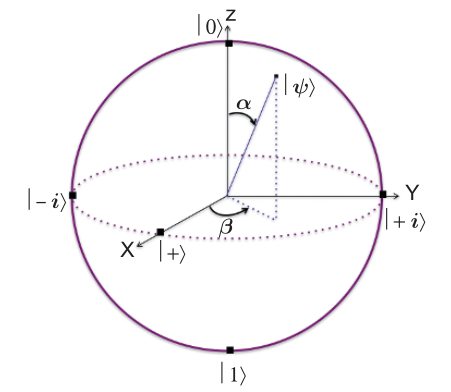
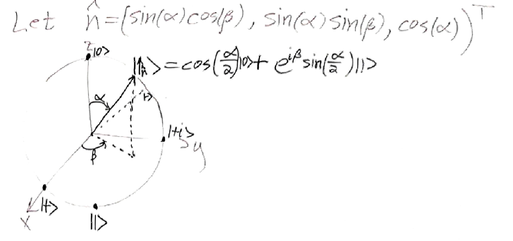

# 8.7 Observables and Von-Neumann Projective Measurements

#### Example of Qubit

Let $|0\rangle = |\uparrow_z\rangle$, $|1\rangle = |\downarrow_z\rangle$  
Then by formula, $|\uparrow_{x}\rangle = T^{\hat{y}}_{\pi/2}|0\rangle$, just like $\hat{x}=R^{(\hat{y})}_{(\pi/2)}\hat{z}$  
$=T_{\pi/2}^{\hat{y}}|\uparrow_{z}\rangle=e^{-i\frac{\pi}{2}\hat{y}\cdot\vec{\sigma}} |0\rangle=e^{-i\frac{\pi}{4}\sigma_2}|0\rangle$ since $\hat{y}=(0,1,0)$ and $\vec{\sigma}=(\sigma_1, \sigma_2, \sigma_3)$  
$= (\cos(\frac{\pi}{4})I - i\sin(\frac{\pi}{4})\sigma_2)|0\rangle = \left[\frac{\sqrt{2}}{2}I - i\frac{\sqrt{2}}{2}\begin{pmatrix} 0 & -i \\ i & 0 \end{pmatrix}\right]|0\rangle$  
$= \frac{\sqrt{2}}{2}\left(\begin{pmatrix} 1 & 0 \\ 0 & 1 \end{pmatrix} - \begin{pmatrix} 0 & 1 \\ -1 & 0 \end{pmatrix}\right)\begin{pmatrix} 1 \\ 0 \end{pmatrix}$  
$= \frac{\sqrt{2}}{2}\begin{pmatrix} 1 & -1 \\ 1 & 1 \end{pmatrix}\begin{pmatrix} 1 \\ 0 \end{pmatrix} = \frac{\sqrt{2}}{2} \times \begin{pmatrix} 1 \\ 1 \end{pmatrix} = \frac{1}{\sqrt{2}}(|0\rangle+|1\rangle)$

##### Conclusion

$|\uparrow_x\rangle = |+\rangle := \frac{1}{\sqrt{2}}(|0\rangle+|1\rangle)$, in a same way,   
​$|\downarrow_x\rangle = T^{\hat{y}}_{-\pi/2}|\uparrow_z\rangle = |-\rangle := \frac{1}{\sqrt{2}}(|0\rangle-|1\rangle)$  
​$|\uparrow_y\rangle = T^{\hat{x}}_{-\pi/2}|\uparrow_z\rangle = |+i\rangle := \frac{1}{\sqrt{2}}(|0\rangle+i|1\rangle)$  
​$|\downarrow_y\rangle = T^{\hat{x}}_{\pi/2}|\uparrow_z\rangle = |-i\rangle := \frac{1}{\sqrt{2}}(|0\rangle-i|1\rangle)$  

#### Generally

Let $\hat{n}=(\sin\alpha\cos\beta, \sin\alpha\sin\beta, \cos\alpha)^{T}, \underbrace{S_{\hat{n}}} _{\text{the spin matrix}}: = \frac{1}{2}\hat{n}\cdot\vec{\sigma}, T^{(\hat{n})}_{\theta} = e^{-i\theta S_{\hat{n}}}$  

If $|\psi\rangle$ represents a spin in the $\hat{n}$ direction, then $T^{(\hat{n})}_\theta|\psi\rangle\langle\psi|(T^{(\hat{n})}_\theta)^* = |\psi\rangle\langle\psi|$  
(spin in its own direction, doesn't change the state)

---

Also, $T^{(\hat{n})}_\theta$ is diagonalizable, then $T^{(\hat{n})}_\theta|\psi\rangle = e^{i\lambda}|\psi\rangle$ (eigen equation)  
Then $e^{-i\theta S_{\hat{n}}}|\psi\rangle = e^{i\lambda}|\psi\rangle$

Also $S_{\hat{n}}$ is diagonalizable, then $S_{\hat{n}}|\psi\rangle=\mu|\psi\rangle$  
Then $e^{-i\theta S_{\hat{n}}}|\psi\rangle = \sum \frac{1}{k!}(-i\theta)^{k} S_{\hat{n}} ^{k} |\psi\rangle = e^{-i\frac{\theta}{2}}|\psi\rangle$ since $(f(S_n)|\psi\rangle=f(\mu)|\psi\rangle)$

We are trying to do $f(S_n) = f(\sum \lambda_x|x\rangle\langle x|) = \sum f(\lambda_x)|x\rangle\langle x|$ where $f(x)=e^{-i\theta x}$

**Homework 1**: Prove:

1. $S_{\hat{n}}^2=\frac{1}{4}I$  

   Proof

   $S_{\hat{n}} = \frac{1}{2}\hat{n}\cdot\vec{\sigma} = \frac{1}{2}(\sin\alpha\cos\beta, \sin\alpha\sin\beta, \cos\alpha)^T(\sigma_1, \sigma_2, \sigma_3)$  
   ​$= \frac{1}{2}(\sin\alpha\cos\beta\begin{pmatrix} 0 & 1 \\ 1 & 0 \end{pmatrix} + \sin\alpha\sin\beta\begin{pmatrix} 0 & -i \\ i & 0 \end{pmatrix} + \cos\alpha\begin{pmatrix} 1 & 0 \\ 0 & -1 \end{pmatrix})$  
   ​$= \frac{1}{2}\left[ \begin{pmatrix} 	0                   & \sin\alpha\cos\beta \\ 	\sin\alpha\cos\beta & 0 \end{pmatrix} + \begin{pmatrix} 	0                    & -i\sin\alpha\sin\beta \\ 	i\sin\alpha\sin\beta & 0 \end{pmatrix} + \begin{pmatrix} 	\cos\alpha & 0           \\ 	0          & -\cos\alpha \end{pmatrix}\right]$  
   ​$= \frac{1}{2}\begin{pmatrix} \cos\alpha & \sin\alpha\cos\beta - i\sin\alpha\sin\beta \\ \sin\alpha\cos\beta + i\sin\alpha\sin\beta & -\cos\alpha \end{pmatrix}$  
   Then $(S_{\hat{n}})^2 = \frac{1}{4}\begin{pmatrix} \cos\alpha & \sin\alpha\cos\beta - i\sin\alpha\sin\beta \\ \sin\alpha\cos\beta + i\sin\alpha\sin\beta & -\cos\alpha \end{pmatrix}^2$  
   ​$= \frac{1}{4}\begin{pmatrix} \cos^2\alpha + \sin^2\alpha\cos^2\beta + \sin^2\alpha\sin^2\beta=1 & 0 \\ 0 & 1 \end{pmatrix} = \frac{1}{4}I$  
   Since $\hat{n}=(\sin\alpha\cos\beta, \sin\alpha\sin\beta, \cos\alpha)^{T}$, $||\hat{n}||=1$

2. The eigenvalues of $S_{\hat{n}}$ are $\pm\frac{1}{2}$  

   Proof

   $S_{\hat{n}} = \frac{1}{2}\begin{pmatrix} \cos\alpha & \sin\alpha\cos\beta - i\sin\alpha\sin\beta \\ \sin\alpha\cos\beta + i\sin\alpha\sin\beta & -\cos\alpha \end{pmatrix}$  
   Then $\chi(x) = \det(S - xId)$ $= \det\begin{pmatrix} \frac{\cos\alpha}{2}-x & \frac{\sin\alpha\cos\beta - i\sin\alpha\sin\beta}{2} \\ \frac{\sin\alpha\cos\beta + i\sin\alpha\sin\beta}{2} & \frac{-\cos\alpha}{2} - x \end{pmatrix}$  
   ​$= (x^2 - \frac{\cos^2\alpha}{4}) + \frac{\cos^2\alpha-1}{4} = x^2 - \frac{1}{4} = 0 \rightarrow x = \pm\frac{1}{2}$
3. Show that if $S_{\hat{n}}|\psi\rangle=\frac{1}{2}|\psi\rangle$, then $|\uparrow_{\hat{n}}\rangle=|\psi\rangle$ $= \cos(\frac{\alpha}{2})|0\rangle+e^{i\beta}\sin(\frac{\alpha}{2})|1\rangle$  

   Proof

   $E_{\frac{1}{2}} = \ker(S-\frac{1}{2}I)$ $= \ker\begin{pmatrix} \frac{\cos\alpha-1}{2} & \frac{\sin\alpha\cos\beta - i\sin\alpha\sin\beta}{2} \\ \frac{\sin\alpha\cos\beta + i\sin\alpha\sin\beta}{2} & \frac{-\cos\alpha-1}{2} \end{pmatrix}$  
   ​$= \ker\begin{pmatrix} \frac{\cos\alpha-1}{2} & \frac{\sin\alpha e^{-i\beta}}{2} \\ \frac{\sin\alpha e^{i\beta}}{2} & \frac{-\cos\alpha-1}{2} \end{pmatrix} = \ker\begin{pmatrix} \cos\alpha-1 & \sin\alpha e^{-i\beta} \\ \sin\alpha e^{i\beta} & -\cos\alpha-1 \end{pmatrix}$  

   Assume $v=(x,y): Av=0$  
   $\begin{cases} (\cos\alpha - 1)x + \sin\alpha e^{-i\beta} y = 0 \\ (\sin\alpha e^{i\beta})x - (\cos\alpha + 1)y = 0 \end{cases} \Rightarrow \begin{cases} -2\sin^2\frac{\alpha}{2} x + 2\sin\frac{\alpha}{2}\cos\frac{\alpha}{2} e^{-i\beta} y = 0 \\ 2\sin\frac{\alpha}{2}\cos\frac{\alpha}{2} e^{i\beta} x - 2\cos^2\frac{\alpha}{2} y = 0 \end{cases}$  
   $\Rightarrow \begin{cases} -\sin\frac{\alpha}{2} x + \cos\frac{\alpha}{2} e^{-i\beta} y = 0 \\ \sin\frac{\alpha}{2} e^{i\beta} x - \cos\frac{\alpha}{2} y = 0 \end{cases} \Rightarrow \begin{cases} (\sin\frac{\alpha}{2})x = \cos\frac{\alpha}{2} e^{-i\beta} y \\ \sin\frac{\alpha}{2} e^{i\beta} x = \cos\frac{\alpha}{2} y \end{cases}$  
   $\Rightarrow \begin{cases} x = \cot\frac{\alpha}{2} e^{-i\beta} y \\ \sin\frac{\alpha}{2}e^{i\beta} \times (\frac{\cos\frac{\alpha}{2}}{\sin\frac{\alpha}{2}} e^{-i\beta} y) = \cos\frac{\alpha}{2} y \end{cases} \Rightarrow \begin{cases} x = \cot\frac{\alpha}{2} e^{-i\beta} y \\ 1 = 1 \end{cases}$  
   Let $x=\cos\frac{\alpha}{2}$, $y=\cos\frac{\alpha}{2} \times \frac{\sin\frac{\alpha}{2}}{\cos\frac{\alpha}{2}} e^{i\beta} = \sin\frac{\alpha}{2} e^{i\beta}$, then $v = \cos\frac{\alpha}{2}|0\rangle + \sin\frac{\alpha}{2}e^{i\beta}|1\rangle$

### Quantum dit and Observables

Observables are something you can measure.

The quantum dit (qudit) represents any d-level quantum system with $d > 2$. To any such physical system we associate a d-dimensional Hilbert space $A \cong \mathbb{C}^d$.

Any orthonormal basis of $A \cong \mathbb{C}^d$ corresponds to $d$ possible outcomes that can be observed in some experiment.  
Moreover, **the second postulate** of quantum mechanics states that **any observable** (a dynamic variable that can be measured, like position, momentum, spin, energy, etc.) **is represented with a Hermitian operator** whose eigenvalues correspond to the values of the observable.  
Recall that for any Hermitian operator $H$, there exists an orthonormal basis of $A$ consisting only of eigenvectors of $H$.  
This basis corresponds to the possible outcomes in the measurement of the observable $H$.

#### Example

In the qubit case, the spin matrix $S_n$ is an observable corresponding to the measurement of spin with the SG experiment.  
In physical systems of $d$ energy levels, the Hamiltonian $H = \sum_{x \in [d]} E_x|x\rangle\langle x|$ is an observable corresponding to the measurement of energy.  
This particular observable states that the values for the energy of the system (i.e. $E_x$) are discrete, and that the eigenvectors $\{|x\rangle\}_{x\in[d]}$ correspond to these energy levels.

### Composite system

**The third postulate** of quantum mechanics states that the Hilbert space associated with **a composite system** is the Hilbert space formed by the tensor product of the state spaces associated with the component subsystems.  
The tensor product structure has a physical significance as the component subsystems correspond to individual particles.

#### Example

$A=B=C=\mathbb{C}^2$, $|0\rangle^{A}\otimes|1\rangle^{B}\otimes|-i\rangle^{C}$, $ABC=\mathbb{C}^2\otimes\mathbb{C}^2\otimes\mathbb{C}^2$  
Of course, not all states have the same tensor product form as the state above.

For example, GHZ state: $|GHZ\rangle = \frac{1}{\sqrt{2}}(|000\rangle+|111\rangle)$ where $|000\rangle=|0\rangle^A\otimes|0\rangle^B\otimes|0\rangle^C$  
And $|GHZ\rangle \ne |\psi\rangle^A\otimes|\phi\rangle^B\otimes|\varphi\rangle^C$ cannot be written as a tensor product of three vectors.

### The singlet state: $\mathbb{C}^2 \otimes \mathbb{C}^2$

$|\Psi_-\rangle = \frac{1}{\sqrt{2}}(|01\rangle - |10\rangle)$

Homework 2: $\forall$ unit vectors $\hat{n}$, $|\Psi^{AB}\rangle = \frac{1}{\sqrt{2}}(|\uparrow_{\hat{n}}\rangle^{A} |\downarrow _{\hat{n}}\rangle - |\downarrow_{\hat{n}}\rangle^{A} |\uparrow_{\hat{n}}\rangle)$  

Proof: NTP: $|01\rangle - |10\rangle = |\uparrow_{\hat{n}}\rangle^A |\downarrow_{\hat{n}}\rangle - |\downarrow_{\hat{n}}\rangle^A |\uparrow_{\hat{n}}\rangle$  
Since $|\uparrow_{\hat{n}}\rangle = \cos(\frac{\alpha}{2})|0\rangle + e^{i\beta}\sin(\frac{\alpha}{2})|1\rangle$, $|\downarrow_{\hat{n}}\rangle = e^{-i\beta}\sin(\frac{\alpha}{2})|0\rangle - \cos(\frac{\alpha}{2})|1\rangle$  
$\Leftrightarrow$ NTP: $\begin{pmatrix} 1 \\ 0 \end{pmatrix} \otimes \begin{pmatrix} 0 \\ 1 \end{pmatrix} - \begin{pmatrix} 0 \\ 1 \end{pmatrix} \otimes \begin{pmatrix} 1 \\ 0 \end{pmatrix} = \begin{pmatrix} \cos\frac{\alpha}{2} \\ e^{i\beta}\sin\frac{\alpha}{2} \end{pmatrix} \otimes \begin{pmatrix} e^{-i\beta}\sin\frac{\alpha}{2} \\ -\cos\frac{\alpha}{2} \end{pmatrix} - \begin{pmatrix} e^{-i\beta}\sin\frac{\alpha}{2} \\ -\cos\frac{\alpha}{2} \end{pmatrix} \otimes \begin{pmatrix} \cos\frac{\alpha}{2} \\ e^{i\beta}\sin\frac{\alpha}{2} \end{pmatrix}$  
$\Leftrightarrow \begin{pmatrix} 0 \\ 1 \\ -1 \\ 0 \end{pmatrix} = \begin{pmatrix} e^{-i\beta}(\sin\frac{\alpha}{2})\cos\frac{\alpha}{2} \\ -(\cos\frac{\alpha}{2})^2 \\ (\sin\frac{\alpha}{2})^2 \\ -e^{i\beta}(\sin\frac{\alpha}{2})\cos\frac{\alpha}{2} \end{pmatrix} - \begin{pmatrix} e^{-i\beta}(\sin\frac{\alpha}{2})\cos\frac{\alpha}{2} \\ (\sin\frac{\alpha}{2})^2 \\ -(\cos\frac{\alpha}{2})^2 \\ -e^{i\beta}(\sin\frac{\alpha}{2})\cos\frac{\alpha}{2} \end{pmatrix}$ Clearly.

### The collapse of Quantum

故事梗概

1. 主角：一只百足虫（蜈蚣），它有上百条腿，并且跳舞跳得特别好，是一种自然而流畅的艺术。
2. 配角：一只乌龟，它不喜欢看百足虫跳舞，想让它停下来。
3. 计划：乌龟没有直接去挑衅，而是想出了一个“恶毒”的计划。它写信给百足虫，先是假意赞美它的舞姿，然后提出了一个看似无害却极其刁钻的问题：“您跳舞时，是先抬起左边第28条腿，再抬起右边第39条腿呢？还是先抬起右边第17条腿，再抬起左边第44条腿？”
4. 结局（让你猜测的部分）：当百足虫收到这封信并开始认真思考自己到底是怎么跳舞、先迈哪条腿时，它突然就完全不会跳舞了。它被这个问题搞糊涂了，陷入了混乱，原本自然流畅的动作变得僵硬，最终瘫痪在地。

故事的寓意  
这个故事的核心寓意是：对于一些自然而然、下意识完成的复杂行为，一旦你试图用意识去分析和控制它的每一个细节，这个行为本身就会被破坏。

百足虫跳舞是一种本能，一种“肌肉记忆”，它不需要思考。但乌龟的提问强迫它将这个下意识的过程转变为有意识的分析。这种“观察”和“测量”自己行为的举动，反而干扰并摧毁了行为本身。

如何与“量子测量”联系起来？  
这正是这个故事被放在《量子测量》这一章的原因。它完美地比喻了量子力学中的“观察者效应”：

- 百足虫的舞蹈 就像一个微观量子系统（例如一个电子）。在不被观测时，它遵循自身的规律运动，处于一种不确定的、多种可能性叠加的自然状态（比如，电子的位置和动量同时存在，但都不确定）。
- 乌龟的提问 就像对量子系统进行“测量”。当我们试图用仪器去精确地测量一个粒子的某个属性时（比如它的位置），这个测量行为本身就会不可避免地干扰这个粒子。
- 百足虫无法跳舞 就像测量导致量子态的“坍缩”。我们的测量行为迫使粒子从不确定的叠加态中选择一个确定的状态（比如，我们测到了它的位置），但这样做的代价是我们彻底改变了它原来的状态（比如，它的动量变得完全不确定了）。

The quantum will collapse after a measurement of value $\lambda$. The state goes to $|\psi\rangle \rightarrow |\lambda\rangle$

### Born's Rule and von-Neumann Projective Measurements

Consider the SG experiment, which involves measuring the spin of an electron along an arbitrary direction denoted as **n**.  
It is well-established that the act of making this measurement can impact the state of the electron.  
This change occurs when the electron's initial spin is not aligned with either the positive or negative directions of **n**.

1. If the SG experiment yields an outcome in the upward direction along **n**, the state evolves to $|\uparrow_{\textbf{n}}\rangle$.
2. If the SG experiment yields an outcome in the downward direction along **n**, the state evolves to $|\downarrow_{\textbf{n}}\rangle$.

Consider $|\psi\rangle = a|0\rangle + b|1\rangle \quad |a|^2+|b|^2=1$  
$|0\rangle = |\uparrow_{z}\rangle \quad |a|^{2} \rightarrow \text{probability}$,   $|1\rangle = |\downarrow_z\rangle \quad |b|^2$  
E.g.: $|\uparrow_x\rangle = \frac{1}{\sqrt{2}}(|0\rangle+|1\rangle)$ in SG exp.

## Born's Rule (consider S.G. exp. in direction $\hat{n}$)

For a given state $|\psi\rangle \in A=\mathbb{C}^2$, the probability that the outcome is $\uparrow_{\hat{n}}$ is $\Pr(\psi, \hat{n}) = |\langle\psi|\uparrow_{\hat{n}}\rangle|^{2}$  

Clearly: $1 = P_r(\psi, \hat{n}) + P_r(\psi, -\hat{n}) = |\langle\psi|\uparrow_{\hat{n}}\rangle|^2 + |\langle\psi|\downarrow_{\hat{n}}\rangle|^2$  
$= \langle\psi|\uparrow_{\hat{n}}\rangle\langle\uparrow_{\hat{n}}|\psi\rangle + \langle\psi|\downarrow_{\hat{n}}\rangle\langle\downarrow_{\hat{n}}|\psi\rangle$ $=\langle\psi|(|\uparrow_{\hat{n}}\rangle\langle\uparrow_{\hat{n}}|+|\downarrow_{\hat{n}} \rangle\langle\downarrow_{\hat{n}}|)|\psi\rangle$  
$=\langle\psi|(\sum_{x\in\{0,1\}}|x\rangle\langle x|)|\psi\rangle=\langle\psi|(\sum |u_{x}\rangle\langle u_{x}|)|\psi\rangle=\langle\psi|I|\psi\rangle=1$

‍

‍
