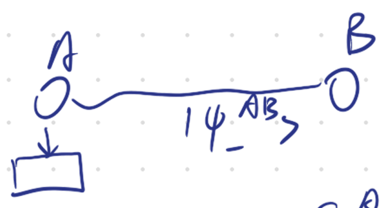

# 8.8 Born's Rule and Projective von-Neumann Measurement

### Born's Rule in Qudit

We call every such a measurement that corresponds to an orthonormal basis a **basis measurement**.

To establish a connection between a basis measurement and a physical observable, let’s consider the energy of a physical system.  
Energy is a fundamental observable in quantum mechanics and therefore can be measured.  
As previously discussed, any observable in quantum mechanics is represented by a Hermitian operator acting on the Hilbert space $A$.  
We denote the energy operator, often referred to as the Hamiltonian, as $H=\sum_{x\in[m]}a_{x}|\phi_{x}\rangle\langle\phi_{x}|$ where $\{|\phi_x\rangle\}_{x \in [m]}$ is an orthonormal basis of $A$.  
Therefore, in order to measure the energy, one has to perform a basis measurement corresponding to the orthonormal basis $\{|\phi_x\rangle\}_{x \in [m]}$, since the energy $a_x$ is determined by the value of $x$.

Born's Rule in measuring energy: $\Pr(a_{x}||\psi\rangle) = |\langle\phi_{x}|\psi\rangle|^{2}$  
But this is not well defined: If $a_1=a_2=a$, then $\Pr(a||\psi\rangle)=$ $|\langle\phi_{1}|\psi\rangle|^{2}+$ $|\langle\phi_2|\psi\rangle|^2$  
That is if $a_1=a_2$, then $\Pr(a_{1}|\psi)=\Pr(a_{2}|\psi)=|\langle\phi_{1}|\psi\rangle|^{2} + |\langle \phi_{2}|\psi\rangle|^{2}$  
$= \langle\psi|\phi_1\rangle\langle\phi_1|\psi\rangle + \langle\psi|\phi_2\rangle\langle\phi_2|\psi\rangle = \langle\psi|(|\phi_1\rangle\langle\phi_1| + |\phi_2\rangle\langle\phi_2|)|\psi\rangle$  
$= \langle\psi|\Pi_{a_1}|\psi\rangle$ where $\Pi_{a_1}$ is projection.

Then we formalise: $H=\sum_{x=1}^m E_x\Pi_x$ where $\Pi_x: A \rightarrow A, A=\mathbb{C}^d$.  
$E_1 > \dots > E_m, m \le d$ and $\Pi_x\Pi_y=\delta_{xy}\Pi_x, \forall x,y \in [m]$. So $\Pi$ is orthogonal projection.

### Definition of Projective von-Neumann Measurement

Any complete set of orthogonal projections $\{\Pi_x\}_{x \in [m]}$ where $\Pi_{x} = \sum_{i} |\phi_{i}\rangle\langle\phi_{i}|$ is called: projective von-Neumann Measurement if

1. $\Pi_x\Pi_y=\delta_{xy}\Pi_x, \forall x,y \in [m]$
2. $\sum_{x=1}^m \Pi_x = I_A$

#### Born's Rule for Qudit: $\Pr(E_{x}||\psi\rangle) = \langle\psi|\Pi_{x}|\psi\rangle$

Initial state: $|\psi\rangle$

- If $H$ is non-degenerate (i.e. $a_1 > a_2 > \dots > a_d$), then after outcome $a_x$, the post-measurement state is $|\phi\rangle$
- But if $H=\sum_{x=1}^m E_x\Pi_x$ is degenerate, then after outcome x (i.e. $E_x$), the state is $\frac{\Pi_{x}|\psi\rangle}{||\Pi_{x}|\psi\rangle||}$  

  Note: $||\Pi_{x}|\psi\rangle||^{2}= \langle\psi|\Pi_{x}|\psi\rangle = \Pr(E_{x}|\psi \rangle )$

##### Example

- If $a_1=a_2=E_1$, $|\psi\rangle=|\phi_1\rangle$ and $\Pi_1=|\phi_1\rangle\langle\phi_1|+|\phi_2\rangle\langle\phi_2|$  
  After outcome $E_1$ occured, the state is $\frac{\Pi_1|\psi\rangle}{||\Pi_1|\psi\rangle||} = \frac{\Pi_1|\phi_1\rangle}{||\Pi_1|\phi_1\rangle||}$ $= \frac{|\phi_{1}\rangle}{|||\phi_{1}\rangle||}$
- $|\psi\rangle = \sqrt{\frac{1}{2}}|0\rangle + \frac{1}{2}|1\rangle + \frac{1}{2}|2\rangle$, $H=3|0\rangle\langle 0| + 3|1\rangle\langle 1| + 7|2\rangle\langle 2|$ is a Energy measurement  
  $\Pr(\text{Energy}=3|\psi\rangle) = \langle\psi|(|0\rangle\langle 0|+|1\rangle\langle 1|)|\psi\rangle = \langle\psi|(\sqrt{\frac{1}{2}}|0\rangle + \frac{1}{2}|1\rangle )$ $= \frac{1}{2} + \frac{1}{4} = \frac{3}{4}$  
  $\Pr(\text{Energy}=7|\psi\rangle) = \langle\psi||2\rangle\langle 2||\psi\rangle = |\langle\psi|2\rangle|^{2} = (\frac{1}{2})^{2} = \frac{1}{4}$  
  State after outcome $E=3$, the post-measurement state: $\frac{(|0\rangle\langle 0|+|1\rangle\langle 1|)|\psi\rangle}{\frac{\sqrt{3}}{2}} = \frac{2}{\sqrt{3}}(\sqrt{\frac{1}{2}}|0\rangle + \frac{1}{2}|1\rangle)$

##### Entangled State

$|\psi_-^{AB}\rangle = \frac{1}{\sqrt{2}}(|01\rangle-|10\rangle)$

Let do a measurement of spin in $\hat{z}$ 

$S_n^A \otimes I^B$: $\Pi_0^{AB} = |0\rangle\langle 0|^A \otimes I^B \quad \Pi_1^{AB} = |1\rangle\langle 1|^A \otimes I^B$

###### Example

- $\Pr(\text{outcome } "0" | \psi_-^{AB}) = \langle\psi_-^{AB}|\Pi_0^{AB}|\psi_-^{AB}\rangle$  
  $= [\frac{1}{\sqrt{2}}(\langle 10| - \langle 01|)][|0\rangle\langle 0|^A \otimes I^B][\frac{1}{\sqrt{2}}(|01\rangle - |10\rangle)]$  
  $= \frac{1}{2}(\langle 10| - \langle 01|)(|01\rangle) = \frac{1}{2}$  
  The post-measurement state is $\frac{\Pi_0^{AB}|\psi_-^{AB}\rangle}{\sqrt{1/2}} = |01\rangle = |0\rangle^A|1\rangle^B$ This is "spooky action at a distance"
- Measurement in $\hat{x}$  
  ​$|\uparrow_x\rangle = |+\rangle$, $|\downarrow_x\rangle = |-\rangle$, $\Pi_0^{AB} := |+\rangle\langle+| \otimes I$, $\Pi_1^{AB} := |-\rangle\langle-| \otimes I$  
  Again, $\Pr(\text{outcome }"0" | \psi) = \langle\psi_{-}^{AB}|\Pi_{0}^{AB}|\psi_{-}^{AB} \rangle = \frac{1}{2}$  
  Post-Measurement state after outcome "0" occured:  
  ​$= \frac{\Pi_0^{AB}|\psi_-^{AB}\rangle}{\sqrt{1/2}} = \sqrt{2}(|+\rangle\langle+| \otimes I) \frac{1}{\sqrt{2}}(|01\rangle - |10\rangle)$  
  ​$= |+\rangle\langle+|0\rangle \otimes |1\rangle - |+\rangle\langle+|1\rangle \otimes |0\rangle$  
  ​$= \frac{1}{\sqrt{2}}|+\rangle|1\rangle - \frac{1}{\sqrt{2}}|+\rangle|0\rangle = |+\rangle \frac{1}{\sqrt{2}}(|1\rangle-|0\rangle) = -|+\rangle^A|-\rangle^B$

#### Unitary Evolution

$t=0, |\psi(0)\rangle = |\psi\rangle, \quad t>0, |\psi(t)\rangle = U(t)|\psi\rangle, \quad U^*(t)U(t)=I$  
Because for closed system, information cannot leak, containing inside the system, any information should be kept

For example, if we want to rotate the electron, then we put the magnet near it.

Unitary Evolution is an interaction, another Evolution is the measurement

‍
