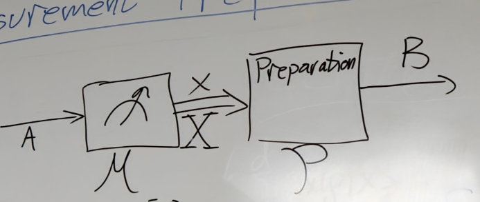
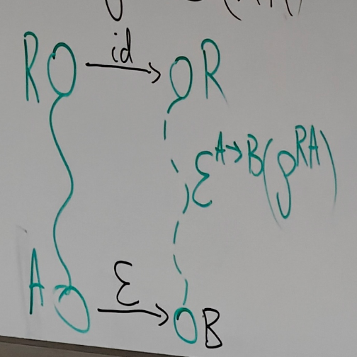
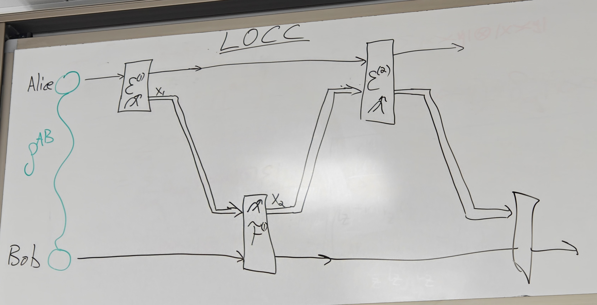
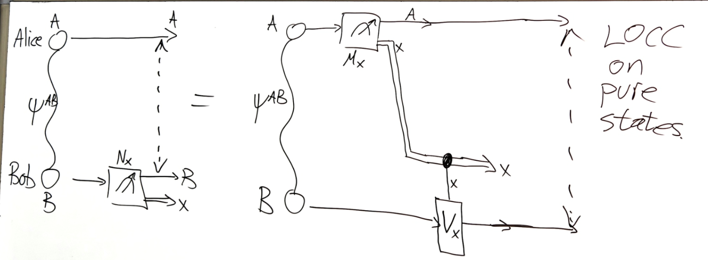

# 9.2 Quantum Channel and LOCC

## Preparation Channel

Preparation Channel: $\mathcal{E}\circ\Delta=\mathcal{E}$. The channel prepare density matrix

We know $\Delta(\rho)=\sum^d_{x=1}\lang x|\rho|x\rang|x\rang\lang x|$

Then $\mathcal{E}(\rho)=\mathcal{E}\circ \Delta(\rho)=\sum^{d}_{x=1}\lang x|\rho|x\rang \mathcal{E}(|x\rang\lang x|)=\sum^{d}_{x=1}\lang x|\rho|x\rang\sigma_{x}$ where $\sigma_x:=\mathcal{E}(|x\rangle\langle x|)$

We can calculate the Choi matrix: $J_{\mathcal{E}}^{AB}=\mathcal{E}^{\tilde{A}\to B}=\mathcal{E}^{\tilde{A}\to B}\circ\Delta^{\tilde{A}\to\tilde{A}} (\Omega^{A\tilde{A}})=\sum_{x,y}|x\rang\lang y|\otimes \mathcal{E}\circ\Delta(|x\rang \lang y|)$  

$=\sum_{x,y}\delta_{xy}|x\rangle\langle y|\otimes\mathcal{E}(|x\rangle\langle x|) =\sum_{x}|x\rangle\langle x|\otimes\sigma_{x}$. This is the Choi matrix of preparation channel.

There is a corresponding between channel and choi matrix

Therefore, $\mathcal{E} \in \mathrm{CPTP}(A \rightarrow B)$ is a cq-channel if and only if its Choi matrix $J_{\mathcal{E}}^{A B}$ is a cq-state: $\rho^{XA}=\sum_{x\in[m]}p_{x}|x\rang\lang x|^{X}\otimes \rho^{A}_{x}$  

**H.M.**  Ex 3.48

Let $\mathcal{E} \in \text{CPTP}(A \rightarrow B)$ be a cq-channel as above, and set $m := |A|$ and $n := |B|$.

1. Show that $\{M_{xy}\}$ with $M_{xy} : A \rightarrow B$ and $M_{xy}:=\sqrt{\sigma_{x}}|y^{B}\rangle\langle x^{A}|,x\in[m]\,,\,y\in[n]$ forms an operator sum representation of $\mathcal{E}$.

   Proof

   Let $M_{xy}:=\sqrt{\sigma_x}\,|y^B\rangle\langle x^A|$ for $x\in[m],\,y\in[n]$.

   $\sum_{x,y}M_{xy}\,\rho\,M_{xy}^{*}=\sum_{x,y}\sqrt{\sigma_{x}}\,|y\rangle\langle x|\,\rho\,|x\rangle\langle y|\,\sqrt{\sigma_{x}}=\sum_{x} \langle x|\rho|x\rangle \,\sqrt{\sigma_{x}}\Big(\sum_{y} |y\rangle\langle y|\Big)\sqrt{\sigma_{x}}=\sum_{x} \langle x|\rho|x\rangle\,\sigma_{x}=\mathcal{E}(\rho).$  

   And $\sum_{x,y}M_{xy}^{*}M_{xy}=\sum_{x,y}|x\rangle\langle y|\,\sigma_{x}\,|y\rangle \langle x|=\sum_{x}\big(\operatorname{Tr}\sigma_{x}\big)\,|x\rangle\langle x|=\sum _{x}|x\rangle\langle x|=I^{A}.$
2. Show that the map $V: A \rightarrow B \otimes \tilde{A}\tilde{B}$ given by $V=\sum_{x\in[m]}\left(\sqrt{\sigma_{x}^{B}}\otimes I^{\tilde{B}}\right)|\Omega^{B\tilde{B}} \rangle\otimes|x^{\tilde{A}}\rangle\langle x^{A}|$ is a Stinespring isometry (the environment system is $\tilde{A}\tilde{B}$) satisfying $\text{Tr}_{\tilde{A}\tilde{B}}[V\rho V^{*}]=\sum_{x\in[m]}p_{x}\sigma_{x}=\mathcal{E} (\rho)\text{ and }V^{*}V=I^{A}$  

   Stinespring isometry(an isometry $V:A\to BE$ s.t. $\mathcal{E}(\rho)=\text{Tr}_{E}[V\rho V^{*}],\forall \rho\in\mathcal{L}(A)$)

   Proof

   Let $V \;=\; \sum_{x\in[m]}\big(\sqrt{\sigma_{x}^{B}}\otimes I^{\tilde B}\big)\,|\Omega ^{B\tilde B}\rangle \otimes |x^{\tilde A}\rangle\langle x^{A}|$ with $|\Omega^{B\tilde B}\rangle=\sum_{y}|y^B y^{\tilde B}\rangle$.

   Isometry: Let $|w_x\rangle:=(\sqrt{\sigma_x}\otimes I)|\Omega\rangle$. Then $V=\sum_{x}|w_{x}\rangle_{B\tilde{B}}\otimes|x^{\tilde{A}}\rangle\langle x^{A}|,\text{ then }V^{*}V=\sum_{x}\langle w_{x}|w_{x}\rangle\,|x^{A}\rangle\langle x^{A}|=\sum _{x}\operatorname{\mathrm{Tr}}\sigma_{x}\,|x\rangle\langle x|=I^{A}.$  

   Output state: $V\rho V^{*}=\sum_{x,x'}\langle x|\rho|x'\rangle\,|w_{x}\rangle\langle w_{x'} |\otimes |x^{\tilde A}\rangle\langle x'^{\tilde A}|.$  
   Then $\operatorname{Tr}_{\tilde A}[V\rho V^{*}]=\sum_{x} \langle x|\rho|x\rangle \,|w_{x}\rangle\langle w_{x}|.$  
   Since $\operatorname{Tr}_{\tilde B}\big[\,|\Omega\rangle\langle\Omega|\,\big]=I^B$, then $\operatorname{Tr}_{\tilde A\tilde B}[V\rho V^{*}]=\sum_{x} \langle x|\rho| x\rangle\,\operatorname{Tr}_{\tilde B}\big[(\sqrt{\sigma_{x}}\otimes I)|\Omega\rangle \langle\Omega|(\sqrt{\sigma_{x}}\otimes I)\big]=\sum_{x} \langle x|\rho|x\rangle\, \sigma_{x}=\mathcal{E}(\rho).$

## Measurement-Prepare Channel

$\mathcal{E}:=\mathcal{P}^{X\rightarrow B}\circ M^{A\rightarrow X}$ where $M^{A\to X}(\rho)=\sum_{x=1}^{m}\operatorname{\mathrm{Tr}}[\underbrace{\Lambda_{x}} _{POVM}\rho]\underbrace{|x\rangle\langle x|^{X}}_{\text{Classical Outcome}}$ POVM Channel

Then $\mathcal{E}(\rho) = \mathcal{P}\cdot M(\rho)$ $=\sum_{x=1}^{m}\operatorname{\mathrm{Tr}}[\Lambda_{x}\rho]\mathcal{P}(|x\rangle\langle x|)$  

Let $\mathcal{E}(\rho)=\sum_{z=1}^{m}\operatorname{\mathrm{Tr}}\left[\Lambda_{z}\rho\right ]\sigma_{z}^{B}$, then Choi Matrix: $J_{\mathcal{E}}^{AB}=\mathcal{E}^{\tilde{A}\rightarrow B}\left(\Omega^{A\tilde{A}} \right)=\sum_{x,y\in[d]}|x\rangle\langle y|\otimes\mathcal{E}(|x\rangle\langle y| )$  

$=\sum_{x,y\in[d]}|x\rangle\langle y|\otimes\sum_{z=1}^{m}\operatorname{\mathrm{Tr}} [\Lambda_{z}|x\rangle\langle y|]\sigma_{z}^{B}=\sum_{x,y\in[d]}|x\rangle\langle y |\otimes\sum_{z=1}^{m}\langle y|\Lambda_{z}|x\rangle\sigma_{z}^{B}$

$= \sum_{z=1}^{m}\underbrace{\left( \sum_{x,y \in [d]}\langle y|\Lambda_{z}|x\rangle |x\rangle \langle y| \right)}_{\Lambda_{z}^{T}} \otimes \sigma_{z}$

Thus $J_{\mathcal{E}}^{AB}=\sum_{z=1}^{m}\Lambda_{z}^{T}\otimes\sigma_{z}^{B}$. This is separable density matrix

Because this channel destroy entangled state

Also when we do $\text{Tr}_B$ on $J_\mathcal{E}^{AB}$, we get identity since $\sigma_z$ has rank 1

Choi matrix is density matrix but not normalized, but even $\frac{1}{|A|} J_{\mathcal{E}}^{A B}$ is not entangled

---

Intuition: We make it into classical state, then return it to quantum

The moment it becomes classical, it is no longer quantum entangled. Then, if it returns to quantum, it loses the entanglement.

## Entanglement Breaking Channel

Let $\mathcal{E} \in CPTP(A \rightarrow B)$. We say that $\mathcal{E}$ is entanglement-breaking if $\forall \rho \in \mathfrak{D}(AR)$, $\mathcal{E}^{A \rightarrow B}(\rho^{RA})$ is separable

### Theorem

$\mathcal{E}$ is entanglement breaking iff $\mathcal{E}$ is Measurement-Prepare Channel

Proof

$\Leftarrow$) Since $\rho$ is convex combination of pure states, then it's enough to prove it for all pure state

Then NTP: $\mathcal{E}^{A\to B}(\psi^{RA})$ is separable $\forall$ pure states $\psi^{RA}$  

We know $|\psi^{RA}\rang =(M\otimes I^{A})|\Omega^{\tilde{A}A}\rang$, then $\mathcal{E}^{A\to B}(\psi^{RA})=(M\otimes I^{A})\mathcal{E}\left(\Omega^{\tilde{A}A} \right)(M\otimes I^{A})^{*}$

$=\left(M\otimes I^{A})J_{\mathcal{E}}^{AB}\right.(M\otimes I^{A})^{*}$, then since [this](#20250902143525-jq76yib), $=\left(M\otimes I^{A}\right)\left(\sum_{z=1}^{m}\Lambda_{z}^{T}\otimes\sigma_{z} ^{B}\right)\left(M\otimes I^{A}\right)^*$

$=\sum_{z=1}^{m}q_{z}\frac{M\Lambda_{z}M^{*}}{q_{z}}\otimes\sigma_{z}$ where $q_{z}:=\operatorname{Tr}\left[M \Lambda_{z} M^{*}\right]=\operatorname{Tr}\left[M^{*} M \Lambda_{z}\right]$

Thus this is separable

Check: Calculate the reduce density matrix of $\psi^{RA}$ and check that $M^*M$ is a density matrix

$\Rightarrow$) Let $J_{\mathcal{E}}^{AB}=\mathcal{E}^{\tilde{A}\rightarrow B}\left(\Omega^{A\tilde{A}} \right)=\sum_{z}q_{z}\omega_{z}^{A}\otimes\tau_{z}^{B}$, let $\eta_{z}^{A}:=q_{z}\omega_{z}^{A}$, then $J_{\mathcal{E}}^{AB}=\sum_{z}\eta_{z}^{A}\otimes\tau_{z}^{B}$.  
Then we just check that $\eta_{z}^{A}$ is a POVM: $\text{Tr}_{B}\left\lbrack J_{\mathcal{E}}^{AB}\right\rbrack=\sum_{z}\eta_{z}^{A} \cdot\text{Tr}[\tau_{z}^{B}]=\sum_{z}\eta_{z}^{A}$  
Since $\mathcal{E}$ is quantum channel, then $J_\mathcal{E}^A=I^A$. Thus $\sum_z\eta_z^A=I_A$  

## LOCC(Local Operations Classical Communication)

### Definition

Entanglement is a property of a composite physical system that cannot be generated nor increased by LOCC

Example: Separable can be generated by LOCC since Alice and Bob can do local operation

Alice has $p_x$ and prepare $\rho_x$ and send $x$ to Bob, then Bob prepares $\sigma_x$. Then they all forget what is $x$

Then the whole system is $\sum_xp_x\rho_x^A\otimes \sigma_x^B$

Similar to Quantum Teleportation

Any measurement on Bob can be simulated by a measurement on Alice, up to a unitary on Bob.

Let $|\psi^{AB}\rangle$ be a bipartite pure state and let $\{N_x\}$ be measurement operators on Bob with $\sum_{x} N_{x}^{*}N_{x} = I_{B}$.  
We want to show that for each $x$ there exist operators $M_x$ on Alice and unitaries $U_x$ on Bob such that $(I\otimes N_{x})\,|\psi^{AB}\rangle\;=\;(M_{x}\otimes V_{x})\,|\psi^{AB}\rangle,$ and that $\sum_{x} M_{x}^{*}M_{x} = I_{A}$ on the support of Alice’s reduced state.

Proof

Let $|\psi^{AB}\rang$ be a state on Alice with a measurement $N_x$ where $\sum_x N^*_xN_x=I$  

We want to prove $I\otimes N_{x}|\psi^{AB}\rangle$ is equivalent $I\otimes N|\psi^{AB}\rangle$  

By Schmidt decomposition: $|\psi^{AB}\rangle=\sum_{y}\sqrt{p_{y}}\,|\phi_{y}\rangle_{A}\,|\varphi_{y}\rangle _{B}=(\Lambda\otimes I)\,|\Omega\rangle$ where $\Lambda = \sum_y \sqrt{p_y}\,|\phi_y\rangle\langle \phi_y|$ (diagonal in $\{|\phi_y\rangle\}$) and $|\Omega\rangle=\sum_{y}|\phi_{y}\rangle_{A}\,|\varphi_{y}\rangle_{B}$  

Then $(I\otimes N)\,|\psi\rangle=(\Lambda\otimes N)\,|\Omega\rangle=(\Lambda N^{T}\otimes I)\,|\Omega\rangle$ and since $\Lambda$ is diagonal, then $\Lambda N^{T}$ is diagonal, by singular value decomposition, we get 

$=UN\Lambda V\otimes I|\Omega\rangle$ $=UN\Lambda\otimes V^{T}I|\Omega\rangle$ $=(UN\otimes V^{T})\underbrace{(\Lambda\otimes I)|\Omega\rangle}_{|\psi\rang}$

Thus $(I\otimes N_{x})|\psi^{AB}\rangle=(\underbrace{U_{x}N_{x}}_{M_{x}}\otimes V_{x}^{T} )|\psi^{AB}\rangle=(M_{x}\otimes V_{x}^{T})|\psi^{AB}\rangle$ where $\sum M_{x}^{*} M_{x} = \sum N_{x}^{*} N_{x} = I$  

Also $p_x=\lang \psi^{AB}|I^A\otimes N_x^*N_x|\psi^{AB}\rang=\lang \psi^{AB}|M_x^*M_x\otimes I^B|\psi^{AB}\rang$

Every measurement bob performed is equivalent to Alice performing measurement and bob do a unitary

This is the most general LOCC(LOCC on pure state)

‍

‍
