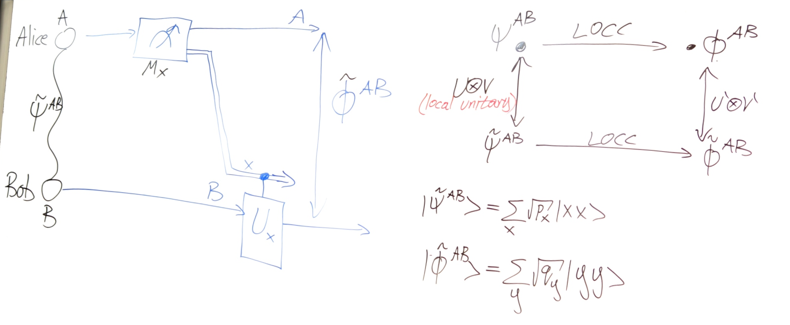
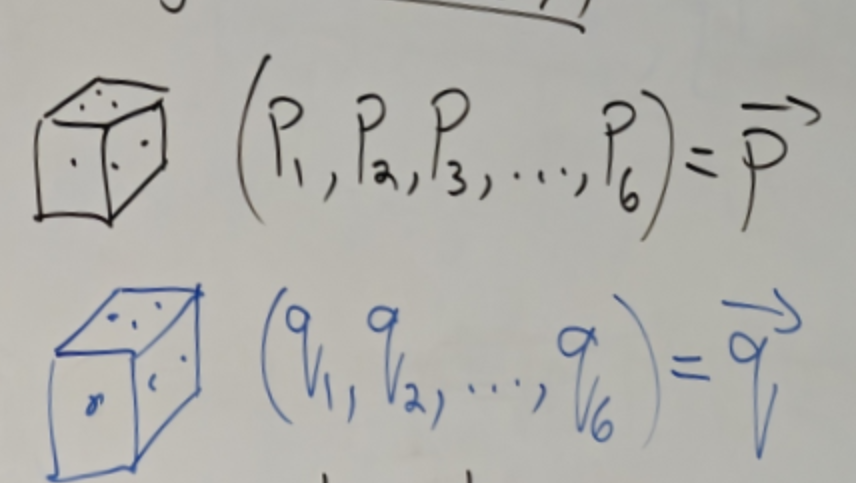

# 9.4 LOCC and Mojorization

## Entanglement Theory of Pure States

$E(\psi^{AB}) \geq E(\phi^{AB})$ if $\psi^{AB} \xrightarrow{\text{LOCC}} \phi^{AB}$ by definition of LOCC

Let consider Reversible LOCC: $U^A \otimes V^B |\psi^{AB}\rangle := |\phi^{AB}\rangle \implies E(\psi^{AB}) \geq E(\phi^{AB})$

Also $U^*\otimes V^*$ is LOCC, then $U^* \otimes V^* |\phi^{AB}\rangle = |\psi^{AB}\rangle \implies E(\phi^{AB}) \geq E(\psi^{AB})$  
Thus $E(\psi^{AB}) = E(\phi^{AB})$

All the states in $\left\{U\otimes V|\psi\rangle\right\}_{\text{U,V-unitaries.}}$ have the same entanglement as $\psi^{\text{AB}}$  
By Schmidt Decomposition: $|\psi^{\text{AB}}\rangle=\sum_{x=1}^{d}\sqrt{P_{x}}|Ux\rangle^{\text{A}}|Vx\rangle ^{\text{B}}=U\otimes V|\tilde{\psi}^{\text{AB}}\rangle$  
Let $|\tilde{\psi}^{\text{AB}}\rangle:=\sum_{x=1}^{d}\sqrt{P_{x}}|x\rangle^{\text{A}} |x\rangle^{\text{B}}$  
Thus there is a probability function related to entanglement: $E(\psi^{\text{AB}}) = f(\vec{P}) \quad \vec{P} = \{P_{x}\}_{x\in[d]}$

$f(1,0,...,0)=0$ since we will get $|x\rang |x\rang$ which is not entangled

---

### Proposition

We are trying to prove we can get $\tilde{\phi}^{AB}$ by LOCC from $\tilde{\psi}^{AB}$, then since $U$ and $V$ is reversible, we can get $\phi^{AB}$ by LOCC from $\psi^{AB}$

Let $|\tilde{\psi}^{AB}\rang=\sum_x\sqrt{p_x}|xx\rang =\sqrt{\rho}\otimes I^B|\Omega^{AB}\rang$ and $|\tilde{\phi}^{AB}\rang=\sum_y\sqrt{q_y}|yy\rang=\sqrt{\sigma}\otimes I|\Omega^{AB}\rang$ where $\rho= \begin{pmatrix} 	p_{1} &       &        &       \\ 	      & p_{2} &        &       \\ 	      &       & \ddots &       \\ 	      &       &        & p_{d} \end{pmatrix}>0$ and $\sigma= \begin{pmatrix} 	q_{1} &       &        &       \\ 	      & q_{2} &        &       \\ 	      &       & \ddots &       \\ 	      &       &        & q_{d} \end{pmatrix}>0$

After outcome $x$-occurred, the post-measurement state is $\frac{1}{\sqrt{r_x}}M_x\otimes U_x|\tilde{\psi}\rang^{AB}=|\tilde{\phi}\rang^{AB},\forall x$ where $r_x:=\lang \tilde{\psi}^{AB}|M_x^*M_x\otimes I|\tilde \psi^{AB}\rang$

$\iff\frac{1}{\sqrt{r_{x}}}(M_{x}\otimes U_{x})(\sqrt{\rho}\otimes I^{B})|\Omega^{AB} \rangle=(\sqrt{\sigma}\otimes I^{B})|\Omega^{AB}\rangle$  

$\iff\frac{1}{\sqrt{r_{x}}}(M_{x}\sqrt{\rho}\otimes U_{x})|\Omega^{AB}\rangle=(\sqrt{\rho} \otimes I)|\Omega^{AB}\rangle$  

$\iff\left(\frac{1}{\sqrt{r_{x}}}M_{x}\sqrt{\rho}U_{x}^{T}\otimes I\right)|\Omega^{AB} \rangle=(\sqrt{\sigma}\otimes I)|\Omega^{AB}\rangle$

Thus we need to ensure $\frac{1}{\sqrt{r_{x}}}M_{x}\sqrt{\rho}U_{x}^{T}=\sqrt{\sigma}\iff M_{x}\sqrt{\rho} =\sqrt{r_{x}}\sqrt{\sigma}V_{x}\text{ where }V_{x}:=\bar{U}_{x}$  
$\iff M_{x}=\sqrt{r_{x}}\sigma^{1/2}V_{x}\rho^{-1/2}$

Once $M_x$ satisfy this, we can get $\tilde{\phi}^{AB}$ by LOCC from $\tilde{\psi}^{AB}$. But we need to ensure $M_x$ is a measurement

Check: $I=\sum_{x}M_{x}^{*}M_{x}=\sum^{m}_{x=1}r_{x}\rho^{-\frac{1}{2}}V^{*}_{x}\sigma^{\frac{1}{2}} \sigma^{\frac{1}{2}}V_{x}\rho^{-\frac{1}{2}}=\sum_{x=1}^{m}r_{x}\rho^{-\frac{1}{2}} V_{x}^{*}\sigma V_{x}\rho^{-\frac{1}{2}}$

Then we mutiply $\rho^{\frac{1}{2}}(...)\rho^{\frac{1}{2}}$ on both sides, we get $\rho=\sum^m_{x=1}r_xV_x^*\sigma V_x$

Thus we can $\tilde{\phi}^{AB}$ by LOCC from $\tilde{\psi}^{AB}$ iff we can find unitary $V_x$ and probability vectors such that $\rho=\sum^m_{x=1}r_xV_x^*\sigma V_x$

Let $K_x=\sqrt{r_x}V_x^*$, then $\rho=\mathcal{E}(\sigma)=\sum_{x}K_{x}\sigma K_{x}^{*}$ is a quantum channel

#### Definition

$\vec{q}\succ\vec{p}\;\char"27FA \;q_{1}^{\downarrow}\geq p_{1}^{\downarrow},\,\, q_{1}^{\downarrow}+q_{2}^{\downarrow}\geq p_{1}^{\downarrow}+p_{2}^{\downarrow},\, \,...\,\,\sum_{x=1}^{k}q_{x}^{\downarrow}\geq\sum_{x=1}^{k}p_{x}^{\downarrow}$ where $\vec p=\begin{pmatrix} p_1\\p_2\\\vdots\\p_d \end{pmatrix},\vec p^\downarrow=\begin{pmatrix} p_1^\downarrow\\p_2^\downarrow\\\vdots\\p_d^\downarrow \end{pmatrix}$ and $p_1^\downarrow\geq ...\geq p_d^\downarrow,\,\,p_x^\downarrow=p_{\pi(x)}$  

We can see that $\begin{pmatrix} 	1      \\ 	0      \\ 	\vdots \\ 	0 \end{pmatrix}\succ \begin{pmatrix} 	p_{1}  \\ 	p_{2}  \\ 	\vdots \\ 	p_{d} \end{pmatrix}\succ \begin{pmatrix} 	\frac{1}{d} \\ 	\frac{1}{d} \\ 	\vdots      \\ 	\frac{1}{d} \end{pmatrix}$, this is a partial order since $\begin{pmatrix} 	\frac{2}{5}  \\ 	\frac{2}{5}  \\ 	\frac{1}{10} \\ 	\frac{1}{10} \end{pmatrix}\begin{matrix} \nprec\\\nsucc \end{matrix} \begin{pmatrix} 	\frac{1}{2} \\ 	\frac{1}{4} \\ 	\frac{1}{4} \\ 	0 \end{pmatrix}$

We know $p_1\geq \frac{1}{d}$, then $p_1+p_2\geq \frac{2}{d}\iff \frac{1}{2}(p_1+p_2)\geq \frac{1}{d}$ and since $\min(p_1+p_2)=\frac{2}{d}$, then it's true 

##### Games of Chance(Majorization)

  
If we need to guess one number and $p_{1}^{\downarrow} > q_{1}^{\downarrow}$ we choose the black dice.

If we need to guess two number and $p_1^\downarrow + p_2^\downarrow \ge q_1^\downarrow + q_2^\downarrow$ we choose black dice.

If we need to guess all numbers and $\vec{p}\succ\vec{q}$ we choose black dice.

#### Pre-Lemma

$\vec{p}\succ\vec q\iff \exists D\in \R^{d\times d}_{+}\,\,\text{ s.t }\,\,\vec{q}= D\vec {p}$ where $D - \text{doubly stochastic matrix}$  

---

Example of doubly stochastic matrix  
$D = \begin{pmatrix} 	\frac{1}{2} & \frac{1}{4} & \frac{1}{4} \\ 	\frac{1}{4} & \frac{1}{2} & \frac{1}{4} \\ 	\frac{1}{4} & \frac{1}{4} & \frac{1}{2} \end{pmatrix}$ $D = \begin{pmatrix} \frac{1}{2} & \frac{1}{2} \\ \frac{1}{2} & \frac{1}{2} \end{pmatrix}$ $D= \begin{pmatrix} 	p   & 1-p \\ 	1-p & p \end{pmatrix}$

They can be written as convex combination

- $D= \begin{pmatrix} 	  p & 1-p \\ 	1- p& p \end{pmatrix}=p \begin{pmatrix} 	1 & 0 \\ 	0 & 1 \end{pmatrix}+(1-p) \begin{pmatrix} 	0 & 1 \\ 	1 & 0 \end{pmatrix}$
- $D = \begin{pmatrix} 	\frac{1}{2} & \frac{1}{4} & \frac{1}{4} \\ 	\frac{1}{4} & \frac{1}{2} & \frac{1}{4} \\ 	\frac{1}{4} & \frac{1}{4} & \frac{1}{2} \end{pmatrix}=\frac{1}{2}\underbrace{ \begin{pmatrix} 	1 & 0 & 0 \\ 	0 & 1 & 0 \\ 	0 & 0 & 1 \end{pmatrix}}_{P_1}+\frac{1}{4}\underbrace{ \begin{pmatrix} 	0 & 1 & 0 \\ 	0 & 0 & 1 \\ 	1 & 0 & 0 \end{pmatrix}}_{P_2}+\frac{1}{4}\underbrace{ \begin{pmatrix} 	0 & 0 & 1 \\ 	1 & 0 & 0 \\ 	0 & 1 & 0 \end{pmatrix}}_{P_3}$  

  Thus $D_3=\sum^3_{x=1}p_xP_x$

#### Theorem(Birkhoff)

$D$ is doubly stochastic iff it can be written as convex combination of permutation matrix  
​$D=\sum_{x=1}^{m}p_{x}\prod_{x}$ where $\prod_{x}$ is permutation matrix and $p_x$ is probability

‍
