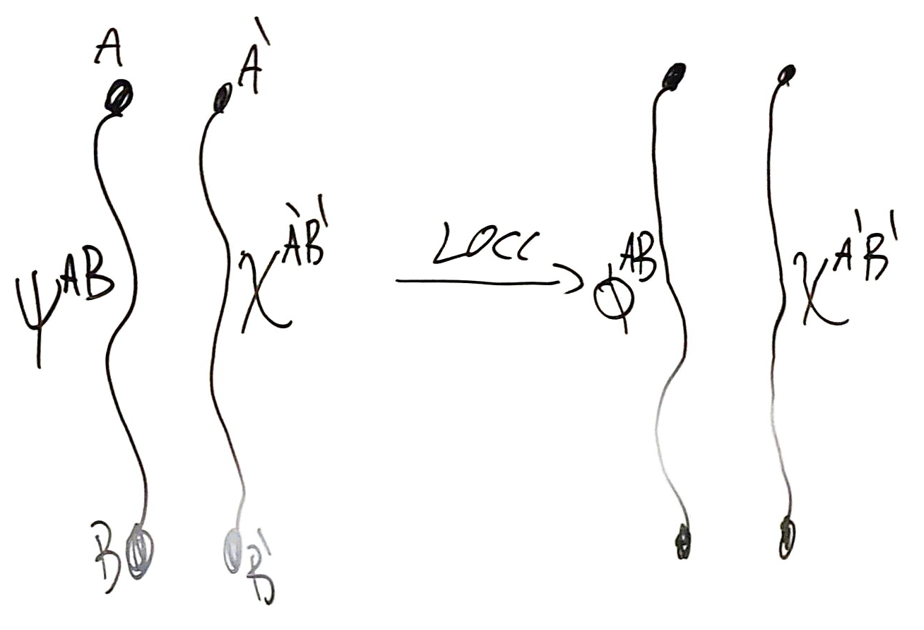

# 9.5 Nielsen Majorization Theorem

### Nielsen Majorization Theorem

Given $|\psi^{AB}\rang =\sum^d_{x=1}\sqrt{p_x}|xx\rang,\,\,|\phi^{AB}\rang =\sum^d_{x=1}\sqrt{q_x}|xx\rang$, then

$$
\psi^{AB}\xrightarrow{LOCC}\phi^{AB}\,\text{ if and only if }\,\,\vec q\succ\vec
p
$$

Proof

Let $\rho= \begin{pmatrix} 	p_{1} &       &        &       \\ 	      & p_{2} &        &       \\ 	      &       & \ddots &       \\ 	      &       &        & p_{d} \end{pmatrix}>0$ and $\sigma= \begin{pmatrix} 	q_{1} &       &        &       \\ 	      & q_{2} &        &       \\ 	      &       & \ddots &       \\ 	      &       &        & q_{d} \end{pmatrix}>0$

So far we showed that $\psi^{AB}\xrightarrow{LOCC}\phi^{AB}$ iff $\exists \vec r\in\text{Prob}(m)$ and unitary matrices $\{U_x\}$ such $\rho=\sum_{x\in[m]}r_xU_x\sigma U_x^*$

To finish the proof, we show that $\rho=\sum_{x\in[m]}r_{x}U_{x}\sigma U_{x}^{*}\iff\vec q\succ \vec p$.

$\Rightarrow$) We first prove a lemma

---

#### Lemma

If $\rho=\mathcal{E}(\sigma)$ and $\mathcal{E}(I)=I$, then $\sigma\succ\rho$

Proof

The eigenvalues of $\rho,\sigma$ are probability vectors since $\rho,\sigma$ are density matrix(positive and trace 1)

Let $\sum_xp_x\psi_x$ and $\sigma=\sum q_x\phi_x$ are spectral decomposition

Then $p_x=\bra{\psi_x}\rho\ket{\psi_x}=\bra{\psi_x}\mathcal{E}(\sigma)\ket{\psi_x}=\sum^d_{y=1}q_y\underbrace{\bra{\psi_x}\mathcal{E}(\phi_y)\ket{\psi_x}}_{a_{xy}}$

Since $\mathcal{E}(\phi_y)$ is positive, then $a_{xy}\geq 0$, $\sum^{d}_{x=1}a_{xy}=\text{Tr}[\mathcal{E}(\phi_y)]=1$ and $\sum^d_{y=1}a_{xy}=1$ since $\mathcal{E}(\sum_y\phi_y)=\mathcal{E}(I)=I$

Thus $A=[a_{xy}]_{x,y\in [d]}$ is doubly stochastic matrix, then $p_{x}=(A\vec{q})_{x}\implies\vec{p}=A\vec{q}$  

Since [this](9.4%20LOCC%20and%20Mojorization.md#20250904120241-e3jtibz), then we get $\vec{q}\succ\vec{p}$

---

Then continuing proving: We apply this Lemma  
Since $\rho=\sum_{x\in[m]}r_{x}U_{x}\sigma U_{x}^{*}$ is a quantum channel, then $\rho=\mathcal{E}(\sigma)$  
Also, $\mathcal{E}(I)=\sum_{x\in[m]}r_{x}U_{x}IU_{x}^{*}=\sum_{x\in[m]}r_{x}I=I$ since $r_x$ is probability.  
Thus $\vec{q}\succ\vec{p}$

$\Leftarrow$) Suppose $\vec{q}\succ\vec{p}\implies\vec p=D\vec q=\sum^{m}_{x=1}r_{x}\Pi_{x}\vec q$ since [this](9.4%20LOCC%20and%20Mojorization.md#20250904120241-e3jtibz) and [this](9.4%20LOCC%20and%20Mojorization.md#20250905102255-7a2fxg5) respectively

Observing that $\rho=\sum^m_{x=1} r_x\Pi_x\sigma \Pi_x^*$, then since $\Pi_x$ is permutation, then unitary

Example

$\prod_x = \begin{pmatrix} 0 & 1 \\ 1 & 0 \end{pmatrix}$ and $0 \le p \le 1$ such that $\prod_x \begin{pmatrix} p \\ 1-p \end{pmatrix} = \begin{pmatrix} 1-p \\ p \end{pmatrix}$

Then $\begin{pmatrix} 0 & 1 \\ 1 & 0 \end{pmatrix} \begin{pmatrix} p & 0 \\ 0 & 1-p \end{pmatrix} \begin{pmatrix} 0 & 1 \\ 1 & 0 \end{pmatrix} = \begin{pmatrix} 1-p & 0 \\ 0 & p \end{pmatrix}$

#### Consequence

If $\vec p= \begin{pmatrix} 	\frac{1}{d} \\ 	\vdots      \\ 	\frac{1}{d} \end{pmatrix}$, then $\psi^{AB}=\frac{1}{\sqrt d}\sum^d_{x=1}|xx\rang=|\Phi^{AB}\rang$. Since $\vec{q}\succ \begin{pmatrix} 	\frac{1}{d} \\ 	\vdots      \\ 	\frac{1}{d} \end{pmatrix}$, then $\Phi^{AB}\xrightarrow{LOCC}\phi^{AB}$  

### Quantification of Entanglement

A function $E: \text{Pure}(AB) \longrightarrow \mathbb{R}$ is a measure of entanglement if:

1. $E(\psi^{AB}) \geq E(\phi^{AB})$ whenever $\psi^{AB}\xrightarrow{LOCC}\phi^{AB}$
2. $E(|0\rangle\langle 0| \otimes |0\rangle\langle 0|) = 0$

### Properties of Entanglement measures

1. $E(\psi^{AB}) \ge 0$, $\forall$ $\psi^{AB}\in \text{Pure}(AB)$
2. Invariance Under Unitaries: $E((U \otimes V)\psi^{AB}(U \otimes V)^*) = E(\psi^{AB})$
3. $E(\psi^{AB}) = f(\vec{p})$ where $\psi^{AB}= \sum_{x} \sqrt{p_{x}}|u_{x}\rangle|v_{x}\rangle$

Thus $f(\vec{p}) \geq f(\vec{q})$ whenever $\vec{q} \succ \vec{p}$ (Schur-Concave)

### Examples of measures of entanglement

1. Entropy of Entanglement

   $E(\psi^{AB}):=H(\vec p):=-\sum^{d}_{x=1}p_{x}\log_{2}p_{x}$ where $\vec p$ is eigenvalues of reduced density matrix of $\psi$  

   Example: $E(\Phi^{AB})=\log_2(d)$ where $|\Phi^{AB}\rang=\frac{1}{\sqrt d}\sum^d_{x=1}|x\rang^A|x\rang^B$ and $E(\Phi_+^{AB})=\log_2(2)=1\text{ebit}$
2. $\alpha$-Entropy of entanglement

   $E_{\alpha}(\psi^{AB})=H_{\alpha}(\vec p)$ where $\alpha$-Renyi-Entropy $H_\alpha(\vec p)=\frac{1}{1-\alpha}\log_2\sum_{x=1}^{d}p_x^\alpha$ and $\alpha\in [0,+\infty]$  
   Check that when $\alpha=1$, by LoHpital, we get $H_1(\vec p)=H(\vec p)$ and $H_\alpha(\Phi^{AB})=\log_2(d)$  

   Check: $H_\alpha(\vec p\otimes \vec q)=H_\alpha(\vec p)+H_\alpha(\vec q)$  

   This is the only additive one
3. Concurrence Monotones

   $f_2(\vec p)=\sum_{x<y}p_xp_y,\,\,f_3(\vec p)=\sum_{x<y<z}p_xp_yp_z$
4. Ky-Fam Norm

   $E_{(k)}(\vec p):=1-\sum^{k}_{x=1}p_{x}^{\downarrow},\forall k\in[d]$  

   Check: $E_{(k)}(\psi^{AB})\geq E_{(k)}(\phi^{AB}),\forall k\iff \psi^{AB}\xrightarrow{LOCC}\phi^{AB}$

## Catalysis of Entanglement

Example

$|\psi^{AB}\rang=\sqrt{\frac{2}{5}}|00\rang+\sqrt{\frac{2}{5}}|11\rang+\sqrt{\frac{1}{10}}|22\rang+\sqrt{\frac{1}{10}}|33\rang$,  $|\phi^{AB}\rang=\sqrt{\frac{1}{2}}|00\rang+\sqrt{\frac{1}{4}}|11\rang+\sqrt{\frac{1}{4}}|22\rang$

$\psi^{AB}\cancel{\xrightarrow{LOCC}}\phi^{AB}$ and $\phi^{AB}\cancel{\xrightarrow{LOCC}}\psi^{AB}$ because $\vec q\nsucc\vec p$ and $\vec p\nsucc \vec q$ where $\vec p=\begin{pmatrix} \frac{2}{5}\\ \frac{2}{5}\\ \frac{1}{10}\\ \frac{1}{10} \end{pmatrix},\vec q=\begin{pmatrix} \frac{1}{2}\\ \frac{1}{4}\\ \frac{1}{4}\\ 0 \end{pmatrix}$  

Let $\vec{r}= \begin{pmatrix} 	\frac{3}{5} \\ 	\frac{2}{5} \end{pmatrix}$, then claim: $\vec{q}\otimes\vec{r}>\vec{p}\otimes\vec{r}$, let $|\chi^{A'B'}\rangle = \sqrt{\frac{3}{5}}|00\rangle + \sqrt{\frac{2}{5}}|11\rangle$  

### Definition

$\vec{q}>_{T} \vec{p}$ if $\exists \vec{r}$ s.t. $\vec{q}\otimes \vec{r}> \vec{p}\otimes \vec{r}$  

If $\vec{q}\otimes \vec{r}> \vec{p}\otimes \vec{r}$ then $H_{\alpha}(\vec{p}\otimes \vec{r}) \ge H_{\alpha}(\vec{q}\otimes \vec{r})$  
$\iff H_{\alpha}(\vec{p}) + H_{\alpha}(\vec{r}) \ge H_{\alpha}(\vec{q}) + H_{\alpha} (\vec{r})$$\iff H_{\alpha}(\vec{p}) \ge H_{\alpha}(\vec{q}) \quad \forall \alpha$

‍

‍
