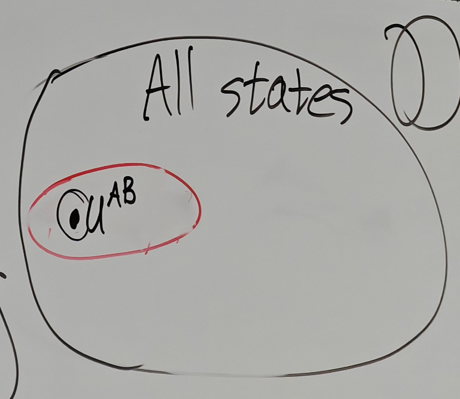

# 9.9

## Mixed-state Entanglement

$\text{SEP}(AB):=\{\rho\in \mathfrak{D}(AB):\rho^{AB}=\sum^{m}_{x=1}p_{x}\omega_{x} ^{A}\otimes \tau_{x}^{B},\sum p_{x}=1,p_{x}\geq 0,\omega_{x}\in\mathfrak{D}(A),\tau _{x}\in\mathfrak{D}(B)\}$

Clearly, $\text{SEP}(AB)\subset \mathfrak{D}(AB)$

If $\rho\in \mathfrak{D}(AB)$, it's hard to say if it is entanglement when the size is big

### Detection of Entanglement

#### Entanglement Witness

##### Definition

An operator $\Gamma\in \text{Herm}(AB)$ is called Entanglement Witness if:

1. $\text{Tr}[\Gamma^{AB}\sigma^{AB}]\geq 0,\,\,\forall\sigma\in \text{SEP}(AB)$
2. $\exists \rho^{AB}\in \mathfrak{D}(AB)\text{ s.t. }\text{Tr}[\Gamma^{AB}\rho^{AB} ]<0$

What do these two conditions tell us?

1. Observe that if $\text{Tr}[\Gamma^{AB}(\omega \otimes \tau)]\geq 0,\forall \omega,\tau$, then $\text{Tr}[\Gamma^{AB}\sigma^{AB}]\geq 0,\forall \sigma\in \text{SEP}(AB)$ since definition of $\text{SEP}(AB)$  

   And we know any density matrix can be written as convex combination of pure state, then it's enough to assume that $\text{Tr}[\Gamma^{AB}(\psi^{A}\otimes \phi^{B})]=\lang \psi^A\otimes \phi^B|\Gamma^{AB}|\psi^A\otimes \phi^B\rang\geq 0,\forall \psi,\phi\in \text{Pure}$
2. $\Gamma$ is not positive, otherwise $\text{Tr}[\Gamma^{AB}\rho^{AB}]\geq 0$ since $\text{Tr}[\Gamma\rho] = \text{Tr}[\Gamma \sum p_{x} \psi_{x}]$$= \sum p_{x} \text{Tr}[|\psi_{x}\rangle\langle\psi_{x}|\Gamma]$ $= \sum p_{x} \langle\psi_{x}|\Gamma|\psi_{x}\rangle$

If separable state is pure, then it looks like $|\psi^{AB}\rang=|\chi^A\rang \otimes |\phi^B\rang$ since the rank 1

---

$u^{AB}=\frac{1}{|AB|}I^{AB}=\frac{1}{|A|}I^A\otimes \frac{1}{|B|}I^B=u^A\otimes u^B$

$\mathcal{B}^{\varepsilon}(u^{AB}):=\{\rho\in \mathfrak{D}(AB):\frac{1}{2}||u^{AB} -\rho^{AB}||\leq \varepsilon\}$

##### Lemma

$\text{SEP}(AB)^*=\{\Gamma^{AB}\in \text{Herm}(AB):\text{Tr}[\Gamma\sigma]\geq 0,\forall \sigma\in \text{SEP}(AB)\}$, $\text{SEP}(AB)^{**}=\text{SEP}(AB)$  

$\forall$ entangled $\rho^{AB}$, $\exists$ entanglement witness $\Gamma$ s.t. $\text{Tr}[\rho\Gamma]<0$  

##### Theorem

There exists $\varepsilon>0$ s.t. $\mathcal{B}^{\varepsilon}(u^{AB})\subset \text{SEP}(AB)$  

Proof

By contradiction, suppose $\forall \varepsilon>0$, $\mathcal{B}^{\varepsilon}(u^{AB})\not \subset \text{SEP}(AB)$, that is $\exists$ sequence of emtamgled states $\{\tau^{AB}\}_{n\in \N}$ s.t. $\lim_{n\to\infty}\frac{1}{2}||\tau^{AB}-u^{AB}||_1=0$

By Lemma, $\exists$ entanglement witness s.t. $\text{Tr}[\Gamma_n\tau^{AB}_n]<0$ and assume $\text{Tr}[\Gamma_n^2]=1$ otherwise we can absorb it

Since set $\{\Gamma\in \text{Herm}(AB):\text{Tr}[\Gamma^2]=1\}$ is compact, then $\{\Gamma_n\}_{n\in \N}$ has converging subsequence s.t. $\lim_{n\to\infty}\Gamma_n=\Gamma$  

Then $0\geq \lim_{n\to\infty}\text{Tr}[\Gamma_n\tau_n]=\text{Tr}[\Gamma u^{AB}]$

But $\Gamma$ is entanglement witness since $\Gamma_n$ are entanglement witness and if $\text{Tr}[\Gamma_{n}^{AB}\sigma^{AB}]\geq 0$, then $\text{Tr}[\Gamma^{AB}\sigma^{AB}]\geq 0$

Thus $0\geq \lim_{n\to\infty}\text{Tr}[\Gamma_{n}\tau_{n}]=\text{Tr}[\Gamma u^{AB}]\geq 0$, then $\text{Tr}[\Gamma]=0$

$\text{Tr}[\Gamma]=0=\text{Tr}[\Gamma^{AB}]=\text{Tr}[\Gamma^{AB}(I^{A}\otimes I^{B} )]=\sum_{xy}\text{Tr}[\Gamma^{AB}(|x\rangle\langle x|\otimes|y\rangle\langle y|)]$  

Then $\text{Tr}[\Gamma^{AB}|x\rangle\langle x|\otimes|y\rangle\langle y|]=0$, then $\langle xy| \Gamma^{AB} |xy \rangle = 0 \implies \Gamma = 0$

But $\text{Tr}(\Gamma^{2})=1$, contradiction

##### Theorem

$\Gamma\in \text{Herm}(AB)$ is Entanglement Witness iff $\Gamma$ is the Choi matrix of a positive map that is not completely positive

Proof

$\Rightarrow$) Suppose $\Gamma=\mathcal{E}^{\tilde{A}\to B}(\Omega)^{A\tilde{A}}$ where $\mathcal{E}^{\tilde{A}\to B}$ is positive but not completely positive. Therefore $\Gamma^{AB}\ngeq 0$

$\text{Tr}[\Gamma^{AB}(\rho^{A}\otimes\sigma^{B})]=\text{Tr}[J_{\mathcal{E}}^{AB} (\rho^{A}\otimes\sigma^{B})]=\text{Tr}_{B}[\sigma^{B}\text{Tr}_{A}[J_{\mathcal{E}} ^{AB}(\rho^{A}\otimes I^{B})]]$  
​$=\text{Tr}_{B}[\sigma^{B}\text{Tr}_{A}[J_{\mathcal{E}}^{AB}((\rho^{A})^{T})^{T}\otimes I^{B}]]]=\text{Tr}[\sigma\mathcal{E}(\rho^{T})]\ge0$ since we can let $\gamma := \mathcal{E}(\rho^{T}) \ge 0$ and $\text{Tr}[\sigma \gamma] \ge 0$ since $\sigma,\gamma\geq 0$  

$\Leftarrow$) Conversely, suppose $\Gamma^{AB}$ is entanglement witness.  
Let $\mathcal{E} \in \mathcal{L}(A) \to \mathcal{L}(B)$ s.t. $\Gamma^{AB} = J_\mathcal{E}^{AB}$ $\Rightarrow \mathcal{E} \notin CP(A \to B)$ because $\Gamma^{AB}\ngeq 0$  
Since $\Gamma^{AB}$ is Entanglement Witness $\text{Tr}[\Gamma^{AB}(\rho^{A}\otimes \sigma^{B})]=\text{Tr}[\sigma^{B} \mathcal{E}(\rho^{A})^{T}] \ge 0$, $\forall \sigma, \forall \rho$

Then we can take $\sigma$ as eigenvectors of $\mathcal{E}(\rho)^T$, then we get $\mathcal{E}(\rho^A)^T\geq 0$, then $\mathcal{E}(\rho^A)\geq 0$

##### Theorem

Let $\Gamma^{AB}$ be an entanglement witness. Suppose $|AB| \le 6$. Then, there exists $\eta_1^{AB}, \eta_2^{AB} \ge 0$ s.t.

$$
\Gamma^{AB}= \eta_{1}^{AB}+ (\eta_{2}^{AB})^{T_B}
$$

where $T_B$ is transpose only on $B$

Proof: Suppose $|A|=2, |B|=3$. Every positive map $\mathcal{E}^{A \to B}$ has the form $\mathcal{E}^{A \to B}= \mathcal{N}_{1}^{A \to B}+ T^{B \to B}\circ \mathcal{N}_{2}^{A \to B}$ where $T^{B\to B}$ is transpose on $B$ and $\mathcal{N}_{1}, \mathcal{N}_{2} \in CP$.

$\Gamma^{AB}=\mathcal{E}^{\tilde{A}\to B}(\Omega^{A\tilde{A}})=\underbrace{J_{\mathcal{N}_1}^{AB}}_{\eta_1} +\underbrace{(J_{\mathcal{N}_2}^{AB})^{T_B}}_{\eta_2}$

---

If $\rho^{AB}$ is separable then $\rho^{AB} = \sum P_x \omega_x^A \otimes \tau_x^B$ and $(\rho^{AB})^{T_B} = \sum_{x \in \{m\}} P_x \omega_x^A \otimes (\tau_x^B)^T \ge 0$

##### Theorem

Let $\rho \in D(AB)$ with $|AB| \leq 6$. Then, $\rho^{AB}$ is separable if and only if $(\rho^{AB})^{T_B} \geq 0$ (Peres-Horodecki Criterion)

Proof

Suppose $(\rho^{AB})^{T_B} \geq 0$. By contradiction, suppose $\rho^{AB}$ is entangled $\Rightarrow \exists E.W. \Gamma^{AB}$ s.t. $\text{Tr}[\Gamma^{AB}\rho^{AB}] < 0$.  
From the previous theorem, $\Gamma^{AB} = \eta_1^{AB} + (\eta_2^{AB})^{T_B}$

So that $0>\text{Tr}[\eta^{AB}\rho^{AB}]=\text{Tr}[\eta_{1}^{AB}+(\eta_{2}^{AB})^{T_{B}}) \rho^{AB}]$ $=\underbrace{\text{Tr}[\eta_{1}^{AB}\rho^{AB}]}_{\geq0}+\underbrace{\text{Tr}[(\eta_{2}^{AB})^{T_{B}}\rho^{AB}]} _{=\text{Tr}[\eta_{2}^{AB}(\rho^{AB})^{T_{B}}]]\ge0}$ since this partial transpose is a self-adjoint

Comment: $((\rho^{AB})^{T_B}) ^T= (\rho^{AB})^{T_A}$  

‍
